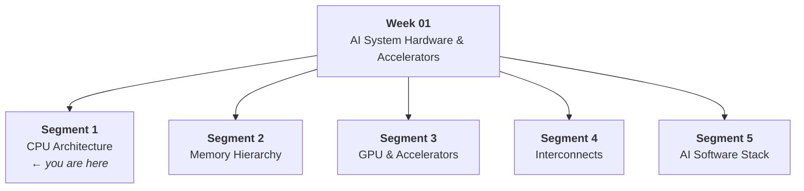
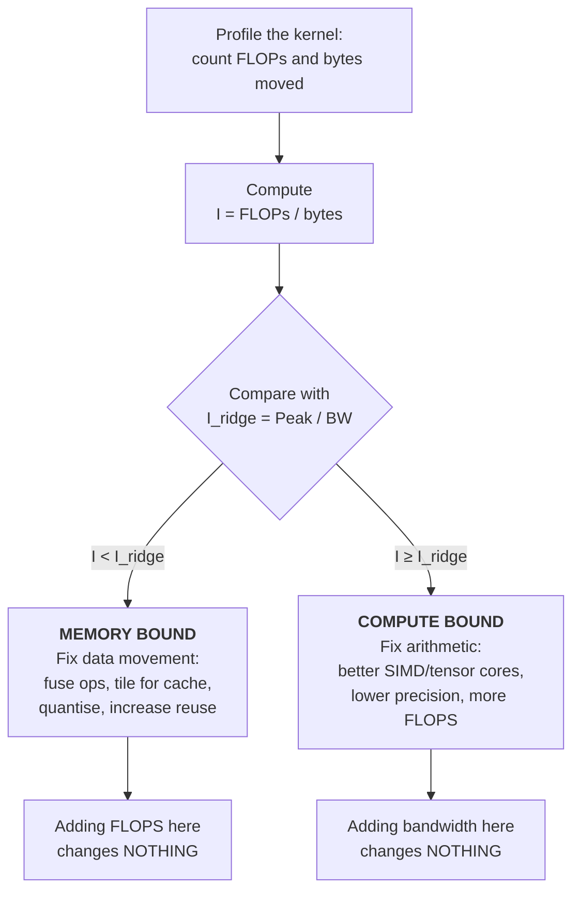
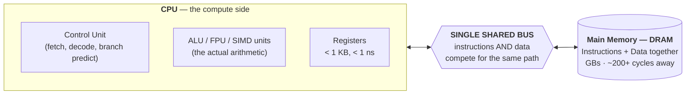
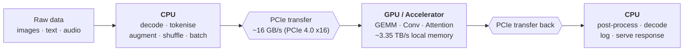

# Applied Accelerated Artificial Intelligence — Week 01, Segment 1
## CPU Architecture and AI Workloads

> **Course:** NPTEL — *Applied Accelerated Artificial Intelligence*
> **Instructor:** Dr. Satyajit Das, Dept. of Computer Science and Engineering, IIT Guwahati
> **Week 01:** AI System Hardware & Accelerators
> **Segment 1 of 5:** *"Understanding how CPUs are structured and why AI demands more than a general-purpose processor"*

---

## Table of Contents

1. [Where This Segment Sits: The Week 01 Roadmap](#1-where-this-segment-sits-the-week-01-roadmap)
2. [Learning Objectives](#2-learning-objectives)
3. [From One Line of Python to Silicon](#3-from-one-line-of-python-to-silicon)
4. [CPU Microarchitecture I — The Five-Stage Pipeline](#4-cpu-microarchitecture-i--the-five-stage-pipeline)
5. [CPU Microarchitecture II — Superscalar Execution](#5-cpu-microarchitecture-ii--superscalar-execution)
6. [CPU Microarchitecture III — Out-of-Order Execution & the Reorder Buffer](#6-cpu-microarchitecture-iii--out-of-order-execution--the-reorder-buffer)
7. [CPU Microarchitecture IV — Branch Prediction](#7-cpu-microarchitecture-iv--branch-prediction)
8. [The Cache Hierarchy](#8-the-cache-hierarchy)
9. [Modern CPU Specifications in AI Context](#9-modern-cpu-specifications-in-ai-context)
10. [Instruction-Level Parallelism (ILP) and Its Ceiling](#10-instruction-level-parallelism-ilp-and-its-ceiling)
11. [SIMD — Data-Level Parallelism](#11-simd--data-level-parallelism)
12. [The Parallelism Gap, Quantified](#12-the-parallelism-gap-quantified)
13. [Arithmetic Intensity — The Master Metric](#13-arithmetic-intensity--the-master-metric)
14. [The Roofline Model](#14-the-roofline-model)
15. [The von Neumann Bottleneck & the Memory Wall](#15-the-von-neumann-bottleneck--the-memory-wall)
16. [Impact on AI Workloads — The 70B Parameter Case Study](#16-impact-on-ai-workloads--the-70b-parameter-case-study)
17. [Where CPUs Still Excel in the AI Pipeline](#17-where-cpus-still-excel-in-the-ai-pipeline)
18. [Heterogeneous Computing Philosophy](#18-heterogeneous-computing-philosophy)
19. [Summary & Golden Rules](#19-summary--golden-rules)
20. [Mini-Glossary](#20-mini-glossary)
21. [Editorial Notes: Transcript Corrections](#21-editorial-notes-transcript-corrections)

---

## 1. Where This Segment Sits: The Week 01 Roadmap

Week 01 covers **AI System Hardware & Accelerators** and is split into five segments. Understanding the map first makes it much easier to see *why* Segment 1 spends so long on something as apparently un-AI as a CPU pipeline.



| Segment | Topic | What it answers |
|---|---|---|
| 1 | **CPU architecture & AI workloads** | How is a CPU built? Why is a general-purpose processor not enough for AI? |
| 2 | **Memory hierarchy** | Data is the essential ingredient of any AI workload — *where does it live*, and how does the hierarchy shape deployment performance? |
| 3 | **GPUs and accelerators** | NVIDIA GPUs, Google TPUs, AMD parts — domain-specific silicon for AI. |
| 4 | **Interconnects** | Modern high-performance interconnects, what they mean, and what performance they bring to an AI deployment. |
| 5 | **AI software stack** | From `import torch` in Python all the way down to the silicon — which layer maps where, and how each layer contributes to performance. |

**The through-line of the whole week:** we are *accelerating* AI workloads, so we must first agree on the **metrics** that define acceleration. Segment 1 introduces those metrics — FLOPS, memory bandwidth, cache capacity, arithmetic intensity — and they are reused for the rest of the course.

---

## 2. Learning Objectives

Straight from the slide deck, the five objectives for Segment 1:

| # | Objective |
|---|---|
| 01 | Describe the key microarchitectural components of a modern CPU (pipeline, cache, ALU) |
| 02 | Explain Instruction-Level Parallelism (ILP) and its limits for AI workloads |
| 03 | Differentiate **latency-optimised** (CPU) vs. **throughput-optimised** (GPU) designs |
| 04 | Identify why **FLOPS**, **memory bandwidth**, and **cache capacity** are critical AI metrics |
| 05 | Analyse the **von Neumann bottleneck** and its impact on DNN inference |

A useful way to hold all five in your head:

> Objectives 01–02 are about **how a CPU extracts performance**.
> Objective 03 is about **why that strategy is the wrong strategy for AI**.
> Objectives 04–05 are about **how to measure and diagnose the mismatch**.

---

## 3. From One Line of Python to Silicon

Start with the simplest possible statement:

```python
x = a + b        # one line of Python
```

This innocuous line does not "just happen." It is transformed into a **sequence of machine instructions** that must be executed inside the CPU's pipeline. Something like:

```asm
load  r1, [a]      ; fetch operand a from memory into a register
load  r2, [b]      ; fetch operand b from memory into a register
add   r3, r1, r2   ; the actual arithmetic in the ALU
store [x], r3      ; write the result back to memory
```

Two observations that set up the entire segment:

1. **Only one of those four instructions does arithmetic.** Three of them are *data movement*. This ratio is the seed of the memory-wall problem discussed in §15.
2. Each instruction travels through a **fixed sequence of pipeline stages**. That sequence is the subject of the next section.

> **Note on scope (from the lecture):** we deliberately do *not* go into deep microarchitecture detail at this stage. The goal is to understand **where the bottlenecks are**, not to design a CPU.

---

## 4. CPU Microarchitecture I — The Five-Stage Pipeline

Modern CPUs execute instructions in a **pipeline**: the work of an instruction is chopped into stages, and different instructions occupy different stages at the same time — exactly like a factory assembly line.

The classical (and still pedagogically standard) **five-stage pipeline**:


| Stage | Name | What physically happens |
|---|---|---|
| 1 | **IF** — Instruction Fetch | The instruction is fetched from memory (in practice, from the instruction cache). |
| 2 | **ID** — Instruction Decode | The bit pattern is decoded: *what operation is this, which registers does it touch?* |
| 3 | **EX** — Execute | The **actual operation** happens — this is where the **ALU** (Arithmetic Logic Unit) / FPU lives. |
| 4 | **MEM** — Memory Access | Memory is accessed, either to **read** data or to **write** data. |
| 5 | **WB** — Write Back | The result is written back into the CPU's **register** file. |

### 4.1 Why pipelining helps — the arithmetic

Let:
- $N$ = number of instructions
- $k$ = number of pipeline stages ($k = 5$ here)
- $\tau$ = time for one stage (one clock cycle)

**Without pipelining**, each instruction must complete all $k$ stages before the next one starts:

$$T_{\text{no-pipe}} = N \times k \times \tau$$

**With pipelining**, the first instruction takes $k$ cycles to drain the pipe, and after that one instruction completes *every* cycle:

$$T_{\text{pipe}} = \big(k + (N-1)\big) \times \tau$$

The speedup is therefore:

$$S = \frac{T_{\text{no-pipe}}}{T_{\text{pipe}}} = \frac{N k \tau}{(k + N - 1)\tau} = \frac{Nk}{k + N - 1}$$

Take the limit for a long instruction stream:

$$\lim_{N \to \infty} S = \lim_{N \to \infty} \frac{Nk}{k + N - 1} = \lim_{N \to \infty} \frac{k}{\frac{k-1}{N} + 1} = k$$

**Result:** an ideal $k$-stage pipeline gives up to a **$k\times$ speedup** — for $k=5$, up to $5\times$ — *without* increasing the clock frequency. Concretely, for $N = 1000$ and $k = 5$:

$$S = \frac{1000 \times 5}{5 + 1000 - 1} = \frac{5000}{1004} \approx 4.98$$

The key concept that falls out: in steady state, **throughput is one instruction per cycle**, so the ideal

$$\text{CPI}_{\text{ideal}} = 1 \qquad \Longleftrightarrow \qquad \text{IPC}_{\text{ideal}} = 1$$

where CPI = Cycles Per Instruction and IPC = Instructions Per Cycle ($\text{IPC} = 1/\text{CPI}$).

This "one instruction per cycle" ceiling is exactly what superscalar execution attacks next.

---

## 5. CPU Microarchitecture II — Superscalar Execution

If a pipeline caps you at 1 instruction/cycle, the obvious next move is: **replicate the datapath**. Copy the fetch/decode/execute/memory/writeback hardware into **several parallel execution engines** and issue multiple instructions per cycle.

That is **superscalar execution**.

> **From the lecture:** *"All the modern processors are basically superscalar engines. There are no scalar engines doing only a single pipeline — rather they do a lot of pipelining, meaning **four to six instructions issued at the same time**, and they go through these pipeline stages."*

### 5.1 Visualising a 2-wide superscalar pipeline

Two instructions enter every cycle, so at any moment ten instructions are in flight across five stages:

| Cycle → | 1 | 2 | 3 | 4 | 5 | 6 | 7 |
|---|---|---|---|---|---|---|---|
| Instr 1 | IF | ID | EX | MEM | **WB** | | |
| Instr 2 | IF | ID | EX | MEM | **WB** | | |
| Instr 3 | | IF | ID | EX | **MEM** | WB | |
| Instr 4 | | IF | ID | EX | **MEM** | WB | |
| Instr 5 | | | IF | ID | **EX** | MEM | WB |
| Instr 6 | | | IF | ID | **EX** | MEM | WB |
| Instr 7 | | | | IF | **ID** | EX | MEM |
| Instr 8 | | | | IF | **ID** | EX | MEM |

(The deck's Fig. 1 shows precisely this staircase; the highlighted column is one instant in time with all five stages simultaneously busy.)

### 5.2 The arithmetic of superscalar width

Let $W$ = **issue width** (instructions issued per cycle). Then:

$$\text{IPC}_{\text{ideal}} = W \qquad\Longrightarrow\qquad \text{CPI}_{\text{ideal}} = \frac{1}{W}$$

For a modern CPU with $W = 4$ and clock $f = 3\ \text{GHz}$, the theoretical instruction throughput is:

$$\text{Instr/s} = W \times f = 4 \times 3 \times 10^9 = 1.2 \times 10^{10}\ \text{instructions/second}$$

That is 12 billion instructions per second **per core** — impressive, and yet §12 will show it is nowhere near enough for AI.

> **Important intuition to carry forward:** all of this — deep pipeline, superscalar issue, out-of-order scheduling, branch prediction, plus an operating system running on top — is happening *simultaneously* inside a single CPU core. The CPU is an extraordinarily **sophisticated** machine. Its sophistication is spent on making a *single, serial, unpredictable* instruction stream go fast. That is a completely different design goal from an AI workload.

---

## 6. CPU Microarchitecture III — Out-of-Order Execution & the Reorder Buffer

### 6.1 The problem: stalls

Suppose instruction #4 is waiting for data to arrive from memory. In a strictly **in-order** machine, instructions #5, #6, #7… all wait too, even if they are completely independent. The whole pipeline **stalls**.

### 6.2 The fix: execute out of order

**Out-of-Order (OoO) execution** means the CPU checks dependencies and, if instruction #5 is *ready*, runs it while #4 waits.

> **From the lecture:** *"Instruction four is waiting for data to come from memory. At that time, if instruction five — the next instruction supposed to get executed — is ready to be executed, it will be executed. So the order of execution is no longer sequential but rather, based on the dependencies, we can execute in an out-of-order fashion."*

Program *semantics* are preserved because results are **retired (committed) in order**, even though they were **executed out of order**.

### 6.3 The Reorder Buffer (ROB) and its window

The hardware structure that makes this possible is the **reorder buffer**. It is a look-ahead window over the instruction stream:

> **From the lecture:** *"Modern CPUs have this buffer called the reorder buffer. The reorder buffer looks ahead around **200 to 250 instructions** in advance and sees which instructions are dependent and which instructions we can execute early, even if stalls happen in the previous instructions."*

$$\text{OoO window} \approx 200\text{–}250\ \text{instructions}$$

This window is **inherently limited** — and that limit is exactly what caps ILP. Here is the quantitative argument:

**How many instructions must be in flight to fully hide a DRAM miss?**

To keep a $W$-wide machine busy for $L$ cycles of memory latency, you need enough independent work queued:

$$N_{\text{required}} = W \times L$$

Plug in the numbers this lecture gives us — $W = 4$ instructions/cycle, $L \approx 200$ cycles for a DRAM access:

$$N_{\text{required}} = 4 \times 200 = 800\ \text{instructions}$$

Compare against the hardware you actually have:

$$N_{\text{available}} = 250\ \text{ROB entries}$$

$$\frac{N_{\text{available}}}{N_{\text{required}}} = \frac{250}{800} = 0.3125 = 31.25\%$$

**Interpretation:** even in the *best possible* case — 250 perfectly independent instructions, zero hazards — the reorder buffer can only cover about **31%** of a single DRAM miss. The remaining ~69% is dead time. This single calculation is the mechanical reason the memory wall (§15) cannot be engineered away with a bigger OoO window.

---

## 7. CPU Microarchitecture IV — Branch Prediction

The fourth pillar. Conditional branches (`if`, loop back-edges) are a problem for pipelines: by the time the CPU *knows* which way a branch goes, it has already fetched several instructions down one path.

**Branch predictors** guess the outcome ahead of time and speculatively fetch down the predicted path. If the guess is right, the pipeline never stalls. If wrong, the speculative work is discarded and the pipeline is flushed.

> **From the lecture:** *"There will be prediction units which are seeing which branch to take… working tirelessly to see which conditional branches to be taken."*

### 7.1 Cost of a misprediction (worked)

Let $p$ = prediction accuracy, and $P$ = misprediction penalty in cycles (pipeline depth that must be refilled). The average added cost per branch is:

$$\text{Penalty}_{\text{avg}} = (1 - p) \times P$$

For a good modern predictor, $p \approx 0.95$ and a deep pipeline with $P \approx 15$ cycles:

$$\text{Penalty}_{\text{avg}} = (1 - 0.95) \times 15 = 0.05 \times 15 = 0.75\ \text{cycles per branch}$$

If branches are ~20% of the instruction mix, the CPI contribution is:

$$\Delta\text{CPI} = 0.20 \times 0.75 = 0.15\ \text{cycles/instruction}$$

Small — *because the predictor is good*. Drop accuracy to $p = 0.80$ and the same arithmetic gives $\Delta\text{CPI} = 0.20 \times (0.20 \times 15) = 0.60$, a fourfold worsening. This is why "branchy" code is CPU territory and GPU poison.

> ⚠️ **Editorial note:** the $p$, $P$, and branch-frequency values above are illustrative and were *not* stated in the lecture; only the *qualitative* role of the branch predictor was. They are included to make the mechanism concrete.

### 7.2 The four pillars together

| Pillar | Type of parallelism / benefit | Key number from the lecture |
|---|---|---|
| **Pipelining** | Overlap stages of different instructions | 5 stages (IF, ID, EX, MEM, WB) |
| **Superscalar** | Multiple instructions issued per cycle | 4–6 instructions/cycle |
| **Out-of-order** | Skip past stalled instructions | ~200–250 instruction ROB window |
| **Branch prediction** | Avoid stalls on conditional branches | Reduces pipeline flushes |

All four together buy the CPU roughly **4–6 TFLOPS** of FP32 peak on a top-end server part (§9). Hold that number.

---

## 8. The Cache Hierarchy

Data does not magically appear at the ALU. It travels up a hierarchy, and **physical distance from the core determines latency**.

The lecture uses an Intel Xeon as the worked example.

### 8.1 The levels

| Level | Capacity | Latency (cycles) | Latency (approx. ns) | Scope | Notes |
|---|---|---|---|---|---|
| **CPU Registers** | < 1 KB | — | < 1 ns | Per-core | Fastest, tiny |
| **L1 cache** | ~32 KB per core (32–64 KB) | ~4 | ~1–4 ns | Per-core **private** | Tightly coupled to / integrated inside the core |
| **L2 cache** | ~256 KB per core (256–512 KB) | ~12 | ~4–12 ns | Per-core **private** | |
| **L3 cache (LLC)** | **30–60 MB shared** (~2.5 MB/core) | ~40 | ~15–40 ns | **Shared** across cores | Last level before leaving the chip |
| **DRAM (main memory)** | **GBs** | **~200+** | ~60–200 ns | System-wide | ⚠️ **This is where the "memory wall" lives** |
| **NVMe SSD** | TBs | — | ~50–200 **µs** | System-wide | Fig. 3 of the deck |

> ⚠️ **Transcript correction:** the auto-transcript renders L3 as *"3260 MB per core"*. That is a mis-transcription of **"30–60 MB"** (shared). The slide states **L3: 30–60 MB shared, ~2.5 MB/core**. A per-core 3260 MB L3 does not exist on any shipping CPU.

### 8.2 Reading the hierarchy as a trade-off

Two axes move in opposite directions as you descend:

```
   FAST, SMALL, EXPENSIVE                              SLOW, HUGE, CHEAP
   ◄──────────────────────────────────────────────────────────────────►

   Registers   L1        L2         L3          DRAM          NVMe SSD
   <1 KB     32-64 KB  256-512 KB  30-60 MB      GBs            TBs
   <1 ns     1-4 ns     4-12 ns    15-40 ns   ~60-200 ns    50-200 µs
     │         │           │           │            │              │
     └─────────┴───────────┴───────────┴────────────┴──────────────┘
        Increasing LATENCY ────────────────────────────────────►
        Increasing CAPACITY ───────────────────────────────────►
```

### 8.3 Converting cycles to nanoseconds

The lecture quotes cache latency in **cycles** and DRAM latency in **nanoseconds**. To reconcile, use:

$$t_{\text{ns}} = \frac{\text{cycles}}{f_{\text{clock}}}$$

At $f_{\text{clock}} = 3\ \text{GHz} = 3 \times 10^9\ \text{Hz}$, one cycle is:

$$\tau = \frac{1}{3 \times 10^9\ \text{s}^{-1}} = 3.33 \times 10^{-10}\ \text{s} = 0.333\ \text{ns}$$

Therefore:

$$
\begin{aligned}
t_{\text{L1}} &= 4 \times 0.333 = 1.33\ \text{ns} \\
t_{\text{L2}} &= 12 \times 0.333 = 4.00\ \text{ns} \\
t_{\text{L3}} &= 40 \times 0.333 = 13.3\ \text{ns} \\
t_{\text{DRAM}} &= 200 \times 0.333 = 66.7\ \text{ns} \approx 60\ \text{ns}
\end{aligned}
$$

These land squarely inside the slide's ranges (1–4 ns, 4–12 ns, 15–40 ns, ~60 ns), which confirms the internal consistency of the numbers.

> ⚠️ **Apparent discrepancy in the deck, resolved:** the slide text says *"Modern DRAM latency ~60 ns"* while Fig. 3 labels DRAM as *"~200 ns"*. Both are correct at different definitions: **~60 ns** is the idle/unloaded device latency (≈ 200 CPU cycles), whereas **~200 ns** is the *loaded* end-to-end latency seen by a real application once queueing, TLB walk, and memory-controller contention are included. The "200" appears in both places — once as cycles, once as nanoseconds — which is the source of confusion.

### 8.4 Average Memory Access Time (AMAT)

The single most useful formula for reasoning about a hierarchy. For a three-level cache:

$$\text{AMAT} = t_{L1} + m_{L1}\Big[t_{L2} + m_{L2}\big(t_{L3} + m_{L3}\,t_{\text{DRAM}}\big)\Big]$$

where $t_i$ = hit time at level $i$ and $m_i$ = **local** miss rate at level $i$.

**Worked example** using the Xeon latencies above, with plausible miss rates $m_{L1}=5\%$, $m_{L2}=20\%$, $m_{L3}=30\%$:

Step 1 — innermost bracket:

$$t_{L3} + m_{L3}\,t_{\text{DRAM}} = 40 + 0.30 \times 200 = 40 + 60 = 100\ \text{cycles}$$

Step 2 — next bracket out:

$$t_{L2} + m_{L2} \times 100 = 12 + 0.20 \times 100 = 12 + 20 = 32\ \text{cycles}$$

Step 3 — outermost:

$$\text{AMAT} = 4 + 0.05 \times 32 = 4 + 1.6 = \mathbf{5.6\ \text{cycles}}$$

**Interpretation:** the hierarchy converts a 200-cycle worst case into a 5.6-cycle average — a $200/5.6 \approx 36\times$ improvement. *But* this only works when there is **locality**. Now watch what happens when locality collapses. Set $m_{L1} = 90\%$, $m_{L2} = 90\%$, $m_{L3} = 90\%$ (a streaming, no-reuse access pattern — exactly what an embedding lookup or a weight-streaming LLM decode looks like):

$$
\begin{aligned}
&40 + 0.90 \times 200 = 40 + 180 = 220 \\
&12 + 0.90 \times 220 = 12 + 198 = 210 \\
&\text{AMAT} = 4 + 0.90 \times 210 = 4 + 189 = \mathbf{193\ \text{cycles}}
\end{aligned}
$$

The cache hierarchy has become almost useless — 193 cycles versus DRAM's 200. **Caches do not solve the memory wall; they only hide it when data is reused.** AI workloads with low reuse walk straight into the wall.

> ⚠️ **Editorial note:** the miss rates in §8.4 are illustrative, not from the lecture. The AMAT formula and the conclusion (caches help only under locality) are standard and directly support the lecture's memory-wall argument.

---

## 9. Modern CPU Specifications in AI Context

We need concrete hardware numbers, because "how fast is this CPU for AI?" must be answerable in units.

| Specification | Value | Source / note |
|---|---|---|
| **AMD EPYC 9654** | 96 cores, **384 MB L3**, **12-channel DDR5** | Server-grade; the reference CPU used in the roofline plot |
| **Intel Xeon Max 9480** | 60 cores + **HBM2e on-package** | Notable: high-bandwidth memory *on the CPU package* |
| **Peak FP32 (CPU)** | **~4–6 TFLOPS** | Top-end server CPU |
| **Peak FP32 (GPU)** | **~1000 TFLOPS** | State-of-the-art GPU, same slide |
| **Memory bandwidth (CPU, DDR5)** | **~300 GB/s** | |
| **Memory bandwidth (GPU, H100 HBM3)** | **~3.35 TB/s** | ≈ 3350 GB/s |

> ⚠️ **Transcript corrections:** the auto-transcript renders "EPYC" as *"API"* throughout, and "384 MB" as *"38 84 MB"*. Read them as **AMD EPYC 9654, 384 MB L3**.

### 9.1 The two ratios that define the whole course

**Compute ratio:**

$$\frac{\text{Peak}_{\text{GPU}}}{\text{Peak}_{\text{CPU}}} = \frac{1000\ \text{TFLOPS}}{5\ \text{TFLOPS}} = 200\times$$

**Bandwidth ratio:**

$$\frac{\text{BW}_{\text{GPU}}}{\text{BW}_{\text{CPU}}} = \frac{3350\ \text{GB/s}}{300\ \text{GB/s}} \approx 11.2\times$$

**Read this carefully.** The GPU is **200× faster at arithmetic** but only **11× faster at feeding itself**. That asymmetry — compute scaling far faster than bandwidth — is the memory wall reappearing at the accelerator level. It is *why* the roofline model exists.

### 9.2 Deriving peak FLOPS from first principles

A CPU's floating-point peak is fully determined by its structure:

$$\text{Peak FLOPS} = N_{\text{cores}} \times f_{\text{clock}} \times W_{\text{SIMD}} \times U_{\text{FMA}} \times 2$$

| Symbol | Meaning | Why it's there |
|---|---|---|
| $N_{\text{cores}}$ | Number of cores | Thread-level parallelism |
| $f_{\text{clock}}$ | Clock frequency (Hz) | Cycles per second |
| $W_{\text{SIMD}}$ | FP32 lanes per SIMD register | Data-level parallelism |
| $U_{\text{FMA}}$ | FMA execution units per core | Superscalar width for FP |
| $2$ | FLOPs per FMA | An FMA does $a \times b + c$ = **1 multiply + 1 add** = 2 FLOPs |

**Step 1 — SIMD width for AVX-512.** A 512-bit register holding FP32 (32-bit) values:

$$W_{\text{SIMD}} = \frac{512\ \text{bits}}{32\ \text{bits/FP32}} = 16\ \text{FP32 lanes}$$

**Step 2 — one core, one FMA unit, at 1.95 GHz:**

$$
\begin{aligned}
\text{Peak}_{\text{1 core, 1 FMA}} &= 1 \times (1.95 \times 10^9) \times 16 \times 1 \times 2 \\
&= 1.95 \times 10^9 \times 32 \\
&= 6.24 \times 10^{10}\ \text{FLOP/s} = 62.4\ \text{GFLOPS}
\end{aligned}
$$

**Step 3 — scale to 96 cores, one FMA unit:**

$$96 \times 6.24 \times 10^{10} = 5.99 \times 10^{12}\ \text{FLOP/s} = \mathbf{5.99\ \text{TFLOPS}}$$

**Step 4 — scale to 96 cores, two FMA units** (modern server cores have two 512-bit FMA pipes):

$$2 \times 5.99 \times 10^{12} = 1.198 \times 10^{13}\ \text{FLOP/s} = \mathbf{11.98\ \text{TFLOPS}} \approx 12\ \text{TFLOPS}$$

> ✅ **This reconciles a genuine inconsistency in the deck.** One slide says *"Peak FP32: ~4–6 TFLOPS (CPU)"*; another says *"96-core EPYC with AVX-512: ~12 TFLOPS."* Both are right at different assumptions: **~6 TFLOPS** with a single FMA pipe (or a lower sustained AVX-512 clock), **~12 TFLOPS** with dual FMA pipes. The **~6 TFLOPS** figure is the one that reproduces the roofline plot (see §14.3), so treat 4–6 TFLOPS as the *practical sustained* peak and 12 TFLOPS as the *theoretical dual-pipe* peak.

### 9.3 The Key Insight (slide, verbatim in spirit)

> **CPUs excel at serial, branchy, latency-sensitive workloads.**
> **AI training/inference is a massively parallel GEMM problem.**

These two sentences are the entire thesis of Segment 1. A CPU is a machine built to make *one* unpredictable instruction stream finish as soon as possible (**latency-optimised**). An AI workload is thousands of identical, independent multiply-accumulates that all need to finish *eventually* (**throughput-optimised**). Mismatched tool, mismatched job.

| Dimension | **CPU** — latency-optimised | **GPU** — throughput-optimised |
|---|---|---|
| Design goal | Minimise time for *one* task | Maximise tasks completed per second |
| Cores | Few (tens), very complex | Many (thousands), simple |
| Per-core machinery | Deep pipeline, wide OoO, big branch predictor, large private caches | Minimal control logic, no OoO, tiny per-thread state |
| Latency handling | **Avoid** it (caches, prefetch, OoO, speculation) | **Hide** it (switch to another warp/thread) |
| Best at | Serial code, branches, irregular control flow, IO | Dense regular math: GEMM, Conv, Attention |
| Peak FP32 | ~4–6 TFLOPS | ~1000 TFLOPS |
| Memory BW | ~300 GB/s (DDR5) | ~3350 GB/s (HBM3) |

---

## 10. Instruction-Level Parallelism (ILP) and Its Ceiling

**ILP** = the parallelism the hardware can extract from a *single* instruction stream, automatically, without the programmer asking.

### 10.1 The two ILP mechanisms

| Mechanism | How it increases ILP | Quantified limit |
|---|---|---|
| **Superscalar issue** | Issue 4–6 instructions per cycle via multiple execution ports | Width $W = 4$–$6$ |
| **Out-of-order window** | Look ahead past stalled instructions and execute ready ones early | ROB ≈ **200–250 instructions** |

### 10.2 What caps ILP: hazards

ILP is never fully realised because of **hazards** — situations where an instruction cannot proceed.

**Data hazards** (three named types, all listed on the slide):

| Hazard | Full name | Pattern | Example | Nature |
|---|---|---|---|---|
| **RAW** | Read After Write | Instr B reads what instr A writes | `A: r1 = r2+r3` then `B: r4 = r1+r5` | **True dependency** — cannot be removed |
| **WAR** | Write After Read | Instr B writes what instr A reads | `A: r4 = r1+r5` then `B: r1 = r6+r7` | **False (anti-)dependency** — removable by register renaming |
| **WAW** | Write After Write | Both write the same register | `A: r1 = r2+r3` then `B: r1 = r6+r7` | **False (output) dependency** — removable by renaming |

**Control hazards:** branches whose direction isn't known yet — mitigated by the branch predictor (§7), never eliminated.

> ⚠️ **Transcript correction:** the auto-transcript garbles these as *"the read after write after read right after write."* The slide is unambiguous: **RAW, WAR, WAW**.

### 10.3 Why ILP is structurally insufficient for AI

Three independent ceilings compound:

1. **Width ceiling.** $W = 4$–$6$. Even at 100% efficiency, that is at most 6 operations per cycle per core.
2. **Window ceiling.** 200–250 instructions of look-ahead vs. the 800 needed to cover one DRAM miss (§6.3) → 31% coverage.
3. **Hazard ceiling.** RAW dependencies are *true* dependencies; no amount of hardware cleverness removes them.

Effective ILP on real code is empirically around **1–2 IPC**, not 4–6. Against a workload needing **billions** of operations (§12), the gap is not something ILP can close. Hence: bring in **data-level parallelism**.

---

## 11. SIMD — Data-Level Parallelism

**SIMD = Single Instruction, Multiple Data.** The name is the definition: *one* instruction operates on *many* data elements simultaneously.

Instead of:

```
mul  r1, r2, r3     ; 1 multiply
mul  r4, r5, r6     ; 1 multiply
... × 16
```

you issue:

```
vmulps zmm1, zmm2, zmm3   ; 16 FP32 multiplies in ONE instruction
```

### 11.1 The SIMD extensions covered

| Extension | Register width | FP32 elements per cycle | Introduced | Vendor | Notes |
|---|---|---|---|---|---|
| **SSE** | 128-bit | **4× FP32** | 1999 (Pentium III) | Intel → both | The original x86 SIMD |
| **AVX-512** | **512-bit** | **16× FP32** | Modern Intel & AMD (Zen 4) | Both | *"Key for inference on CPUs"* |
| **AMX** | Matrix **tiles up to 1024 bytes** | Matrix-shaped, not vector-shaped | Recent Intel | **Intel only** | Accelerates **GEMM on-chip** |

**Deriving the lane counts** (so the numbers are never magic):

$$W_{\text{SSE}} = \frac{128}{32} = 4 \qquad W_{\text{AVX-512}} = \frac{512}{32} = 16$$

**AMX tile capacity** — how many FP32 values fit in a 1024-byte tile?

$$\frac{1024\ \text{bytes}}{4\ \text{bytes per FP32}} = 256\ \text{FP32 values per tile}$$

The crucial architectural difference: **SSE/AVX are *vector* units (1-D), AMX is a *matrix* unit (2-D).** A 2-D tile engine can perform a small matrix-multiply as a single operation, which is a step in the direction of what a GPU tensor core does — hence the phrase *"accelerates GEMM on-chip."*

> ⚠️ **Transcript corrections:** the auto-transcript renders SIMD variously as *"cmd," "CIMD," "CMD"*; SSE as *"SSC"*; and 512-bit registers as *"5.2 bit registers."* It also implies AVX-512 is AMD-only and AMX Intel-only — **AVX-512 is available on both Intel and AMD (Zen 4+); AMX is Intel-only.**

### 11.2 SIMD speedup, and where it stops

Theoretical speedup from vectorisation:

$$S_{\text{SIMD}} = W_{\text{SIMD}} = 16\times \quad \text{(AVX-512, FP32)}$$

But SIMD only helps when the data is **regular, contiguous, and independent**:

| Works beautifully | Defeats SIMD |
|---|---|
| Dense matrix multiply | Sparse / gather-scatter access |
| Element-wise tensor ops | Data-dependent branching per element |
| Convolutions | Variable-length sequences |
| Contiguous arrays | Pointer-chasing structures |

And critically — **SIMD widens the ALU, it does not widen the memory pipe.** A 16× wider compute unit fed by the same 300 GB/s DDR5 simply starves 16× faster. That observation is the hinge into the next section.

---

## 12. The Parallelism Gap, Quantified

The lecture poses the question directly: *"Does this bridge the gap of doing thousands or millions of parallel data operations for these matrix multiplications for AI workloads?"*

**Answer: not remotely.** Here is the arithmetic.

### 12.1 The workload: ResNet-50 inference

A single ResNet-50 inference requires:

$$\approx 4 \times 10^9\ \text{MAC operations (multiply-accumulate)}$$

Since 1 MAC = 1 multiply + 1 add = **2 FLOPs**:

$$\text{FLOPs}_{\text{ResNet-50}} = 4 \times 10^9\ \text{MAC} \times 2\ \frac{\text{FLOP}}{\text{MAC}} = 8 \times 10^9\ \text{FLOP} = 8\ \text{GFLOP}$$

**And that is for ONE image.** A training run touches millions of images across many epochs.

### 12.2 Time on each machine

$$t = \frac{\text{FLOPs required}}{\text{Peak FLOPS}}$$

**(a) Single core, scalar (no SIMD), 3 GHz, 1 FMA/cycle = 2 FLOP/cycle:**

$$\text{Peak} = 3 \times 10^9 \times 2 = 6 \times 10^9\ \text{FLOP/s} = 6\ \text{GFLOPS}$$

$$t = \frac{8 \times 10^9}{6 \times 10^9} = 1.33\ \text{s}$$

**(b) Single core with AVX-512, 3 GHz, 2 FMA pipes × 16 lanes × 2 FLOP:**

$$\text{Peak} = 3 \times 10^9 \times (2 \times 16 \times 2) = 3 \times 10^9 \times 64 = 1.92 \times 10^{11} = 192\ \text{GFLOPS}$$

$$t = \frac{8 \times 10^9}{1.92 \times 10^{11}} = 4.17 \times 10^{-2}\ \text{s} = 41.7\ \text{ms}$$

**(c) 96-core EPYC with AVX-512 — 12 TFLOPS:**

$$t = \frac{8 \times 10^9}{1.2 \times 10^{13}} = 6.67 \times 10^{-4}\ \text{s} = 0.667\ \text{ms}$$

**(d) NVIDIA H100 (Hopper) — ~2000 TFLOPS on TF32:**

$$t = \frac{8 \times 10^9}{2 \times 10^{15}} = 4 \times 10^{-6}\ \text{s} = 4\ \mu\text{s}$$

### 12.3 The gap, in one table

| Machine | Peak FP32/TF32 | ResNet-50 inference | Relative to H100 |
|---|---|---|---|
| 1 core, scalar | 6 GFLOPS | 1.33 s | 333,000× slower |
| 1 core, AVX-512 | 192 GFLOPS | 41.7 ms | 10,400× slower |
| 96-core EPYC + AVX-512 | **12 TFLOPS** | 0.667 ms | **167× slower** |
| **NVIDIA H100 (TF32)** | **~2000 TFLOPS** | **4 µs** | **1×** |

$$\frac{\text{Peak}_{\text{H100}}}{\text{Peak}_{\text{EPYC}}} = \frac{2000\ \text{TFLOPS}}{12\ \text{TFLOPS}} \approx 167\times$$

And the lecture's headline consequence:

> **For training LLMs, CPU-only is 100–1000× slower than GPU-based systems.**

### 12.4 Why SIMD couldn't save us — the intuition

Look at the ladder in §12.3. Going scalar → AVX-512 on one core bought us $1.33\,\text{s} / 41.7\,\text{ms} \approx 32\times$. Going to 96 cores bought another $\approx 62\times$. Together, roughly $2000\times$. **And it still wasn't enough**, because the required work is measured in billions of operations *per inference*, and the GPU brings $167\times$ more on top of that.

> ⚠️ **Note on the GPU peak figure:** the specification slide says *"~1000 TFLOPS (GPU)"* while the parallelism-gap slide says *"~2000 TFLOPS (TF32)."* These are consistent if 1000 TFLOPS is **dense** TF32 tensor throughput and 2000 TFLOPS is the same figure **with 2:1 structured sparsity**, which is how vendors typically quote the doubled number. The roofline plot in the deck uses the **2000 TFLOPS** roof (verified numerically in §14.3).

---

## 13. Arithmetic Intensity — The Master Metric

This is the single most important concept in Segment 1, and the one the lecturer explicitly says you must learn to compute.

### 13.1 Definition

$$\boxed{\ I = \frac{\text{Total FLOPs performed}}{\text{Total bytes moved from memory}}\ } \qquad \left[\frac{\text{FLOP}}{\text{byte}}\right]$$

In words: **how much arithmetic do I get out of each byte I drag out of memory?**

### 13.2 The two properties that make it powerful

| Quantity | Depends on | Fixed by |
|---|---|---|
| **Arithmetic intensity $I$** | The **algorithm / kernel / workload** | The *software* you wrote |
| **Peak FLOPS, Peak BW** | The **hardware** | The *machine* you bought |

$I$ is a property of your *code*, not your *chip*. The same kernel has the same $I$ on a CPU, a GPU, and a TPU. This is what makes it a portable diagnostic.

### 13.3 Worked example — deriving $I$ for a matrix multiply

Consider $C = A \times B$ where all matrices are $n \times n$ FP32.

**Step 1 — count FLOPs.** Each output element $C_{ij} = \sum_{k=1}^{n} A_{ik}B_{kj}$ requires $n$ multiplies and $n$ adds = $2n$ FLOPs. There are $n^2$ output elements:

$$\text{FLOPs} = n^2 \times 2n = 2n^3$$

**Step 2 — count bytes (best case, everything read exactly once).** Three matrices, $n^2$ elements each, 4 bytes per FP32:

$$\text{Bytes} = 3 n^2 \times 4 = 12 n^2$$

**Step 3 — form the ratio:**

$$I_{\text{GEMM}} = \frac{2n^3}{12n^2} = \frac{n}{6}$$

**Step 4 — evaluate.** For $n = 6000$:

$$I = \frac{6000}{6} = 1000\ \frac{\text{FLOP}}{\text{byte}}$$

✅ **This reproduces the slide's figure exactly:** *"GEMM (large): ~1000 FLOP/byte — compute bound on GPU."*

**The critical structural insight:** $I_{\text{GEMM}} = n/6$ **grows linearly with matrix size.** Bigger matrices ⇒ more arithmetic per byte ⇒ more compute-bound ⇒ better GPU utilisation. *This is why AI frameworks fight so hard to batch operations into large GEMMs.*

### 13.4 The workload catalogue

| Workload | Arithmetic intensity | Classification | Why |
|---|---|---|---|
| **Large GEMM (MatMul)** | **~1000 FLOP/byte** | **Compute bound** (even on GPU) | $I = n/6$ grows with $n$; enormous data reuse |
| **Transformer attention (Flash)** | ~50 FLOP/byte | Compute bound on CPU; **memory bound on GPU** | $O(n^2)$ access pattern per layer |
| **ResNet-50 (conv)** | Near the CPU ridge point | Borderline / compute bound | Sits *"almost towards the intersection point"* |
| **LayerNorm / BatchNorm** | **~3–5 FLOP/byte** | **Memory bound** | Read tensor, compute mean/variance, write back — almost no reuse |
| **Embedding lookup** | **~1 FLOP/byte** | **Memory bound everywhere** | Pure gather: load a byte, do ~one operation, done |

> **From the lecture:** *"Embedding lookup — you have one floating-point operation per byte. So you load one byte of data and you do one floating-point operation. This is your memory bound. You do not do many operations for your loaded data."*

### 13.5 Attainable performance for a memory-bound kernel — worked

An embedding lookup on an H100 ($I = 1$, BW = 3350 GB/s, peak = 2000 TFLOPS):

$$P_{\text{attainable}} = \min(\text{Peak},\ \text{BW} \times I) = \min\big(2\times10^{15},\ 3.35\times10^{12} \times 1\big)$$

$$= \min(2\times10^{15},\ 3.35\times10^{12}) = 3.35\ \text{TFLOP/s}$$

As a fraction of the machine's capability:

$$\frac{3.35 \times 10^{12}}{2 \times 10^{15}} \times 100\% = 0.168\%$$

**You are using 0.17% of a $30,000 GPU.** The other 99.83% of the silicon sits idle waiting for DRAM. This is the memory wall, priced.

Repeat for LayerNorm at $I = 4$:

$$P = \min\big(2\times10^{15},\ 3.35\times10^{12}\times 4\big) = 13.4\ \text{TFLOP/s} = 0.67\%\ \text{of peak}$$

Still catastrophic. **This is why operator fusion exists** — fusing LayerNorm into an adjacent GEMM raises the *fused kernel's* $I$ by eliminating the intermediate round-trip to DRAM.

---

## 14. The Roofline Model

The roofline model is a single plot that tells you, for any workload on any machine, **what is limiting you and therefore what to fix**.

*Reference: Williams, Waterman & Patterson, "Roofline: An Insightful Visual Model," CACM 2009.*

### 14.1 The equation

$$\boxed{\ P_{\text{attainable}} = \min\big(P_{\text{peak}},\ \ \text{BW}_{\text{peak}} \times I\big)\ }$$

Read as two competing ceilings:

- $P_{\text{peak}}$ — a **horizontal roof**: you can never exceed the machine's arithmetic throughput, no matter how much data reuse you have.
- $\text{BW}_{\text{peak}} \times I$ — a **sloped roof** (slope = bandwidth on a log-log plot): if you only pull $B$ bytes/s and do $I$ FLOPs per byte, you achieve at most $B \times I$ FLOP/s.

**Axes:**
- **x-axis:** arithmetic intensity $I$ (FLOP/byte) — a property of your **workload**
- **y-axis:** attainable performance (GFLOP/s) — also expressible as **throughput** = operations per unit time

### 14.2 The ridge point

The **ridge point** is where the two roofs meet. Set them equal:

$$P_{\text{peak}} = \text{BW}_{\text{peak}} \times I_{\text{ridge}}$$

$$\boxed{\ I_{\text{ridge}} = \frac{P_{\text{peak}}}{\text{BW}_{\text{peak}}}\ }$$

And the decision rule that follows:

$$
\text{Workload is}
\begin{cases}
\textbf{memory bound} & \text{if } I < I_{\text{ridge}} \quad \text{(left of the ridge)}\\[4pt]
\textbf{compute bound} & \text{if } I \geq I_{\text{ridge}} \quad \text{(right of the ridge)}
\end{cases}
$$



### 14.3 Deriving the ridge points in the deck's Fig. 2

**CPU (AMD EPYC 9654).** First derive the DDR5 bandwidth from the specification "12-channel DDR5":

$$\text{BW} = N_{\text{channels}} \times \text{Data rate} \times \text{Bus width in bytes}$$

$$= 12 \times (4800 \times 10^6\ \text{transfers/s}) \times 8\ \text{bytes/transfer}$$

$$= 12 \times 4800 \times 8 \times 10^6 = 460{,}800 \times 10^6\ \text{B/s} = 460.8\ \text{GB/s}$$

(The slide's "~300 GB/s" is the *sustained/achievable* figure; 460.8 GB/s is the theoretical peak — real DDR5 efficiency is ~65–70%, and $460.8 \times 0.65 \approx 300$. Both numbers are correct at different definitions.)

Now the ridge, using the theoretical peaks:

$$I_{\text{ridge}}^{\text{CPU}} = \frac{P_{\text{peak}}}{\text{BW}} = \frac{5990\ \text{GFLOP/s}}{460.8\ \text{GB/s}} = 13.0\ \frac{\text{FLOP}}{\text{byte}}$$

✅ **The deck's plot is labelled "Ridge 13.0 FLOP/B" for the CPU.** Exact match — and note this confirms the ~6 TFLOPS (single-FMA-pipe) figure is the one used for the CPU roof, resolving the 6-vs-12 TFLOPS question from §9.2.

**GPU (NVIDIA H100 SXM5).**

$$I_{\text{ridge}}^{\text{GPU}} = \frac{2{,}000{,}000\ \text{GFLOP/s}}{3350\ \text{GB/s}} = 597.0\ \frac{\text{FLOP}}{\text{byte}}$$

✅ **The deck's plot is labelled "Ridge 597.0 FLOP/B" for the GPU.** Exact match, and it confirms the GPU roof is drawn at 2000 TFLOPS.

### 14.4 Reading the plot

```
Attainable
Performance
(GFLOP/s)
          │                                              GPU roof: 2000 TFLOP/s
   10^6   ┤                                    ┌─────────────────────────────
          │                                   ╱│              ● Large GEMM
          │                                  ╱ │                (~1000 F/B)
          │                                 ╱  │
   10^5   ┤                                ╱   ├─ GPU ridge = 597 FLOP/B
          │                               ╱    │
          │        ● Transformer Attn    ╱     │
   10^4   ┤          (~50 F/B)          ╱      │
          │                            ╱       │
          │  ┌────────────────────────────────────────  CPU roof: ~6 TFLOP/s
   10^3   ┤ ╱  ● LayerNorm/BatchNorm   │
          │╱     (~3-5 F/B)            └─ CPU ridge = 13 FLOP/B
          ╱
   10^2   ┤  ● Embedding Lookup (~1 F/B)
          └──┬──────┬──────┬──────┬──────┬──────┬──────►
           10^-2  10^-1   10^0   10^1   10^2   10^3   10^4
                    Arithmetic Intensity (FLOP / byte)

          ◄─────── MEMORY BOUND ────────►◄──── COMPUTE BOUND ────►
```

Now walk each labelled workload:

| Workload | $I$ | vs. CPU ridge (13) | vs. GPU ridge (597) | Verdict |
|---|---|---|---|---|
| **Embedding lookup** | ~1 | $1 < 13$ → memory bound | $1 < 597$ → memory bound | **Memory bound everywhere** |
| **LayerNorm / BatchNorm** | ~3–5 | $< 13$ → memory bound | $< 597$ → memory bound | **Memory bound everywhere** |
| **Transformer attention** | ~50 | $50 > 13$ → **compute bound on CPU** | $50 < 597$ → **memory bound on GPU** | **Classification flips with hardware!** |
| **Large GEMM** | ~1000 | $\gg 13$ → compute bound | $1000 > 597$ → **compute bound** | **Compute bound everywhere** |

> **From the lecture, on transformer attention:** *"That is way above the maximum compute performance we can get from the CPU itself. And this lies in the memory-bound [region] of this GPU."*

**The single most important lesson on this plot:** *the same kernel can be compute bound on one machine and memory bound on another.* Attention is compute-limited on a CPU (the CPU simply cannot do the math fast enough) but memory-limited on an H100 (the GPU does the math instantly and then waits for HBM). **Never say "this kernel is memory bound" without naming the hardware.**

### 14.5 A small helper for your own kernels

```python
def roofline(flops, bytes_moved, peak_flops, peak_bw):
    """
    flops       : total floating-point operations in the kernel
    bytes_moved : total bytes read+written from/to DRAM
    peak_flops  : machine peak, FLOP/s   (e.g. 2e15 for H100 TF32)
    peak_bw     : machine peak, bytes/s  (e.g. 3.35e12 for H100 HBM3)
    """
    I         = flops / bytes_moved          # arithmetic intensity, FLOP/byte
    I_ridge   = peak_flops / peak_bw         # ridge point of THIS machine
    attainable = min(peak_flops, peak_bw * I)

    return {
        "arithmetic_intensity": I,
        "ridge_point":          I_ridge,
        "bound":                "COMPUTE" if I >= I_ridge else "MEMORY",
        "attainable_FLOPs":     attainable,
        "pct_of_peak":          100 * attainable / peak_flops,
    }

# Embedding lookup on an H100: 1 FLOP per byte
print(roofline(flops=1e9, bytes_moved=1e9,
               peak_flops=2e15, peak_bw=3.35e12))
# → bound: 'MEMORY', pct_of_peak: 0.1675   (i.e. 0.17% of the GPU is used)

# Large GEMM (n = 6000) on an H100: I = n/6 = 1000 FLOP/byte
print(roofline(flops=2*6000**3, bytes_moved=12*6000**2,
               peak_flops=2e15, peak_bw=3.35e12))
# → bound: 'COMPUTE', pct_of_peak: 100.0
```

---

## 15. The von Neumann Bottleneck & the Memory Wall

### 15.1 The architecture

Nearly every computer you have ever used is a **von Neumann machine**: a single processing unit connected to a single main memory that holds **both instructions and data**, over **one shared bus**.



**The consequence:** because instructions and data share one path, **memory accesses are serialised**. Compute units **starve** while they wait.

> **From the lecture:** *"Single shared bus between the CPU and memory. In the cache you have the segregation between the data and instruction, but essentially your data and instructions come from DRAM. So memory access is serialised and compute starves while waiting for the data."*

Note the nuance the lecturer flags: caches *are* split (separate L1-I and L1-D). But that split is only a local optimisation — everything ultimately funnels back to a unified DRAM.

### 15.2 The memory wall — the historical divergence

*Reference: Wulf & McKee, "Hitting the Memory Wall," ACM SIGARCH 1995.*

| Quantity | Historical growth rate | Period |
|---|---|---|
| **CPU clock / compute speed** | **~60% per year** (roughly 1.5–2× gain per year) | 1987–2002 |
| **DRAM bandwidth** | **~10% per year** | Same period |
| **The resulting gap** | **~50% per year** (per the deck's "Processor Memory Gap" chart) | Same period |

**Deriving the gap growth rate.** If compute grows by a factor $1.60$ per year and memory by $1.10$ per year, the *ratio* grows by:

$$g = \frac{1.60}{1.10} = 1.4545 \quad \Longrightarrow \quad \textbf{45.5\% per year}$$

which is the deck's "~50% per year," rounded.

**Compounding over 15 years (1987 → 2002):**

$$\text{Gap factor} = (1.4545)^{15}$$

Take logarithms:

$$\ln(1.4545) = 0.3747 \qquad 15 \times 0.3747 = 5.621 \qquad e^{5.621} \approx 276$$

$$\boxed{\text{Gap} \approx 276\times \text{ over 15 years}}$$

Cross-check the components independently:

$$1.60^{15} = e^{15 \ln 1.60} = e^{15 \times 0.4700} = e^{7.05} \approx 1155$$
$$1.10^{15} = e^{15 \ln 1.10} = e^{15 \times 0.0953} = e^{1.430} \approx 4.18$$
$$\frac{1155}{4.18} \approx 276 \quad ✓$$

Compute got **~1155× faster**. Memory got **~4× faster**. The mismatch is a factor of ~276.

### 15.3 Two walls, not one

Around **2002–2005** two independent walls were hit simultaneously:

| Wall | What happened | Consequence |
|---|---|---|
| **Memory wall** | DRAM bandwidth stopped keeping pace with compute | Compute units idle, waiting for data |
| **Power wall** | Clock frequency could no longer be raised past ~3.5–4 GHz without melting the chip | Frequency scaling ended → industry pivoted to **multi-core** |

> **From the lecture:** *"If you increase the clock frequency beyond 3.5 [GHz], essentially you will melt the chip itself. So CPU clock speed grew ~60% per year till 2002 — now it's plateaued."*

The physics behind the power wall (not derived in the lecture, but worth one line): dynamic power scales as

$$P_{\text{dynamic}} = \alpha \, C \, V^2 f$$

and since raising $f$ generally requires raising $V$ too, power rises roughly **cubically** with frequency. That is why 4 GHz became a practical ceiling.

### 15.4 The current-day numbers

| Parameter | Value |
|---|---|
| Modern DRAM latency | **~60 ns** (unloaded) |
| Cache-miss penalty | **200+ cycles** |
| Effective loaded DRAM latency | ~200 ns |

**Translating a miss into lost work.** At $W = 4$ instructions/cycle and a 200-cycle miss:

$$\text{Lost issue slots} = 4 \times 200 = 800\ \text{instruction slots}$$

Every single cache miss throws away the opportunity to execute 800 instructions. The reorder buffer can recover at most 250 of them (§6.3). **This is the memory wall in its most concrete form.**

---

## 16. Impact on AI Workloads — The 70B Parameter Case Study

### 16.1 The three AI workload classes

| Workload | Access pattern | Bound by | Reason |
|---|---|---|---|
| **Transformer attention** | $O(n^2)$ memory access per layer | Memory (on GPU) | Attention matrix scales quadratically with sequence length |
| **LLM inference (decode)** | Full weight sweep **per token** | **Memory** | Every generated token requires re-reading the entire model |
| **DNN training** | Large mini-batches | **Compute** | Big batches provide enough reuse to fill the arithmetic units |

The contrast between rows 2 and 3 deserves emphasis: **the same model is memory bound at inference and compute bound at training.** Batching is what changes the classification — training amortises a weight load across many samples; batch-1 decoding does not.

### 16.2 The headline calculation — 70B parameters in FP16

This is the worked example the deck highlights in its own callout box. Let us do every step.

**Step 1 — how many bytes is the model?**

FP16 = 16 bits = 2 bytes per parameter.

$$\text{Model size} = 70 \times 10^9\ \text{params} \times 2\ \frac{\text{bytes}}{\text{param}} = 140 \times 10^9\ \text{bytes} = \mathbf{140\ \text{GB}}$$

**Step 2 — how often must those bytes move?**

For **every single token generation step**, autoregressive decoding must read **every weight** to compute the next token. There is no way around it: each token's output depends on all 70 billion parameters.

$$\text{Bytes per token} = 140\ \text{GB}$$

**Step 3 — how long does that take at the memory bandwidth?**

$$t_{\text{token}} = \frac{\text{Bytes per token}}{\text{Memory bandwidth}} = \frac{140\ \text{GB}}{400\ \text{GB/s}}$$

$$t_{\text{token}} = 0.35\ \text{s} = \mathbf{350\ \text{ms per token}}$$

**Step 4 — convert to a user-facing throughput:**

$$\text{Throughput} = \frac{1}{t_{\text{token}}} = \frac{1}{0.35\ \text{s}} = 2.86\ \text{tokens/second}$$

A 100-token reply therefore takes:

$$100 \times 0.35\ \text{s} = 35\ \text{seconds}$$

> **The deck's own words:** *"For a 70-billion-parameter model in FP16, that is 140 gigabytes of data — loaded every single token generation step. At 400 GB/s bandwidth, that takes 350 milliseconds per token. **That is the bottleneck.**"*

### 16.3 Proving it is memory bound, not compute bound

Now compute the arithmetic intensity of this exact workload — this is the payoff of §13.

**Step 1 — FLOPs per token.** A forward pass through a dense transformer costs approximately **2 FLOPs per parameter** (one multiply + one add per weight):

$$\text{FLOPs per token} = 2 \times 70 \times 10^9 = 1.4 \times 10^{11}\ \text{FLOP} = 140\ \text{GFLOP}$$

**Step 2 — bytes per token:** $140 \times 10^9$ bytes (from §16.2).

**Step 3 — arithmetic intensity:**

$$I_{\text{LLM decode}} = \frac{1.4 \times 10^{11}\ \text{FLOP}}{1.4 \times 10^{11}\ \text{bytes}} = \mathbf{1.0\ \frac{\text{FLOP}}{\text{byte}}}$$

**Step 4 — classify against the H100 ridge point (597 FLOP/byte from §14.3):**

$$I = 1.0 \quad \lll \quad I_{\text{ridge}} = 597 \quad \Longrightarrow \quad \textbf{catastrophically memory bound}$$

**Step 5 — how much of the GPU is actually used?**

$$P_{\text{attainable}} = \text{BW} \times I = 400\ \text{GB/s} \times 1\ \frac{\text{FLOP}}{\text{byte}} = 400\ \text{GFLOP/s} = 0.4\ \text{TFLOP/s}$$

$$\text{Utilisation} = \frac{0.4\ \text{TFLOPS}}{2000\ \text{TFLOPS}} \times 100\% = \mathbf{0.02\%}$$

**Step 6 — sanity-check against pure compute time.** If memory were free:

$$t_{\text{compute}} = \frac{1.4 \times 10^{11}\ \text{FLOP}}{2 \times 10^{15}\ \text{FLOP/s}} = 7 \times 10^{-5}\ \text{s} = 0.07\ \text{ms}$$

Compare:

$$\frac{t_{\text{memory}}}{t_{\text{compute}}} = \frac{350\ \text{ms}}{0.07\ \text{ms}} = 5000\times$$

**The GPU spends 5000× longer waiting for weights than doing arithmetic.** Note that this arithmetic intensity of exactly 1.0 FLOP/byte places batch-1 LLM decoding in *the same roofline region as an embedding lookup* — the most memory-bound thing on the chart.

> ⚠️ **Editorial note:** Steps 1 and 3–6 of §16.3 extend the lecture's own 140 GB / 400 GB/s / 350 ms figures using the arithmetic-intensity framework the lecture teaches in §13. The lecture states the conclusion ("LLM inference: memory-bound") without deriving $I$; the derivation is added here because it makes the *why* unavoidable and ties §13, §14, and §16 into one story.

**And this immediately explains real engineering practice:**

| Technique | Effect on the equation | Why it works |
|---|---|---|
| **Quantisation** (FP16 → INT8/INT4) | Halves or quarters *bytes per token* | 140 GB → 35 GB at INT4 → 87.5 ms/token |
| **Batching** | Amortises one weight load across $B$ requests | Bytes stay ~140 GB, FLOPs scale by $B$ → $I$ rises to $\approx B$ |
| **KV caching** | Avoids recomputing past keys/values | Cuts redundant memory traffic |
| **Higher-bandwidth memory** (HBM3, 3350 GB/s) | Raises the denominator | $140/3350 = 41.8$ ms/token — an $8.4\times$ speedup |
| **Model/tensor parallelism** | Splits 140 GB across $N$ GPUs' aggregate bandwidth | Each GPU reads $140/N$ GB |

Every one of these is an attack on **bytes moved**, not on FLOPs. That is what "memory bound" *means* in practice.

---

## 17. Where CPUs Still Excel in the AI Pipeline

The lecturer is explicit that CPUs are **not obsolete**. They are indispensable — just for different parts of the pipeline.

### 17.1 Pre/post-processing — the CPU's domain

| Task | Why it belongs on a CPU |
|---|---|
| **Data ingestion, tokenisation, augmentation** | Branchy and irregular — exactly what branch prediction and OoO were built for |
| **OpenCV image decoding** | JPEG/PNG decode is serial, bit-level, control-heavy |
| **librosa audio processing** | Variable-length signals, irregular transforms |
| **NLTK / spaCy text parsing** | Rule-based, deeply branchy |
| **Dataset shuffling, batching, prefetching** | Managed by CPU DataLoader worker processes |

### 17.2 Model components that stay on CPU

| Component | Why |
|---|---|
| **Sparse operations** | Variable-length sequences, **dynamic graphs** in PyTorch — irregular access defeats SIMD and GPU warps alike |
| **Control flow in RL environments** | `step()`, `reset()` — pure branchy serial logic |
| **ONNX Runtime on CPU** | Viable in production for **lightweight models (< 10M params)** — for these the PCIe round-trip costs more than the compute saves |

> **From the lecture:** *"In reinforcement learning you have dynamic graphs which are sparse in nature. You need CPU intervention to effectively compute them."*

> ⚠️ **Transcript correction:** the auto-transcript renders ONNX Runtime as *"NX runtime."* The slide reads **ONNX Runtime**.

### 17.3 The dividing principle

| Characteristic | Send it to the **CPU** | Send it to the **GPU** |
|---|---|---|
| Regularity | Irregular, data-dependent | Regular, uniform |
| Control flow | Heavy branching | Little or none |
| Parallelism available | Low (tens of threads) | Massive (thousands) |
| Data size per op | Small | Large |
| Precision of the work | Exactness/serial ordering matters | Bulk numeric throughput matters |

---

## 18. Heterogeneous Computing Philosophy

The conclusion is not "CPU vs GPU." It is **CPU *and* GPU, each doing what it is good at.**



### 18.1 The division of labour

| **CPU** | **GPU / Accelerator** |
|---|---|
| Orchestration | Massively parallel tensor operations |
| Control flow | GEMM (general matrix multiply) |
| Serial computations | Convolutions |
| IO management | Attention |
| Data augmentation | |

### 18.2 The transfer tax — why "always profile before offloading"

The deck's rule of thumb:

$$\text{PCIe 4.0 x16} \approx 16\ \text{GB/s} \qquad\text{vs.}\qquad \text{GPU local memory} \approx 3350\ \text{GB/s}$$

$$\frac{3350}{16} \approx \mathbf{209\times}$$

**The link to the GPU is 209× slower than the GPU's own memory.** So offloading is only worth it if the compute saved exceeds the transfer cost.

**Break-even derivation.** Offloading $B$ bytes of work worth $F$ FLOPs is worthwhile only when:

$$\underbrace{\frac{F}{P_{\text{CPU}}}}_{\text{time on CPU}} \;>\; \underbrace{\frac{2B}{\text{BW}_{\text{PCIe}}}}_{\text{round-trip transfer}} \;+\; \underbrace{\frac{F}{P_{\text{GPU}}}}_{\text{time on GPU}}$$

(The factor 2 accounts for sending data over *and* bringing results back.)

Since $P_{\text{GPU}} \gg P_{\text{CPU}}$, the last term is usually negligible, giving the practical test:

$$\frac{F}{P_{\text{CPU}}} > \frac{2B}{\text{BW}_{\text{PCIe}}} \quad\Longleftrightarrow\quad \frac{F}{B} > \frac{2 \, P_{\text{CPU}}}{\text{BW}_{\text{PCIe}}}$$

Substituting $P_{\text{CPU}} = 6 \times 10^{12}$ FLOP/s and $\text{BW}_{\text{PCIe}} = 16 \times 10^9$ B/s:

$$I_{\text{min}} = \frac{2 \times 6 \times 10^{12}}{16 \times 10^9} = 750\ \frac{\text{FLOP}}{\text{byte}}$$

**Interpretation:** in the worst case — data starting on the host and results needed back on the host — a kernel needs arithmetic intensity above roughly **750 FLOP/byte** before naive offloading pays for itself. Only large GEMM (~1000 FLOP/byte) clears that bar. This is precisely why real frameworks *keep tensors resident on the GPU* across many kernels rather than shuttling them back and forth, and why **"always profile before offloading"** is the operational rule.

> ⚠️ **Editorial note:** the break-even derivation is an extension. The lecture and slide state the qualitative rule ("PCIe transfer overhead can dominate for small ops") and the 16 GB/s vs 3.35 TB/s numbers; the threshold is derived here from those numbers.

### 18.3 The diagnostic metric

> **Key Metric (from the slide):** Use `nvidia-smi` to check GPU utilisation. **If utilisation < 60%, the CPU is the bottleneck.**

```bash
# Live GPU utilisation, sampled every second
nvidia-smi --query-gpu=utilization.gpu,utilization.memory,memory.used \
           --format=csv --loop=1
```

If GPU utilisation is low while your job runs, the accelerator is starving. The fix is almost always on the **CPU side**: too few DataLoader workers, slow image decoding, unpinned host memory, or a synchronisation point in the training loop.

*Reference: NVIDIA Nsight Systems; Raschka et al., "Machine Learning with PyTorch and Scikit-Learn" (2022).*

---

## 19. Summary & Golden Rules

### 19.1 The five summary points from the deck

1. ✓ CPUs use **deep pipelines, caches, OoO execution, and SIMD** for **latency-optimised serial computation**.
2. ✓ The **memory wall** and **von Neumann bottleneck** constrain CPU performance for data-heavy AI tasks.
3. ✓ **SIMD extensions (AVX-512, AMX) partially close the gap** but cannot match GPU-scale parallelism.
4. ✓ **Arithmetic intensity** determines whether a workload is compute-bound or memory-bound **on any architecture**.
5. ✓ CPUs remain **essential** for data preprocessing, orchestration, and sparse/control-flow-heavy tasks in AI pipelines.

### 19.2 Golden Rules Cheat Sheet

| # | Rule |
|---|---|
| **1** | **Pipeline speedup ceiling is the stage count:** $S \to k$ as $N \to \infty$. A 5-stage pipe buys at most $5\times$. |
| **2** | **Superscalar sets IPC:** $\text{IPC}_{\text{ideal}} = W$, and modern CPUs run $W = 4$–$6$. |
| **3** | **The OoO window is 200–250 instructions**, but covering one DRAM miss needs $W \times L = 4 \times 200 = 800$. Hence ~31% coverage — ILP structurally cannot beat the memory wall. |
| **4** | **Hazards cap ILP:** RAW is a *true* dependency (unavoidable); WAR and WAW are *false* (removable by register renaming). |
| **5** | **Latency ladder to memorise:** L1 ≈ 4 cycles · L2 ≈ 12 · L3 ≈ 40 · DRAM ≈ 200+. Each step is roughly $3\times$ worse. |
| **6** | **Caches only work under locality.** With 90% miss rates, AMAT collapses back to ~DRAM latency. |
| **7** | **SIMD width from register width:** $W = \text{register bits} / \text{element bits}$. AVX-512 FP32 → $512/32 = 16$. |
| **8** | **Peak FLOPS formula:** $N_{\text{cores}} \times f \times W_{\text{SIMD}} \times U_{\text{FMA}} \times 2$. The trailing 2 is FLOPs per FMA. |
| **9** | **1 MAC = 2 FLOPs.** Always convert before comparing against a FLOPS rating. |
| **10** | **Arithmetic intensity is the master metric:** $I = \text{FLOPs} / \text{bytes moved}$. It is a property of your **code**, not your **chip**. |
| **11** | **GEMM's intensity grows with size:** $I_{\text{GEMM}} = n/6$. Bigger matrices ⇒ more compute-bound ⇒ better accelerator utilisation. |
| **12** | **Roofline:** $P = \min(P_{\text{peak}},\ \text{BW} \times I)$; ridge at $I_{\text{ridge}} = P_{\text{peak}}/\text{BW}$. Left of the ridge = memory bound, right = compute bound. |
| **13** | **Ridge points to remember:** EPYC 9654 ≈ **13 FLOP/byte**; H100 ≈ **597 FLOP/byte**. |
| **14** | **Bound-ness is hardware-relative.** Attention ($I \approx 50$) is *compute* bound on CPU and *memory* bound on H100. |
| **15** | **If memory bound, adding FLOPS does nothing.** Attack bytes moved: fuse, tile, quantise, batch, cache. |
| **16** | **LLM decode is $I \approx 1$ FLOP/byte** — the same roofline region as an embedding lookup, and ~0.02% of an H100's peak. |
| **17** | **The 70B rule of thumb:** 70B params × 2 B (FP16) = 140 GB per token; ÷ 400 GB/s = **350 ms/token** = 2.86 tokens/s. |
| **18** | **The GPU is 200× faster at math but only 11× faster at feeding itself.** Compute scales faster than bandwidth — everywhere, always. |
| **19** | **Offload break-even is high** (~750 FLOP/byte for a host round-trip). Keep tensors resident on the device. |
| **20** | **`nvidia-smi` < 60% GPU utilisation ⇒ the CPU is your bottleneck**, not the GPU. |
| **21** | **CPUs are not obsolete.** They own ingestion, tokenisation, augmentation, sparse ops, RL control flow, and orchestration. |

---

## 20. Mini-Glossary

| Term | Definition |
|---|---|
| **ALU** | Arithmetic Logic Unit — the hardware in the EX stage that performs integer/logic operations. The FPU is its floating-point sibling. |
| **AMAT** | Average Memory Access Time — the expected latency of a memory reference across a cache hierarchy. |
| **AMX** | Advanced Matrix Extensions — Intel's on-chip **matrix tile** engine (tiles up to 1024 bytes) for accelerating GEMM. |
| **Arithmetic intensity ($I$)** | FLOPs performed per byte of memory traffic. Property of the algorithm, not the hardware. |
| **AVX-512** | 512-bit SIMD extension; 16 FP32 lanes per register. |
| **Bandwidth (BW)** | Bytes transferable per second between memory and compute. Distinct from latency. |
| **Branch predictor** | Hardware that guesses the outcome of conditional branches to avoid pipeline stalls. |
| **Compute bound** | $I \ge I_{\text{ridge}}$: performance limited by the arithmetic units. |
| **CPI / IPC** | Cycles Per Instruction / Instructions Per Cycle; $\text{IPC} = 1/\text{CPI}$. |
| **DDR5** | Current-generation commodity DRAM standard; EPYC 9654 uses 12 channels. |
| **DRAM** | Dynamic RAM — main memory. GBs of capacity, ~200+ cycles away, home of the memory wall. |
| **FLOPS** | FLoating-point Operations Per Second. Note: **FLOPs** (lowercase s) = a *count* of operations; **FLOPS** = a *rate*. |
| **FMA** | Fused Multiply-Add: $a \times b + c$ in one instruction = **2 FLOPs**. |
| **GEMM** | GEneral Matrix Multiply — the fundamental AI kernel. (Rendered as "gym" in the auto-transcript.) |
| **Hazard** | A condition preventing an instruction from executing in its intended cycle: data (RAW/WAR/WAW), control, or structural. |
| **HBM2e / HBM3** | High Bandwidth Memory — stacked DRAM placed on-package. H100's HBM3 delivers ~3.35 TB/s. |
| **ILP** | Instruction-Level Parallelism — parallelism extracted automatically from one instruction stream. |
| **Latency-optimised** | Design goal of minimising time-to-complete for a single task (CPU). |
| **MAC** | Multiply-ACcumulate — one multiply plus one add; **1 MAC = 2 FLOPs**. |
| **Memory bound** | $I < I_{\text{ridge}}$: performance limited by data movement, not arithmetic. |
| **Memory wall** | The widening gap between compute speed (~60%/yr) and DRAM bandwidth (~10%/yr). |
| **ONNX Runtime** | Cross-platform inference engine; viable on CPU for models under ~10M parameters. |
| **OoO** | Out-of-Order execution — running ready instructions ahead of stalled ones. |
| **Pipeline** | Splitting instruction execution into overlapping stages (IF, ID, EX, MEM, WB). |
| **Reorder buffer (ROB)** | The structure holding in-flight instructions for OoO execution; ~200–250 entries. |
| **Ridge point** | $I_{\text{ridge}} = P_{\text{peak}} / \text{BW}$ — the intensity where memory-bound becomes compute-bound. |
| **Roofline model** | $P = \min(P_{\text{peak}}, \text{BW} \times I)$ — a visual bottleneck-diagnosis framework. |
| **SIMD** | Single Instruction, Multiple Data — one instruction operating on many data elements. |
| **SSE** | Streaming SIMD Extensions — 128-bit, 4× FP32, introduced 1999 on Pentium III. |
| **Superscalar** | Issuing multiple instructions per cycle via replicated execution units (4–6 on modern CPUs). |
| **TF32** | TensorFloat-32 — NVIDIA's reduced-precision format for tensor cores. |
| **Throughput-optimised** | Design goal of maximising total work per unit time across many tasks (GPU). |
| **von Neumann bottleneck** | The single shared bus for instructions *and* data, which serialises memory access. |

---

## 21. Editorial Notes: Transcript Corrections

The source transcript is auto-generated, and several technical terms and figures were mis-transcribed. All corrections below were made against the **slide deck**, which is authoritative. The lecturer's narrative and reasoning are preserved unchanged.

| Transcript rendering | Corrected to | Basis |
|---|---|---|
| *"supercaling," "supercalar," "supercalary"* | **superscalar** | Slide: "Superscalar execution" |
| *"cmd," "CIMD," "CMD," "same extension"* | **SIMD** | Slide: "SIMD Extensions: Data-Level Parallelism" |
| *"SSC"* | **SSE** | Slide: "SSE (128-bit)" |
| *"5.2 bit registers"* | **512-bit registers** | Slide: "AVX-512 (512-bit)" |
| *"L3 which is 3260 MB per core shared"* | **L3: 30–60 MB shared** (~2.5 MB/core) | Slide bullet + figure |
| *"38 84 MB of L3"* | **384 MB L3** | Slide: "AMD EPYC 9654: 96 cores, 384 MB L3" |
| *"API processor," "9654 API"* | **AMD EPYC 9654** | Slide |
| *"AVX-512 in the AMD processors, in the Intel processors AMX"* | AVX-512 is on **both** Intel and AMD (Zen 4+); **AMX is Intel-only** | Slide: "AMX (Intel)" |
| *"read after write after read right after write"* | **RAW, WAR, WAW** | Slide: "Data hazards (RAW, WAR, WAW)" |
| *"restnet 50"* | **ResNet-50** | Slide |
| *"AP16 data type"* | **FP16** | Slide callout |
| *"gym"* | **GEMM** (General Matrix Multiply) | Slide |
| *"NX runtime"* | **ONNX Runtime** | Slide |
| *"vonneuman," "volume bottleneck"* | **von Neumann bottleneck** | Slide title |
| *"DAM," "DM"* | **DRAM** | Slide |
| *"EI workloads," "EI context"* | **AI workloads / AI context** | Slide |
| *"350 mconds," "60 nconds"* | **350 milliseconds, 60 nanoseconds** | Slide |
| *"3.5 or 3.12 GHz"* | **~3.5–4 GHz** (the practical frequency plateau) | Slide: "now plateaued" |
| *"1,000 teraflops" (GPU) vs "2,000 teraflops"* | Both retained; **1000 TFLOPS** = dense TF32, **2000 TFLOPS** = with 2:1 sparsity. The roofline plot uses **2000**, verified numerically in §14.3. | Both slides + ridge-point arithmetic |
| *"Peak FP32: 4–6 TFLOPS" vs "96-core EPYC with AVX-512: ~12 TFLOPS"* | Both retained; reconciled in §9.2 as **single vs. dual FMA pipe**. The **~6 TFLOPS** figure reproduces the plotted CPU ridge of 13.0 FLOP/byte. | Both slides + ridge-point arithmetic |
| Fig. 3 DRAM *"~200 ns"* vs text *"~60 ns"* | Both retained; **60 ns** = unloaded device latency (≈ 200 cycles), **200 ns** = loaded end-to-end latency. | §8.3 |

**Additions beyond the lecture (all flagged inline where they appear):** the pipeline speedup derivation (§4.1), the branch-misprediction cost model (§7.1), the AMAT worked example (§8.4), the peak-FLOPS derivation reconciling 6 vs 12 TFLOPS (§9.2), the ridge-point derivations verifying the plotted 13.0 and 597.0 FLOP/byte labels (§14.3), the arithmetic-intensity derivation for LLM decode (§16.3), and the PCIe offload break-even threshold (§18.2). Each uses **only numbers stated in the lecture or deck** and applies the frameworks the lecture itself teaches.


