# Week 10 | Session 2: Dask and Ray — Python-First Distributed Data

> **Course:** Distributed Data Engineering
> **Session focus:** The two Python-native frameworks that implement the distributed-data theory from Session 1, and when to use each.
> **Coming up:** Session 3 (skew handling, Spark comparison) and Session 4 (wrap-up).

---

## Table of Contents

1. [The Big Picture](#1-the-big-picture)
2. [Key Terms (Vocabulary)](#2-key-terms-vocabulary)
3. [Dask](#3-dask)
   - 3.1 Three high-level collections
   - 3.2 Dask DataFrame: looks like pandas
   - 3.3 Lazy evaluation, `persist()` and `compute()`
   - 3.4 Deployment models
4. [Ray](#4-ray)
   - 4.1 Tasks vs Actors
   - 4.2 The Ray ecosystem libraries
5. [Dask vs Ray: When to Pick Which](#5-dask-vs-ray-when-to-pick-which)
6. [Moving from pandas to Dask: What Doesn't Translate](#6-moving-from-pandas-to-dask-what-doesnt-translate)
7. [Common Mistakes and How to Spot Them](#7-common-mistakes-and-how-to-spot-them)
8. [Quick Revision Cheat Sheet](#8-quick-revision-cheat-sheet)
9. [Likely Exam / Interview Questions](#9-likely-exam--interview-questions)

---

## 1. The Big Picture

Session 1 covered the **theory** of distributed data engineering. This session covers the **two Python-native tools that actually implement it**, and when to reach for each one.

These are **frameworks, not just libraries**, and they do **different jobs**:

| | **Dask** | **Ray** |
|---|---|---|
| **One-line pitch** | Scale your **DataFrame** code | Scale **arbitrary Python** |
| **Nature** | Nearly identical to pandas | General-purpose tasks and actors |
| **Best for** | Tabular ETL at 10 GB to 10 TB scale | GPU batch inference, ML pipelines |
| **Focus** | Distributing *data processing* | Distributing *ML/AI workloads* across CPUs and GPUs |
| **Analogy** | A pandas notebook that learned to delegate: *same recipes, more kitchens* | A general contractor: hire workers (tasks) for any job, or keep a specialist (actor) on staff who remembers things between jobs, like a loaded model on a GPU |

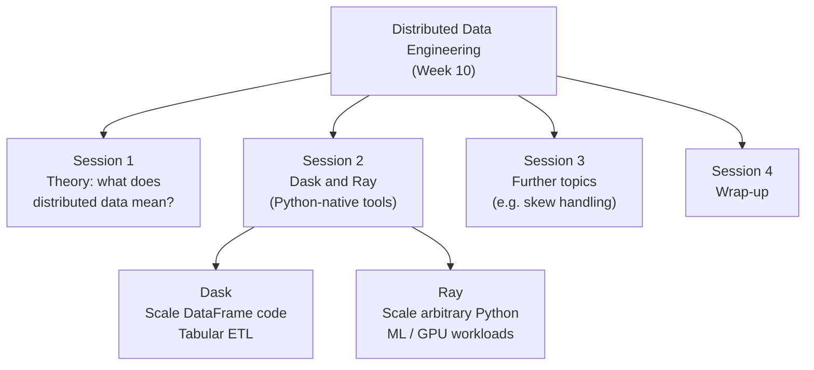

### Key intuition

- **Dask** = *same instructions, different slices of data, executed on different workers.*
- **Ray** = *distribute a Python program (and ML/AI workloads) across workers, deciding how CPUs and GPUs are used, e.g. how to load a model onto a GPU.*
- Normal Python is **sequential**. Ray is a framework that **distributes Python programming among various workers**, so it is essentially *distributed Python*.

---

## 2. Key Terms (Vocabulary)

| Term | Meaning |
|---|---|
| **Dask DataFrame** | A pandas-like DataFrame **split across a cluster**. Same API, runs in parallel. |
| **Cluster** | The set of machines doing the work. |
| **Scheduler** | The process that **assigns tasks** to the machines/workers in the cluster. |
| **Ray task** | A **stateless** function that Ray can run on **any available worker**. |
| **Ray actor** | A **stateful** Python object that **stays alive on one worker** across many calls. |
| **`compute()`** | **Trigger execution now** and pull the result back. |
| **`persist()`** | **Cache an intermediate result in memory** (across workers) so it doesn't need to be recomputed. |

> **Naming note from the lecture:** "process", "worker", "actor" and "task" are used a bit differently across the two tools, but the underlying idea is the same: a unit of work assigned to a machine.

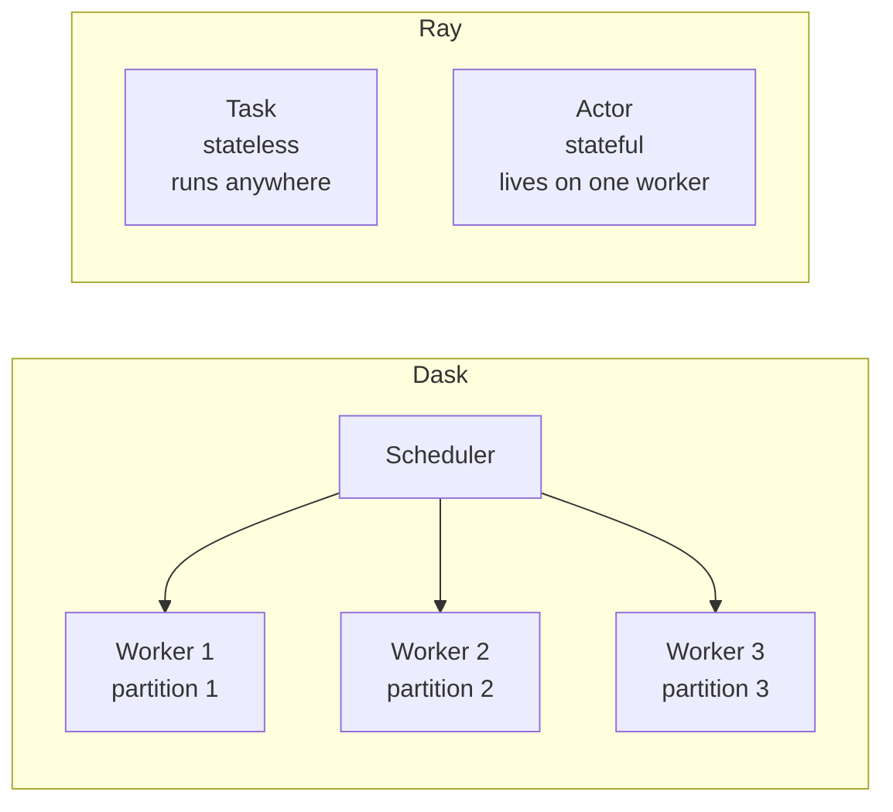

---

## 3. Dask

### 3.1 Three High-Level Collections

Dask can take data from **CSV files, Excel files, and other data structures**, and process it in a distributed way. It offers three main collections:

| Collection | What it is | Mirrors | Example API | Best for |
|---|---|---|---|---|
| **DataFrame** | Pandas DataFrames **split by row** | pandas | `df.groupby`, `df.merge` | **Tabular ETL** |
| **Array** | A **chunked NumPy ndarray** | NumPy | `arr.mean`, `arr + arr` | **Scientific computing** |
| **Bag** | A **parallel iterable over Python objects** | Python lists / iterators | `map`, `filter`, `reduce` | **Raw JSON / text** |

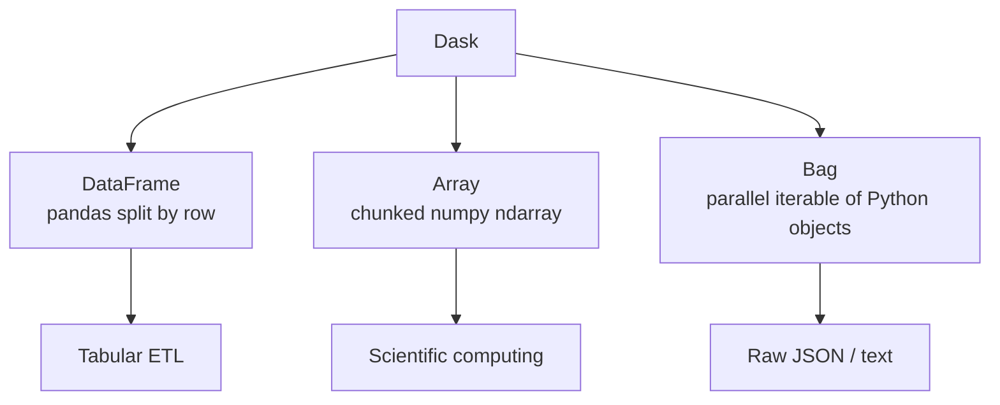

> **KEY IDEA:** Dask's pitch is to **scale your EXISTING pandas/NumPy code with minimal changes**. Swap `import pandas as pd` for `import dask.dataframe as dd`.

---

### 3.2 Dask DataFrame: It Looks Like pandas

```python
from dask.distributed import Client
import dask.dataframe as dd

client = Client('dask-scheduler:8786')          # connect to any cluster type

df = dd.read_parquet('s3://logs/events/')       # 1 TB across 500 files - LAZY
df = df[df.event == 'click']
df['hour'] = df.ts.dt.hour
hourly = df.groupby(['user_id', 'hour']).agg({'duration': 'sum'})

hourly = hourly.persist()    # cache expensive intermediate across workers
out = hourly.compute()       # trigger execution, pull result to driver
```

**Line-by-line explanation**

| Code | What it does |
|---|---|
| `Client('dask-scheduler:8786')` | Connects your script to a **scheduler**. This one line can connect to **any cluster type** (local, Kubernetes, cloud-managed). |
| `dd.read_parquet('s3://logs/events/')` | Reads Parquet **lazily**. It returns a **PLAN, not data**. You can point at **1 TB across 500 files** without loading it. |
| `df[df.event == 'click']` | Filter rows (same as pandas). Still lazy. |
| `df['hour'] = df.ts.dt.hour` | Derive a column (same as pandas). Still lazy. |
| `df.groupby([...]).agg(...)` | Aggregate (same as pandas). Still lazy. |
| `.persist()` | **Cache** the expensive intermediate result in memory across workers. |
| `.compute()` | **Trigger execution** and pull the final result to the **driver**. |

**Takeaways**

- One line connects to any cluster type: **local, Kubernetes, cloud-managed**.
- `read_parquet` returns a **plan**, not data. The API is familiar and ported transparently.
- The API looks like pandas but is shifted to a **lazy-evaluation approach for distributed computing**.
- Laziness lets Dask see the **whole plan** before running it, so it can read only what's needed and **minimise shuffle and recomputation**.

---

### 3.3 Lazy Evaluation, `persist()` and `compute()`

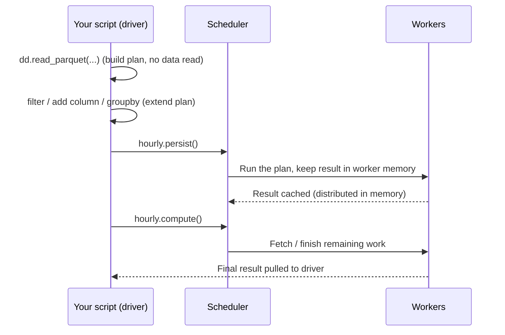

| Operation | Behaviour | Where result lives | Use when |
|---|---|---|---|
| **Lazy ops** (`read_parquet`, filter, groupby...) | Only build up a task graph / plan | Nowhere yet | Always. This is the default. |
| **`persist()`** | Executes and **caches in memory across workers** | Cluster memory (still distributed) | An **expensive intermediate result** is reused several times |
| **`compute()`** | Executes and **returns result to the driver** | Local memory as a regular pandas object | You need the **final, small** result locally |

> **Warning:** Only call `compute()` on results small enough to fit on one machine. It pulls everything to the driver.

---

### 3.4 Dask Deployment Models

| Deployment | Code | Best for |
|---|---|---|
| **LocalCluster** | `Client()` | **Dev**: uses all cores of one machine |
| **Kubernetes** | `KubeCluster(...)` | **Dynamic**: autoscaling pods |
| **Cloud managed** | Coiled / Saturn | **Managed Dask-as-a-service** |

> **Think of it like this:** the deployment model is **separate from your code**. Your ETL script stays identical; you just **pass a different Client**, like plugging the same appliance into a different outlet.

> **RECOMMENDATION:** Start with **LocalCluster for dev**, move to **Kubernetes for production**.

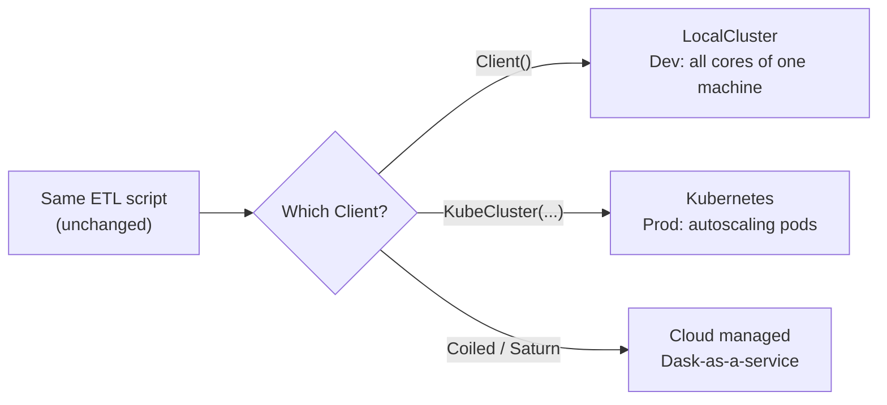

**Typical lifecycle:** local cluster (development) → Kubernetes (production) → cloud-managed (offering it to people as a service).

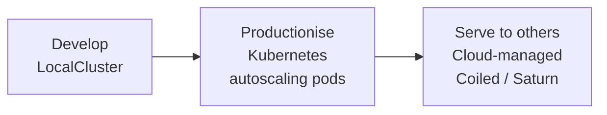

---

## 4. Ray

**Ray is general-purpose distributed Python.** Instead of only distributing DataFrames, it distributes *any* Python function or object, which makes it ideal for ML/AI workloads that need to coordinate **CPUs and GPUs**.

### 4.1 Tasks vs Actors

```python
# TASKS (stateless)
@ray.remote
def score(batch):
    return model.predict(batch)

futures = [score.remote(b) for b in batches]
results = ray.get(futures)
```

```python
# ACTORS (stateful)
@ray.remote(num_gpus=1)
class InferenceWorker:
    def __init__(self):
        self.m = load_model().cuda()
    def score(self, b):
        return self.m(b)
```

| | **Ray Task** | **Ray Actor** |
|---|---|---|
| **State** | **Stateless** | **Stateful** |
| **Defined with** | `@ray.remote` on a **function** | `@ray.remote` on a **class** |
| **Lifetime** | Runs and finishes | **Stays alive on one worker** across many calls |
| **Placement** | **Any available worker** | Pinned to **one worker** |
| **Resources** | Default CPU | Can reserve resources, e.g. `num_gpus=1` |
| **Typical use** | Independent, parallel, short jobs | Holding a **loaded model on a GPU** and reusing it |
| **Calling** | `f.remote(x)` returns a **future** | Create the actor, then call methods with `.remote()` |
| **Getting results** | `ray.get(futures)` | `ray.get(...)` on method calls |

**Key points**

- `f.remote(...)` returns a **future** immediately (non-blocking); `ray.get(futures)` **waits and collects** the results.
- The **actor** loads the model **once** in `__init__` (`load_model().cuda()`) and then keeps it **resident on the GPU**, so every later `score()` call is fast.
- With a **task**, there is no memory between calls, so if the model has to be loaded inside it, it gets **reloaded on every call**. That is the classic mistake (see Section 7).

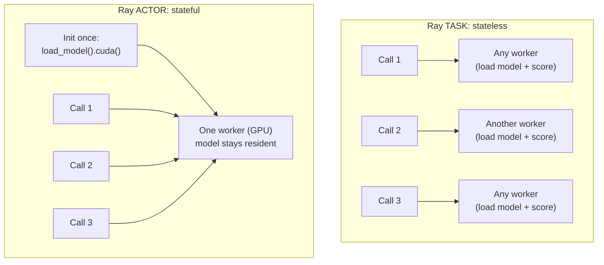

---

### 4.2 The Ray Ecosystem Libraries

| Library | Purpose |
|---|---|
| **Ray Data** | **Distributed, streaming, GPU-aware DataFrame** (data loading/preprocessing/batch inference) |
| **Ray Train** | **Distributed training wrapper** (DDP / FSDP) |
| **Ray Tune** | **Hyperparameter search at (production) scale** |
| **Ray Serve** | **Model serving with autoscaling**, A/B testing |

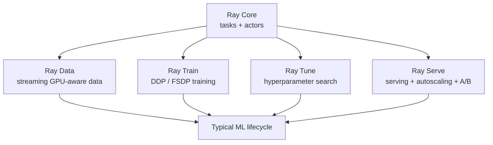

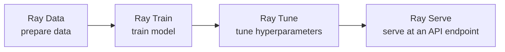

> Because these libraries are **tightly integrated**, Ray is the natural choice for a **unified ML stack** (train + tune + serve).

---

## 5. Dask vs Ray: When to Pick Which

| Scenario | Pick | Why |
|---|---|---|
| **Tabular ETL** at 100 GB to 10 TB | **Dask** | DataFrame API matches pandas (especially good if you have legacy pandas code) |
| **Batch GPU inference on 1B images** | **Ray Data** | GPU actors + streaming |
| **Distributed hyperparameter search** | **Ray Tune** | Purpose-built schedulers |
| **Unified ML stack** (train + tune + serve) | **Ray** | Tightly integrated libraries |

> **Note on sizes:** the "Big Picture" slide says Dask suits **10 GB to 10 TB**, while this comparison slide says **100 GB to 10 TB**. Treat it as: Dask is strongest for tabular ETL from tens/hundreds of GB up to ~10 TB. (If asked in an exam, quote the slide the question refers to.)

### Common in practice: use both

> **Dask for ETL → persist to Parquet → Ray for GPU inference.**

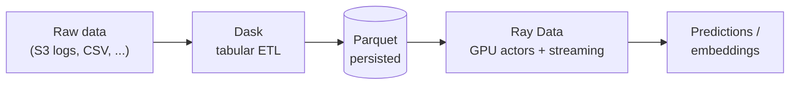

### Decision flowchart

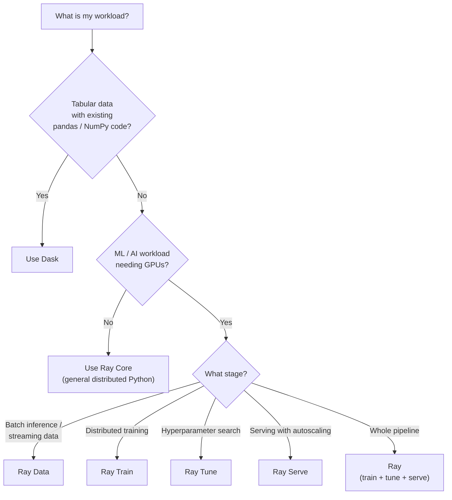

---

## 6. Moving from pandas to Dask: What Doesn't Translate

The pitch "**just change `pd` to `dd`**" is real for roughly **90% of code**. But if it becomes a **habit**, a few pandas patterns become **traps at scale**. Be mindful of them; it should not become a blind habit.

| Pandas habit | Why it's a problem in Dask | What to do instead |
|---|---|---|
| **`df.iterrows()`** | Defeats the whole point: pulls data **row-by-row through Python** | Use **`map_partitions`** |
| **`df.sort_values()` globally** | A global sort needs a **full shuffle** to establish total order | **Avoid unless truly needed** |
| **Missing pandas ops** | Some features (e.g. **Styler**, some **datetime edge cases**) aren't implemented | **Check the docs** first |
| **`len(df)` / `df.shape`** | Both force a **full pass over the data**, just like `.compute()` | Be aware of the cost; don't call casually |

```python
# BAD: row-by-row through Python, defeats parallelism
for _, row in ddf.iterrows():
    ...

# BETTER: apply a pandas function to each partition (in parallel)
def process(pdf):          # pdf is a regular pandas DataFrame (one partition)
    pdf['x2'] = pdf['x'] * 2
    return pdf

ddf = ddf.map_partitions(process)
```

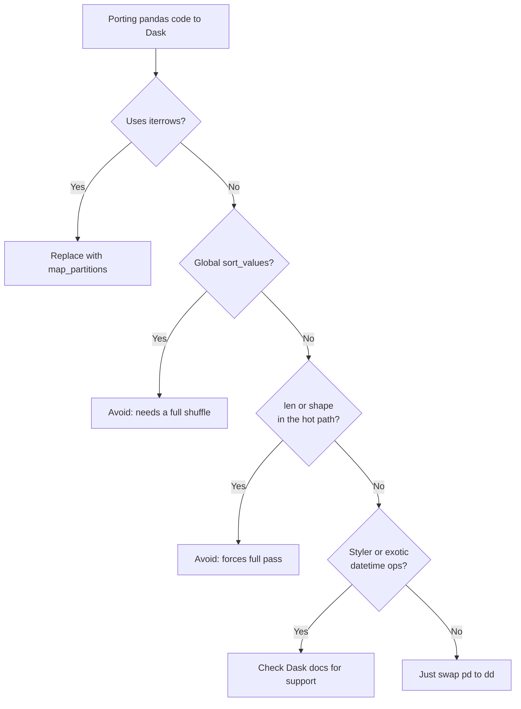

---

## 7. Common Mistakes and How to Spot Them

| # | Mistake | How it shows up | Fix |
|---|---|---|---|
| 1 | **Choosing Dask for GPU inference** | Awkward workarounds, **poor GPU utilisation** | Use **Ray Data / actors** for GPU-heavy batch work |
| 2 | **Using Ray tasks for a loaded model** | **Model reloads on every single call**, very slow | Use a **Ray actor** to keep the model **resident** |
| 3 | **Assuming Dask handles skewed keys well** | **One partition much larger than the rest** | Same skew-handling as Spark (covered in **Session 3**) |

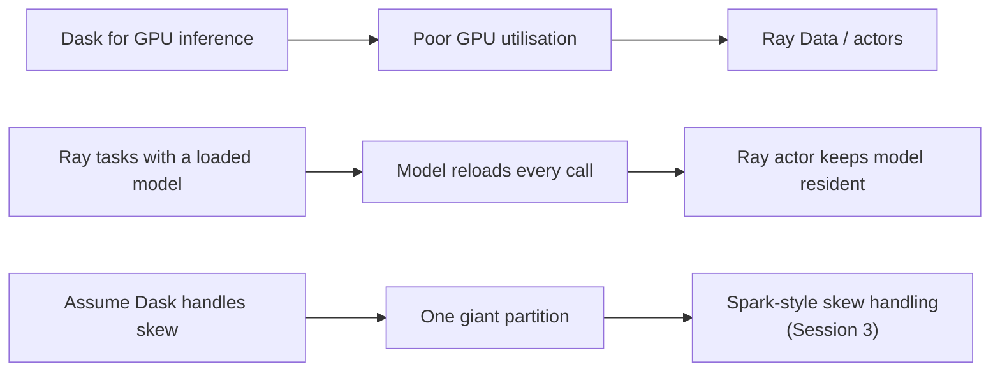

---

## 8. Quick Revision Cheat Sheet

**One-liners**

- **Dask** = pandas/NumPy that scales out. Best for **tabular ETL**.
- **Ray** = distributed Python for **ML/AI, CPU + GPU**. Best for **GPU batch inference, tuning, training, serving**.
- **Task** = stateless function; **Actor** = stateful object on one worker.
- **`persist()`** = cache in cluster memory. **`compute()`** = run and bring the result back.
- **LocalCluster (dev) → Kubernetes (prod) → Coiled/Saturn (managed)**. Same script, different `Client`.
- **Dask ETL → Parquet → Ray GPU inference** is a common combined pattern.

**Side-by-side summary**

| Aspect | Dask | Ray |
|---|---|---|
| Core abstraction | Distributed DataFrame / Array / Bag | Tasks and Actors |
| API familiarity | pandas / NumPy | Decorators (`@ray.remote`) |
| Evaluation | **Lazy** (`compute()` / `persist()`) | Futures (`.remote()` then `ray.get()`) |
| Sweet spot | Tabular ETL, 10 GB to 10 TB | GPU inference, ML pipelines |
| GPU story | Weak (awkward) | Strong (GPU actors, Ray Data) |
| Deployment | Local / Kubernetes / Coiled, Saturn | (Ray cluster, e.g. on Kubernetes or cloud; not detailed in this session) |
| Traps | `iterrows`, global sort, `len`/`shape`, skew | Using tasks for loaded models |

---

## 9. Likely Exam / Interview Questions

1. **What is the difference between a Ray task and a Ray actor? Give a use-case for each.**
   *Task: stateless, runs on any worker (independent batch scoring). Actor: stateful, lives on one worker (keeps a model loaded on a GPU).*

2. **Why does `dd.read_parquet()` on 1 TB of data return instantly?**
   *It's lazy: it returns a plan, not data. Nothing runs until `compute()`/`persist()`.*

3. **What's the difference between `persist()` and `compute()`?**
   *`persist()` caches the result in distributed cluster memory. `compute()` executes and pulls the result to the driver.*

4. **Why should you avoid `df.iterrows()` and global `sort_values()` in Dask?**
   *`iterrows` pulls data row-by-row through Python (use `map_partitions`); global sort requires a full shuffle.*

5. **You have a legacy pandas ETL job at 2 TB. Which tool and why?**
   *Dask: the DataFrame API matches pandas, so minimal code changes.*

6. **You must run a vision model on 1 billion images. Which tool and why?**
   *Ray Data: GPU actors plus streaming.*

7. **How does Dask keep the same ETL script working across local, Kubernetes and cloud?**
   *Deployment is separate from code: only the `Client`/cluster object changes.*

8. **How can Dask and Ray be combined?**
   *Dask for ETL → persist to Parquet → Ray for GPU inference.*

9. **What symptom indicates key skew in Dask?**
   *One partition much larger than the rest; handle it as you would in Spark (Session 3).*

---

*Notes compiled from the Session 2 slides and lecture transcript. The extra code comments, diagrams and exam questions are added for revision purposes.*
