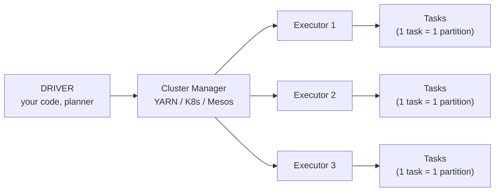
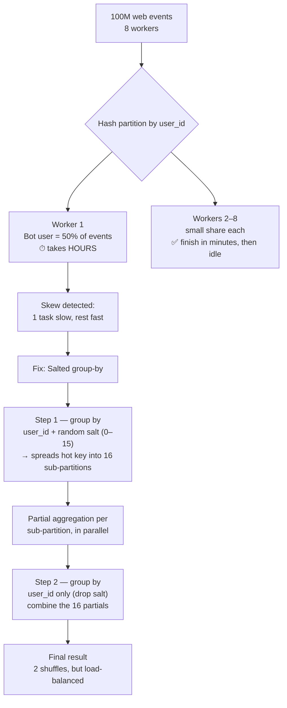

# Week 10 · Session 3 — RAPIDS, Spark, and Handling Data Skew

*Distributed Data Engineering*

---

## 1. The Big Picture: The "Big" Tools for "Big" Workloads

Sessions 1–2 covered **Dask** and **Ray**, which handle most Python-native distributed needs. This session covers what to reach for when you outgrow those:

- **GPU-accelerated DataFrames** → RAPIDS (cuDF / dask-cuDF)
- **Petabyte-scale standard** → Apache Spark

### The analogy

| Tool | Analogy | Character |
|---|---|---|
| **Dask** | Fast bicycle | Lightweight, Python-native |
| **Ray** | Versatile van | Flexible, general-purpose distributed compute |
| **RAPIDS** | Racing car | Blazing fast, narrow use case |
| **Spark** | Freight train | Huge capacity, mature infrastructure, works at a scale nothing else touches |

### Three takeaways for this session

1. **RAPIDS puts pandas on the GPU** — same API, **10–100x faster** for the right workload shape.
2. **Spark is still the default at petabyte scale** — mature SQL optimizer, lakehouse ecosystem, battle-tested.
3. **Data skew is the recurring killer** — one overloaded key can turn a 5-minute job into an 8-hour workload, because of excess recomputation and shuffle.

---

## 2. Key Terms

| Term | Definition |
|---|---|
| **cuDF** | A GPU-accelerated DataFrame library with a pandas-like API. |
| **Data skew** | When one partition/key has far more data than others, creating a bottleneck. |
| **Executor** | A Spark worker process that runs tasks and holds data in memory. |
| **Salting** | Adding a random value to a skewed key to spread its rows across more partitions. |
| **Catalyst optimizer** | Spark's query planner that automatically rewrites your code/query for better performance. |

---

## 3. RAPIDS cuDF — "Pandas on GPU"

cuDF gives you the **same API as pandas**, but execution happens on the GPU instead of the CPU.

```python
# PANDAS (CPU)
import pandas as pd
df = pd.read_parquet('trades.parquet')
agg = df.groupby('symbol').agg({'value': 'sum'})
# 80M rows: ~25 sec on 32 cores
```

```python
# cuDF (GPU)
import cudf
df = cudf.read_parquet('trades.parquet')
agg = df.groupby('symbol').agg({'value': 'sum'})
# 80M rows: ~0.4 sec on one A100
```

**Result:** Same API, roughly **50x faster** on the right workload (this example: ~25s → ~0.4s on 80M rows).

### When cuDF wins — and when it doesn't

| ✅ Wins | ❌ Loses |
|---|---|
| Column-oriented ops on **1M+ rows** that fit in GPU memory | Small datasets (**< 100k rows**) |
| Compute-intensive, vectorizable workloads | Heavily branched Python UDFs |
| | I/O-bound or memory-bound work (rather than compute-bound) |

**Rule of thumb:** if your data is small, or your bottleneck is I/O/UDF logic rather than raw compute, the GPU won't help — and may even be *slower* than plain pandas due to transfer/launch overhead.

---

## 4. Dask + cuDF — Scaling RAPIDS Across GPUs

- **Single-GPU cuDF** is fast.
- **Multi-GPU `dask_cudf`** is faster **and** handles datasets bigger than a single GPU's memory.

```python
from dask_cuda import LocalCUDACluster
import dask_cudf

cluster = LocalCUDACluster(n_workers=8)  # 8 GPUs, one worker each

df = dask_cudf.read_parquet('s3://huge/')   # looks like dask.dataframe, runs on cuDF
agg = df.groupby(['symbol', 'minute']).value.mean().compute()
```

### When it wins vs. when it doesn't

| ✅ When it wins | ❌ When it doesn't |
|---|---|
| Multi-TB tabular workload | Small data |
| 8+ GPUs available | Heavy SQL workloads (Spark's optimizer is more mature) |
| ETL is the bottleneck | |

---

## 5. Spark — The Heavy Hitter

| Strength | Detail |
|---|---|
| **Petabyte scale** | Battle-tested at Databricks / LinkedIn / Netflix scale. |
| **Mature SQL optimizer** | Catalyst automatically rewrites queries for speed. |
| **Lakehouse ecosystem** | Delta Lake, Iceberg — ACID transactions on object storage. |
| **Multi-language** | Scala, Python, R, SQL — same job, same performance. |

> **Rule of thumb:** If your dataset lives in a lakehouse or is measured in **TB+ daily**, you'll meet Spark — even if you're also using GPUs elsewhere in the pipeline.

---

## 6. Spark Architecture in One Diagram



| Concept | Definition |
|---|---|
| **Job** | One action (`count`, `write`, etc.). Splits into stages. |
| **Stage** | A set of contiguous tasks with **no shuffle** in between. |
| **Task** | The smallest unit of work — one partition processed by one slot. |
| **Partition** | A chunk of the dataset. **More partitions = more parallelism.** |

---

## 7. Data Skew — The Problem, and the Salted Group-By Pattern

### Why skew matters
Data skew slows processing down: it means excessive shuffling and recomputation. A single overloaded key can turn a **5-minute job into an 8-hour** one.

### Concrete scenario
- 100M web events, spread across **8 workers**.
- One bot account generates **50% of all events**.
- After standard hash partitioning, **one worker holds half the data** and takes hours to finish, while the other seven workers sit idle after finishing their (small) share in minutes.

### The salting fix
1. **First group-by (salted):** Split the skewed key into sub-partitions (e.g., 16) by appending a random "salt" value to the key. This spreads a single hot key's rows across 16 partitions instead of one, balancing the load.
2. **Second group-by (small):** Re-aggregate across the salted sub-groups to get the final result (e.g., group by the original key again, dropping the salt).

**Trade-off:** this costs **two shuffles instead of one** — but it wins big when a single key dominates the dataset, because it turns one massive, unparallelizable partition into many balanced, parallel ones.

### Diagram: skew problem → salting fix



---

## 8. Adaptive Query Execution (AQE) — Automating the Manual Fix

Spark 3.0+ can **detect and fix skew automatically at runtime**, using real shuffle statistics rather than upfront guesses.

```python
spark.conf.set('spark.sql.adaptive.enabled', 'true')  # on by default in Spark 3.2+
spark.conf.set('spark.sql.adaptive.skewJoin.enabled', 'true')
spark.conf.set('spark.sql.adaptive.coalescePartitions.enabled', 'true')
```

- **AQE re-plans the query** *after* seeing real shuffle statistics (not before).
- **Skew join handling** automatically splits an oversized partition — this is the runtime equivalent of manual salting.
- Still worth knowing the **manual salting pattern**:
  - **Dask has no AQE equivalent.**
  - **Older Spark versions** may have AQE disabled by default.

---

## 9. Common Mistakes & How to Spot Them

| Mistake | How it shows up | Fix |
|---|---|---|
| Reaching for cuDF on small data | GPU version is **slower** than pandas | cuDF wins above ~1M rows, not below |
| Ignoring one slow Spark stage | One task takes 30 min, 199 tasks take 30 sec | That's skew — apply a salted group-by, or enable AQE |
| Calling `.collect()` on a huge dataset | The driver runs out of memory and crashes | Write to storage instead of collecting to the driver |

---

## 10. Quick Decision Guide

| If your situation is... | Reach for... |
|---|---|
| Python-native, moderate scale, general distributed compute | Dask / Ray (Session 2) |
| Pandas-style workload, 1M+ rows, compute-bound, fits on GPU(s) | RAPIDS cuDF (single GPU) or dask-cuDF (multi-GPU) |
| Small data (< 100k rows), UDF-heavy, or I/O-bound | Stick with plain pandas — GPU won't help |
| Petabyte-scale, lakehouse storage, heavy SQL, TB+/day | Spark |
| One task/stage running far slower than the rest | Diagnose as **data skew** → salted group-by or enable AQE |

---

### One-line summary
**RAPIDS** = pandas, but on the GPU, for compute-heavy jobs that fit in GPU memory. **Spark** = the mature, petabyte-scale workhorse with a smart optimizer (Catalyst) and lakehouse support. **Data skew** — one overloaded key dominating a partition — is the most common silent killer of job performance in both worlds, fixed manually via **salting** or automatically via **Spark's AQE**.
