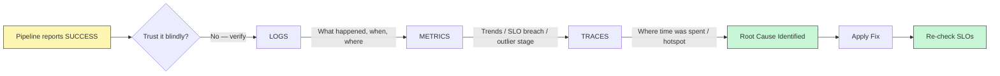
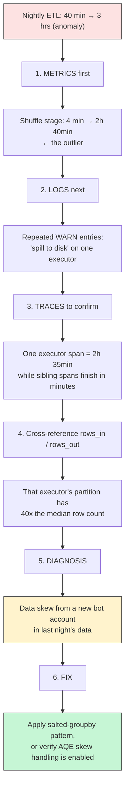
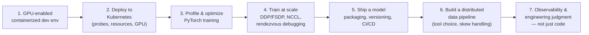

# Week 10 — Observability & Course Wrap
### Distributed Data Engineering

> **Core idea:** A pipeline can run perfectly, report `SUCCESS`, and still silently produce garbage. Observability is how you catch that *before* a customer does.

---

## 1. The Big Picture — Why This Session Exists

**The dashboard analogy:** A car's dashboard doesn't just have an "engine on" light — it has a speedometer, fuel gauge, and warning lights for specific problems.

- **"The job ran"** = the engine light (binary, tells you almost nothing)
- **Observability** = the whole dashboard (tells you *how well* it ran, not just whether it started)

Three foundational ideas anchor this session:

| # | Idea | Meaning |
|---|------|---------|
| 1 | **Data pipelines fail silently** | The job "succeeds" but the output is empty, wrong, or stale |
| 2 | **Three complementary signals** | Logs, metrics, and traces each answer a *different* question |
| 3 | **SLOs make "healthy" measurable** | An explicit, measurable promise — not a vague feeling |

---

## 2. Key Terms Before We Start

| Term | Definition |
|---|---|
| **Log** | A discrete, timestamped record of something that happened |
| **Metric** | A numeric measurement tracked over time (e.g., rows processed per minute) |
| **Trace** | A record of *where time was spent* across the steps of one request/run |
| **SLO** (Service Level Objective) | An explicit, measurable promise about how well a system should perform |
| **Error budget** | The amount of "bad" (downtime, errors) you're allowed before you must slow down and fix things |

---

## 3. Why Observability Matters for Data Pipelines

Silent failure modes that observability is designed to catch:

| Failure Mode | What It Looks Like |
|---|---|
| **Empty outputs** | Job ran fine. Wrote 0 rows. (Filter logic bug) |
| **Stale data** | Yesterday's run failed silently; today uses 2-day-old data |
| **Schema drift** | Upstream added a column; your job ignored it |
| **Volume drops** | 1B rows yesterday, 100M today — why? |
| **Distribution shift** | Same row count, different values — model quietly degrades |
| **Quiet skew** | Job succeeds but takes 10x longer, quietly |

---

## 4. The Three Pillars — Logs, Metrics, Traces

| Pillar | Used For | Example |
|---|---|---|
| **Logs** | What happened, when, where | `ERROR partition 47 OOM` |
| **Metrics** | Trends, alerts, SLOs | `rows_processed_total = 12.4B` |
| **Traces** | Where time was spent | `shuffle stage took 47s` |

> Together they answer **"what, how much, where."** One alone answers none. A real investigation uses all three, **in that order**: Logs → Metrics → Traces.

### Diagnostic Flow (Mermaid)



---

## 5. Instrumenting a Pipeline — The Basics

```python
rows_in = Counter('etl_rows_in_total', 'rows read', ['stage'])
stage_seconds = Histogram('etl_stage_seconds', 'duration', ['stage'])

def run_stage(name, fn, df):
    with tracer.start_as_current_span(name):
        n_in = df.count()
        out = fn(df)
        n_out = out.count()
        logging.info('stage_done', extra={
            'stage': name,
            'rows_in': n_in,
            'rows_out': n_out,
            'drop_rate': 1 - n_out / max(n_in, 1)
        })
        return out
```

**Key detail:** `drop_rate = (rows_in - rows_out) / rows_in`

This single field is what catches "the filter accidentally dropped 50% of users" — silently.

> ⚠️ **Alert rule:** `drop_rate > 0.1` unexpectedly → page/notify.

---

## 6. SLOs for Data Pipelines — Four Dimensions

| Dimension | Definition | Example |
|---|---|---|
| **Freshness** | Max age of the latest data | Feature table under 30 min old |
| **Completeness** | Fraction of expected rows present | ≥ 99.5% of daily events arrive |
| **Correctness** | Fraction of rows passing schema/value checks | Schema + value validation pass rate |
| **Latency (p99)** | Time from event to downstream availability | 99th-percentile event-to-availability time |

> **Rule:** Define SLOs in terms consumers actually *feel*. Not "the job ran" — **"the data was usable."**

---

## 7. Bottleneck Analysis — Reading the Pillars Together (Worked Example)

**Scenario:** A nightly ETL that normally takes 40 minutes takes **3 hours** tonight.



**Step-by-step reasoning chain:**

1. **Metrics first** — the shuffle stage jumped from 4 min to 2h40m → that's the outlier
2. **Logs next** — repeated `WARN` entries about spill-to-disk on one executor
3. **Traces to confirm** — one executor's span is 2h35m while its siblings finish in minutes
4. **Cross-reference rows_in/rows_out** — that executor's partition has ~40x the median row count
5. **Diagnosis** — data skew from a new bot account in last night's data
6. **Fix** — apply the salted-groupby pattern, or verify AQE (Adaptive Query Execution) skew handling is enabled

---

## 8. Common Mistakes & How to Spot Them

| Mistake | How It Shows Up | Fix |
|---|---|---|
| Only checking "did the job succeed" | Silent data quality issues go unnoticed for weeks | Track `drop_rate`, row counts, and freshness explicitly |
| No SLOs defined anywhere | Nobody can say whether a pipeline is "healthy" | Define freshness / completeness / correctness / latency SLOs |
| Using only one of logs/metrics/traces | Investigations take hours instead of minutes | Instrument all three, use them together |

---

## 9. Course Wrap — What You Can Now Do

A recap of the full distributed data engineering skill arc across all sessions:



| # | Capability |
|---|---|
| 1 | Stand up a GPU-enabled, containerized dev environment reproducible across machines |
| 2 | Deploy a workload onto Kubernetes with proper probes, resources, and GPU allocation |
| 3 | Profile and optimize PyTorch training end to end |
| 4 | Train at scale with DDP/FSDP — multi-node, NCCL, debugging rendezvous |
| 5 | Ship a model with proper packaging, versioning, and CI/CD |
| 6 | Build a distributed data pipeline — choose the right tool, handle skew |
| 7 | Reason about cost, scaling, and observability — **engineering judgment, not just code** |

---

## 10. One-Page Cheat Sheet

- **Golden rule:** "Success" ≠ "correct." Always verify output quality, not just exit code.
- **Investigation order:** Metrics (find the outlier) → Logs (find the symptom) → Traces (find the hotspot).
- **Instrument every stage** with `rows_in`, `rows_out`, `drop_rate`, and a trace span.
- **Alert threshold example:** `drop_rate > 0.1` unexpectedly.
- **Define SLOs** across Freshness, Completeness, Correctness, Latency (p99) — in terms the *consumer* feels.
- **Error budget** = how much bad behavior you tolerate before you must stop and fix.
