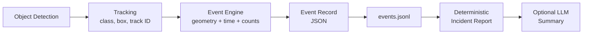
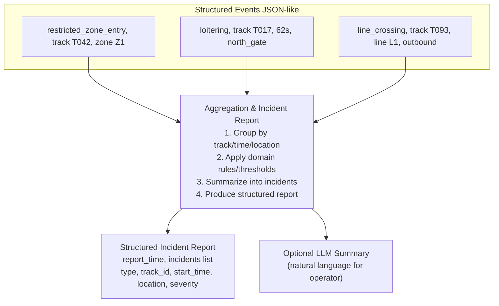

# Smart Surveillance Pipeline — Notes
## Part 3: Event Analytics & Part 4: Structured Events and Reports

---

## 1. Overview

This section of the pipeline turns **tracked objects** into **spatial and temporal rules**, and then turns those rule outputs into **structured, auditable records** and human-readable reports.



The four basic analytics covered:

| Analytic | Type | What it answers |
|---|---|---|
| ROI (Region of Interest) | Spatial | Is the object inside/outside a polygon? |
| Virtual line crossing | Spatial | Did the object cross a defined line? |
| Dwell time / loitering | Temporal | How long has the object stayed in a state? |
| Crowd count | Aggregate | Has a group-level threshold been reached? |

---

## 2. Event Logic from Tracking

The event engine does **not** start from raw pixels — it starts from **tracked objects**. Each track provides:

- **Class** (person, car, bicycle, bus…)
- **Box / center point**
- **Track ID** (from the persistence/tracking logic, e.g. ByteTrack)
- **Time**

The engine combines these observations with **application rules**:

| Input | Rule type | Tells us |
|---|---|---|
| Geometry | Spatial | Whether an object is crossing a line / inside a region |
| Time | Temporal | How long a track has stayed in a given state |
| Counts | Aggregate | Whether a group-level threshold has been reached |

**Core formula:**
```
event = object + identity over time + spatial rule + temporal rule
```

### Why keep event logic as a separate layer?

- The neural network detects **visual categories** only — it does not know **site-specific meaning** (e.g., which polygon is a restricted zone vs. a queue vs. a parking area).
- Event logic combines **class label + track ID + geometry + time**.
- In the demo, this layer is **deterministic** → easy to inspect and debug.
- Separating layers means rules can be changed **without retraining** the detector/tracker (e.g., an operator can move a count line or change a dwell threshold with zero retraining).

---

## 3. Region of Interest (ROI): From Geometry to Semantics

- A **region of interest** is a **polygon drawn on the image plane**.
- At the **geometry level**, the only question is: *is a point inside or outside the polygon?*
- The **application** gives the polygon meaning — the same polygon shape could be a "restricted zone," "queue region," "waiting area," or "parking boundary" depending on the site.
- The demo uses the **center point of the tracked bounding box** as the representative point (simple, fast, easy to debug). This can be extended to more complex representations later.

**Geometry → Semantics → Event pipeline:**

| Layer | Example |
|---|---|
| Geometry | Point inside polygon |
| Semantics | Person inside restricted zone |
| Event | Restricted-zone entry |

### Normalized coordinates for ROI configuration

Polygon and line coordinates are stored as **normalized values between 0 and 1**:

- `x = 0.10` → 10% of image width
- `y = 0.20` → 20% of image height

**Advantage:** the same configuration works across different resolutions/aspect ratios (e.g., 720×1280 → 920×1080) since normalized coordinates refer to the same *relative* location.

**Limitation:** normalization does not understand the scene — you must still **inspect the first frame** and manually place the polygon over the correct physical region.

```yaml
# config.yaml example
restricted_zone:
  points:
    - [0.55, 0.25]
    - [0.95, 0.25]
    - [0.95, 0.95]
    - [0.55, 0.95]
```

---

## 4. The Four Event Rules

### 4.1 Restricted-Zone Entry Rule

Triggered when a person track **transitions** from outside the ROI to inside it — not merely "is inside."

```python
previous_inside = False
current_inside  = True

if class_name == "person" and current_inside and not previous_inside:
    emit zone_entry
```

- The engine remembers, per track, whether it was inside the zone on the previous processed frame.
- Event record includes: **timestamp, track ID, class name, confidence, zone name**.
- This is the moment low-level perception becomes an **application event**.

### 4.2 Loitering / Dwell-Time Rule (Temporal)

Requires tracking continuity (a lost track or ID switch breaks this rule).

```python
entry_time[track_id] = t_enter

dwell = current_time - t_enter

if dwell >= loiter_seconds:
    emit loitering
```

- When a person enters the ROI, the engine stores the **entry time** for that track ID.
- On later frames, while the same track remains inside, it computes `dwell = current_time - entry_time`.
- If dwell time ≥ configured threshold → emit a **loitering** event.
- *Tip: reduce `loiter_seconds` temporarily to test/experience the event quickly.*

### 4.3 Virtual-Line Crossing Rule

```python
movement = segment(prev_center, center)
line     = segment(p1, p2)

if intersects(movement, line):
    emit line_crossing
```

- A virtual line is defined by **two endpoints** in the image plane.
- For each track, the engine stores the **previous** and **current** center points, forming a short motion segment.
- If that motion segment **intersects** the virtual line → emit `line_crossing`.
- Supports: traffic counting, corridor flow, entrance/exit analytics.
- The basic demo detects crossing **without direction**; direction can be added later by checking which side of the line the track came from vs. moved to.

### 4.4 Crowd-Threshold Rule (Aggregate)

```python
inside_people = count(person tracks in ROI)

if inside_people >= crowd_threshold and cooldown_has_elapsed:
    emit crowd_threshold
```

- Instead of one track, this **counts multiple person tracks** currently inside the ROI.
- If count ≥ threshold **K** → emit `crowd_threshold`.
- A **cooldown interval** avoids re-emitting the same event every frame (crowds tend to persist across many consecutive frames).
- Useful for occupancy and congestion analytics.

---

## 5. Summary Table: event = object + identity + rule

| Component | Example from demo |
|---|---|
| Object | person, car, bicycle, bus |
| Identity over time | Track ID from ByteTrack |
| Spatial rule | Inside restricted zone / crossing a line |
| Temporal rule | Dwell time above threshold |
| Event record | JSON line with timestamp, type, severity, and metadata |

**Key insight:** an event is a *composition* across layers — object category + identity over time + spatial rule + (sometimes) temporal rule. This is not a new kind of object-detector output; it's application semantics **built on top of** model outputs.

---

## 6. Part 4 — Structured Events and Reports

**Goal:** make events **auditable, searchable, and easy to summarize.**

Pipeline of artifacts:
1. `events.jsonl` — raw structured facts
2. Deterministic **incident report**
3. Optional **LLM natural-language summary**

### 6.1 Structured Events as Auditable Facts (JSON Lines)

- One **JSON object per event**, appended to `events.jsonl`.
- **JSONL** (JSON Lines) is useful for streaming — events can be appended independently as they occur.
- Each record can contain: `timestamp`, `frame_index`, `event_type`, `severity`, `track_id`, `class_name`, `confidence`, and optional `zone`/`line` info.

```json
{
  "timestamp_s": 8.36,
  "event_type": "restricted_zone_entry",
  "track_id": 14,
  "class_name": "person",
  "severity": "high"
}
```

**Why structured over free text:**
- Easy to filter/count (e.g., count all restricted-zone entries)
- Easy to search within a time range
- Easy to compare predicted events vs. ground-truth events
- Creates a **safe interface** for optional LLM summarization

### 6.2 From Structured Events to Incident Reports



- The **event records remain the source of truth**.
- A **deterministic report-generation stage** aggregates counts, identifies highest-severity / high-priority events, and suggests explicit review actions.
- Every report field traces back to the underlying event record → builds **trust and traceability**, which matters more in public-space surveillance systems than raw detection/report generation alone.

### 6.3 Deterministic Report Generation (No LLM)

```bash
python summarize_events.py \
  --events outputs/events.jsonl \
  --out-dir outputs
```

- Produced **without an LLM** — counts event types and severity levels.
- Identifies high-priority events (e.g., restricted-zone entries).
- Creates recommended operator actions based on **explicit, predefined rules**.
- Outputs: `incident_report.json` and `incident_report.txt`.
- Easy to audit: every line traces back to `events.jsonl`. If the report claims "3 restricted-zone entries," that count is verifiable directly from the JSON log.
- **Convention:** show this deterministic report *before* showing any LLM-generated summary, to keep the distinction between natural-language reports and deterministic reports clear.

### 6.4 Optional LLM Summary — Correct Role

- The LLM does **not** inspect the raw video.
- It receives **only** the structured incident report / event summary.
- Its job: write a **concise natural-language summary** for the operator.
- This placement makes the LLM a **presentation layer**, not the source of truth — an intentionally conservative design choice, prioritizing traceability and trust over "fancy" LLM-driven output.

**Example LLM summary:**
> Two notable incidents were detected. A person (Track T042) entered a restricted zone (Z1) at 10:14 UTC. Another person (Track T017) loitered near the north gate for 62 seconds at 10:16 UTC. Both events may require review.

### 6.5 Guardrails for LLM Summarization

| Allowed | Not Allowed |
|---|---|
| Summarize event counts and severities | Invent events not present in the JSON |
| Mention timestamps and track IDs from the input | Identify people or infer personal identity |
| Recommend human review where appropriate | Infer intent, guilt, or cause without evidence |
| State uncertainty when evidence is limited | Override the deterministic event engine |

**Core principle:** *First produce structured, verifiable facts using deterministic components. Use the LLM only to organize/explain facts already discovered by the deterministic system.* This is what builds trust in systems like smart-city surveillance.

---

## 7. Key Takeaways

1. **Separation of concerns:** detection/tracking ≠ event logic ≠ reporting ≠ LLM summarization. Each layer can evolve independently without retraining others.
2. **Determinism first:** spatial/temporal rules and incident reports are rule-based and fully traceable — critical for trust and auditability in public-space systems.
3. **Normalized coordinates** make ROI/line configs resolution-independent, but still require manual scene calibration.
4. **Track continuity is foundational** — dwell-time and line-crossing rules break down if tracking IDs are lost or switched.
5. **LLMs are a presentation layer only** — they summarize verified structured facts, never generate or override them.
