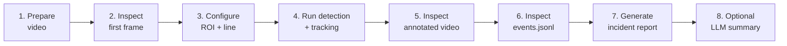
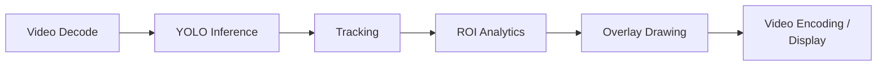
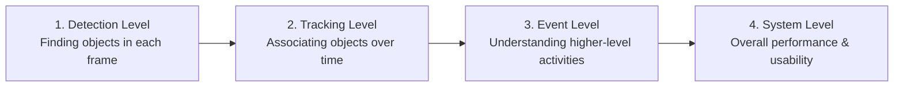

# IVA Pipeline — Part 6: Performance & Evaluation

*How to measure the complete application, not only the model.*

---

## 1. The Classroom Demonstration Workflow

The full pipeline runs through eight stages, from raw video to an optional LLM summary:



> **Demo goal:** convert video into auditable structured events. The LLM step (8) is optional — the demonstration is complete without it.

---

## 2. The Core Principle

> **Reporting only the detector's inference time does not "cut it."**

Performance must be measured **end-to-end** — across the whole application — not just for the neural network. The input stream's real-world usability depends on total throughput, not detector speed alone.

---

## 3. End-to-End Performance Measurement



**Formula:**
```
End-to-end latency = Decode + Inference + Tracking + Analytics + Drawing + Encoding/Display
```

### Example measurement

| Metric | Value | What it measures |
|---|---|---|
| Model inference latency | **8.4 ms** | Time for YOLO model inference per frame (e.g., on GPU) |
| End-to-end wall FPS | **24.3 FPS** | Overall application throughput — input frame → displayed output |

> **Application performance is not detector latency alone.** A fast detector doesn't guarantee a fast application if another stage (drawing, encoding) is the bottleneck.

### The bottleneck concept

If the detector becomes twice as fast but video encoding/drawing is already the dominant cost, **end-to-end FPS will not improve by 2×** — another stage has become the bottleneck. System optimization always requires identifying the *actual* bottleneck, not just tuning the model.

---

## 4. CPU vs. GPU Classroom Experiment

| | GPU / Auto Run | CPU Run |
|---|---|---|
| Config | `config.yaml` (uses CUDA when available) | `config_cpu.yaml` |
| Inference speed | Accelerated neural-network inference | Usually slower for YOLO inference |
| What it exposes | Still includes non-model stages in wall FPS | May reveal video decoding / drawing overhead |
| Purpose | Useful for connecting to Week 9 serving topics | Useful as a baseline for systems thinking |

**Commands:**
```bash
python run_demo.py --source input.mp4 --config config.yaml --output-dir outputs_gpu
python run_demo.py --source input.mp4 --config config_cpu.yaml --output-dir outputs_cpu
```

**Correct comparison:** run the same clip on CPU and GPU, then compare *both* detector latency and wall FPS — not just one.

---

## 5. Evaluation Levels in IVA

Evaluation happens at increasing levels of semantic understanding, from low-level perception to full application-level evaluation:



> A high detector mAP **does not guarantee** high event-level accuracy or a faithful LLM summary. Each layer must be evaluated independently.

### Metrics by level

| Level | Typical Metrics | What It Tells Us |
|---|---|---|
| **Detection** | Precision, Recall, mAP | Whether the right objects were found |
| **Tracking** | ID switches, track continuity, MOT metrics | Whether identity is maintained over time |
| **Event** | Event precision, recall, F1 score, timestamp tolerance | Whether application-level events are correct |
| **System** | Latency (end-to-end), throughput (FPS), memory, CPU/GPU usage | Whether operational requirements are met (e.g., 20 FPS target) |
| **LLM Summary** | Factual consistency, omissions, hallucinated claims | Whether the summary preserves structured facts |

> Note on timestamp tolerance: a predicted event can be *correct* but emitted a few frames earlier/later than the manually labeled event — tolerance windows account for this.

---

## 6. Common Failure Modes and What They Teach

| Failure Mode | Likely Cause | Important Point |
|---|---|---|
| No event fired | ROI / line not aligned with scene | Site calibration matters |
| False zone entry | False detection or poor geometry | Perception and rule errors propagate |
| Wrong dwell time | Track ID switch or lost track | Temporal identity is fragile |
| Wrong line count | Missed track or poor line placement | Event rules need validation |
| LLM adds unsupported claim | Summary not constrained enough | LLM output must be grounded in structured facts |

> **Failure analysis is part of the lesson.** Debugging stage-by-stage, module-by-module gives visibility into errors at every level — the problem is often calibration or a downstream stage, not "the neural network."

---

## 7. Key Takeaways

- **End-to-end performance ≠ model inference time.** Always report both.
- **Find the bottleneck**, not just the slowest-looking component — optimizing the wrong stage wastes effort.
- **Evaluate at every level**: detection, tracking, event, system, and (if used) LLM summary — each can fail independently of the others.
- **Calibration (ROI/line placement) is as important as model choice** — many "model failures" are actually geometry/configuration failures.
- **Ground LLM summaries in structured facts** to avoid hallucinated or unsupported claims.
- The pipeline is configurable — adjust `config.yaml` for your own scene, classes, and operational requirements (e.g., a target FPS).
