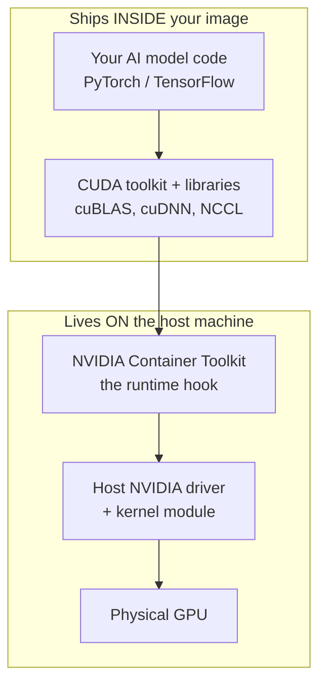
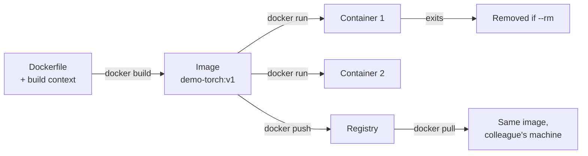
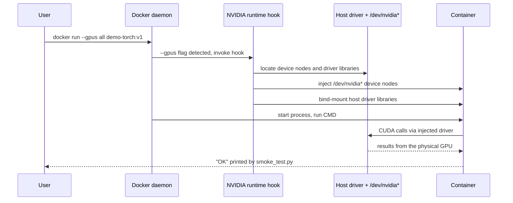
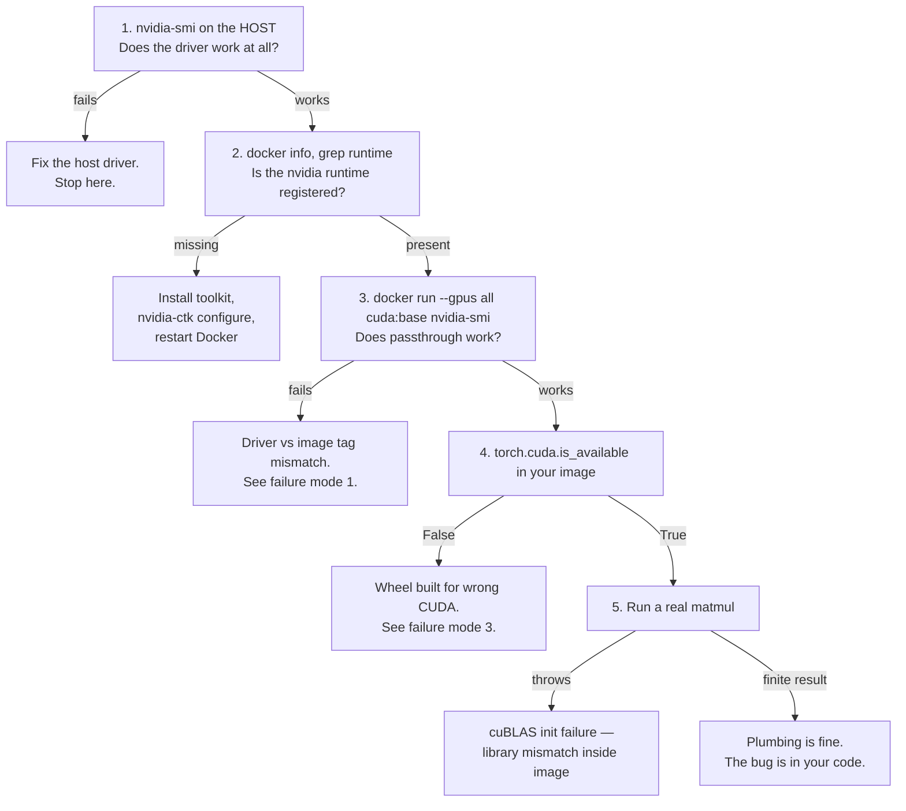

# Docker Fundamentals for GPU-Enabled AI Workloads

> **The one-line thesis of this session:** *Containers freeze the entire userspace; the host keeps the kernel and the GPU driver. Everything else in this session is a consequence of that single split.*

## Table of Contents

1. [Session at a Glance](#1-session-at-a-glance)
2. [Why Containers? The Reproducibility Problem in AI](#2-why-containers-the-reproducibility-problem-in-ai)
3. [Core Concepts: Image vs Container vs Layer](#3-core-concepts-image-vs-container-vs-layer)
4. [Dockerfile vs Build Context, Layer vs Tag](#4-dockerfile-vs-build-context-layer-vs-tag)
5. [Anatomy of a GPU Dockerfile](#5-anatomy-of-a-gpu-dockerfile)
6. [The CUDA Split: Driver vs Toolkit](#6-the-cuda-split-driver-vs-toolkit)
7. [NVIDIA Container Toolkit: How the GPU Reaches Your Container](#7-nvidia-container-toolkit-how-the-gpu-reaches-your-container)
8. [Tag Taxonomy: base / runtime / devel](#8-tag-taxonomy-base--runtime--devel)
9. [Layer Caching: 30-Second vs 30-Minute Rebuilds](#9-layer-caching-30-second-vs-30-minute-rebuilds)
10. [Lab 1 — Verify GPU Passthrough](#10-lab-1--verify-gpu-passthrough)
11. [Lab 2 — Build and Run Your First GPU Image](#11-lab-2--build-and-run-your-first-gpu-image)
12. [Reading the Smoke Test Output](#12-reading-the-smoke-test-output)
13. [The Numbers Behind the Smoke Test](#13-the-numbers-behind-the-smoke-test)
14. [The Instructor's Lab Environment](#14-the-instructors-lab-environment)
15. [Debugging Playbook](#15-debugging-playbook)
16. [Exercise & Check-for-Understanding](#16-exercise--check-for-understanding)
17. [Mini-Glossary](#17-mini-glossary)
18. [Golden Rules — Cheat Sheet](#18-golden-rules--cheat-sheet)
19. [What's Next](#19-whats-next)
20. [Editorial Notes](#20-editorial-notes)

## 1. Session at a Glance

### 1.1 What this session is about

The framing question the instructor opens with is deliberately blunt:

> *"Why containers are the backing units of modern AI, and how your code actually reaches a GPU."*

Those are two separate questions, and this session answers both:

| Question | Answer in one sentence |
|---|---|
| Why containers? | Because AI stacks break when moved between machines, and containers freeze everything above the kernel into one shippable artifact. |
| How does code reach the GPU? | Through the NVIDIA Container Toolkit, which injects the host's device nodes and driver libraries into the container at run time. |

### 1.2 Learning objectives

By the end of this session you should be able to:

1. **Explain the layered image model** and why it matters for multi-gigabyte AI images.
2. **Distinguish** image vs container, Dockerfile vs build context, layer vs tag.
3. **Describe the CUDA driver / toolkit split** and the failure modes it causes.
4. **Run a GPU-backed container** and verify passthrough with `nvidia-smi`.
5. **Build a pinned, GPU-capable image** from a Dockerfile — hands-on.

### 1.3 The Why → What → How arc of this session


## 2. Why Containers? The Reproducibility Problem in AI

### 2.1 The scenario, exactly as posed

Imagine a **real research stack** — not a toy one. The instructor's example:

| Component | Version / detail |
|---|---|
| Python | 3.12 |
| CUDA | 13.0 |
| cuDNN | 9 |
| PyTorch | 2.11 |
| `transformers` | a *pinned* version |
| System libraries | `libgl1`, `ffmpeg` |
| Custom CUDA kernels | require a **specific gcc** |

Now ship it to a collaborator.

On their machine:

- a **different NVIDIA driver** is installed,
- a **different Python** interpreter is default,
- a **different BLAS** implementation is linked,
- the system libraries may be absent or a different major version.

The result, in the instructor's words: **"it breaks — silently or loudly."**

The *silently* is the dangerous half. A loud break is an `ImportError` you fix in ten minutes. A silent break is a different BLAS producing slightly different floating-point results, or a different cuDNN algorithm selection changing convergence — and you spend three weeks wondering why the collaborator can't reproduce your numbers.

### 2.2 Why conda / virtualenv is not enough

This is the point people most often get wrong. The instructor is explicit: **"Conda environments do help us with Python, but not actually with the system libraries, the drivers and the kernels."**

Here is the coverage gap laid out:

| Layer of the stack | Frozen by conda / venv? | Frozen by a container? | Stays on the host? |
|---|:---:|:---:|:---:|
| Python interpreter version | ✅ | ✅ | — |
| Python packages (`torch`, `transformers`) | ✅ | ✅ | — |
| C/C++ system libraries (`libgl1`, `ffmpeg`, glibc) | ❌ | ✅ | — |
| CUDA toolkit + cuBLAS / cuDNN / NCCL | ⚠️ partially | ✅ | — |
| Compiler toolchain (specific `gcc`) | ❌ | ✅ | — |
| OS distribution and userspace | ❌ | ✅ | — |
| **Linux kernel** | ❌ | ❌ | ✅ |
| **NVIDIA GPU driver + kernel module** | ❌ | ❌ | ✅ |
| **Physical GPU hardware** | ❌ | ❌ | ✅ |

Read the last three rows carefully — that boundary *is* the whole session. Everything a container can freeze, it freezes. Everything below the line stays on the host, and that is not a limitation to work around; it is the design.

### 2.3 What a container actually gives you

> **Containers freeze the entire userspace — OS libs, Python, frameworks — into one shippable artifact.**

The practical consequence the instructor emphasises: your collaborator **"can actually start working immediately"** — no environment setup, no version archaeology, no README full of `apt-get` incantations that were correct eight months ago.

### 2.4 The mental model of the full stack

The instructor walks through this stack top-to-bottom. It is worth memorising, because every failure mode in [Section 15](#15-debugging-playbook) is a break at one specific arrow in this chain.



Stated as a rule:

> **A container has no GPU hardware and no GPU driver.** Those are on the host. What the container *does* carry is every CUDA library, every framework, and every application file your program needs in order to drive the physical GPU that the host owns.

---

## 3. Core Concepts: Image vs Container vs Layer

These three words get used interchangeably in casual conversation and they should not be. Here are the precise definitions from the session.

### 3.1 Image

> An **immutable**, **layered filesystem** plus metadata. Built once, run anywhere a compatible runtime exists.

Three words carry the weight:

- **Immutable** — once built, an image never changes. If you need a change, you build a new image. This is what makes an image a reliable unit of shipping.
- **Layered** — it is not one flat blob; it is a stack of filesystem diffs (see [3.3](#33-layer)).
- **Metadata** — the environment variables, the default command, the working directory, the exposed ports. The `ENV`, `CMD`, and `WORKDIR` lines in a Dockerfile do not create filesystem content; they write metadata.

### 3.2 Container

> A **running (or stopped) instance** of an image, with its **own writable layer**, **namespaces**, and **cgroups**.

The relationship is exactly the class/object relationship from programming:

- Image : Container :: Class : Object
- One image can spawn many containers simultaneously, each isolated from the others.

The three mechanisms named:

| Mechanism | What it does | Plain-language version |
|---|---|---|
| **Writable layer** | A thin read-write layer stacked on top of the read-only image layers | The container can create and modify files without touching the image |
| **Namespaces** | Isolate PIDs, network, mounts, users, hostname | The container thinks it has its own machine |
| **cgroups** | Control groups — limit and account CPU, memory, I/O | The host decides how much of the machine the container may consume |

Because the writable layer is *per container* and is destroyed when the container is removed, **anything you want to keep must be written to a mounted volume, not to the container filesystem.** (Note the `--rm` flag in `run.sh` — it removes the container immediately on exit.)

### 3.3 Layer

> **One filesystem diff per Dockerfile step.** Cached and shared between images.

Every instruction that changes the filesystem — `RUN`, `COPY`, `ADD` — produces one layer containing only what *changed*. Layers are:

- **Content-addressed** — identified by a hash of their contents.
- **Cached** — if the inputs to a step haven't changed, Docker reuses the existing layer instead of re-executing the step.
- **Shared** — if ten images all start `FROM nvidia/cuda:13.0.0-runtime-ubuntu24.04`, that multi-gigabyte base is stored **once** on disk and referenced ten times.

### 3.4 Why layers matter *specifically* for AI

This is the point the instructor flags as **"very very important."**

AI base images are **5–10 GB** — a CUDA runtime image plus cuDNN plus a PyTorch wheel gets there quickly. At that size:

> **Layer caching and ordering are not "nice-to-haves." They decide whether rebuilds take 30 seconds or 30 minutes.**

Sharing also means the 10 GB base you pulled once is not re-downloaded for every project that uses it — a decisive difference on a laptop or a shared lab machine.

### 3.5 Side-by-side comparison

| Property | Image | Container | Layer |
|---|---|---|---|
| Mutability | Immutable | Has a writable top layer | Immutable |
| Lifetime | Persists until deleted | Created on `run`, gone on `rm` | Cached until pruned |
| Count relationship | 1 image | → many containers | 1 image = many layers |
| Created by | `docker build` | `docker run` | One Dockerfile step |
| Shareable across images | Via registry | No | ✅ Yes — this is the point |
| Analogy | Class / blueprint | Object / running process | A single `git` commit diff |

### 3.6 Lifecycle: from text file to running GPU program



---

## 4. Dockerfile vs Build Context, Layer vs Tag

Learning objective 2 asks you to distinguish four things. Two were covered above; here are the other two pairings.

### 4.1 Dockerfile vs build context

| | **Dockerfile** | **Build context** |
|---|---|---|
| What it is | A text file of instructions | A directory tree sent to the Docker daemon |
| Role | The *recipe* | The *ingredients available to the recipe* |
| In `docker build -t demo-torch:v1 .` | Found at `./Dockerfile` by default | The `.` — the current directory |
| Determines | What steps run, in what order | What `COPY` is allowed to see |

The critical rule: **`COPY` can only copy from inside the build context.** `COPY smoke_test.py /smoke_test.py` works because `smoke_test.py` sits next to the Dockerfile in the directory passed as `.`. You cannot `COPY ../secrets.txt` — it is outside the context.

The practical corollary: the *entire* build context is transmitted to the daemon before the build starts. If your directory contains a 40 GB dataset or a `.git` history, that gets shipped too, and your build appears to hang before executing a single instruction. Use a `.dockerignore` file to exclude it.

### 4.2 Layer vs tag

These sound similar and are unrelated.

| | **Layer** | **Tag** |
|---|---|---|
| Nature | A filesystem diff — actual data | A human-readable *name* pointing at an image |
| Created by | Each Dockerfile step | `docker build -t <name>:<tag>` |
| Example | "the layer that installed `python3-pip`" | `demo-torch:v1`, `nvidia/cuda:13.0.0-runtime-ubuntu24.04` |
| Quantity | Many per image | One image can carry several tags |
| Mutability | Immutable, content-addressed | **Mutable** — a tag can be re-pointed to a different image |

That last row is the reason for **pinning**. `nvidia/cuda:latest` is a tag that means something different next month. `nvidia/cuda:13.0.0-runtime-ubuntu24.04` names a specific, unchanging combination. The session's learning objective says *"Build a **pinned**, GPU-capable image"* precisely because unpinned tags silently reintroduce the reproducibility problem containers were meant to solve.

Anatomy of the base image tag used in this session:

```
nvidia/cuda : 13.0.0 - cudnn - runtime - ubuntu24.04
    │           │        │        │          │
    │           │        │        │          └─ base OS distribution
    │           │        │        └─ flavour: base / runtime / devel (Section 8)
    │           │        └─ cuDNN included
    │           └─ CUDA toolkit version
    └─ repository
```

---

## 5. Anatomy of a GPU Dockerfile

This is the slide version — read it top to bottom, because **order is meaning** in a Dockerfile.

```dockerfile
FROM nvidia/cuda:13.0.0-runtime-ubuntu24.04       # no driver inside
ENV DEBIAN_FRONTEND=noninteractive
RUN apt-get update && apt-get install -y --no-install-recommends \
      python3.12 python3-pip git && rm -rf /var/lib/apt/lists/*
COPY requirements.txt /tmp/requirements.txt        # deps first
RUN pip install --no-cache-dir -r /tmp/requirements.txt
COPY . /workspace                                  # code last
WORKDIR /workspace
CMD ["python3", "train.py"]
```

### 5.1 Line-by-line

| Line | What it does | Why it is written this way |
|---|---|---|
| `FROM nvidia/cuda:13.0.0-runtime-ubuntu24.04` | Selects the base image | Supplies the **CUDA userspace**. Note the comment: *no driver inside* — the driver is the host's job |
| `ENV DEBIAN_FRONTEND=noninteractive` | Sets an environment variable | Stops `apt` from opening interactive prompts (e.g. timezone selection) that would hang a non-interactive build forever |
| `RUN apt-get update && apt-get install ... && rm -rf /var/lib/apt/lists/*` | Installs Python + git | Three details below |
| `COPY requirements.txt /tmp/requirements.txt` | Copies **only** the dependency manifest | The single most important line for build speed — see [Section 9](#9-layer-caching-30-second-vs-30-minute-rebuilds) |
| `RUN pip install --no-cache-dir -r /tmp/requirements.txt` | Installs Python dependencies | `--no-cache-dir` stops pip's download cache from being baked into the layer |
| `COPY . /workspace` | Copies the source code **last** | Code changes most often, so it must invalidate the fewest layers |
| `WORKDIR /workspace` | Sets the default directory | Metadata only — no new filesystem content |
| `CMD ["python3", "train.py"]` | Default command | Metadata only. Exec form (a JSON array) avoids a shell wrapper process |

**Three details inside that one `RUN` line:**

1. **`&&` chaining puts it all in one layer.** If `apt-get update` and `apt-get install` were separate `RUN` steps, Docker could cache a stale package index and then install against it.
2. **`--no-install-recommends`** skips optional packages. On a base that is already 5–10 GB, this routinely saves hundreds of megabytes.
3. **`rm -rf /var/lib/apt/lists/*` in the same layer.** This matters more than it looks. Deleting a file in a *later* layer does not shrink the image — the earlier layer still contains the bytes, and the later layer just records a whiteout marker. The cleanup must happen in the *same* `RUN` for the space to actually be reclaimed.

### 5.2 The two rules this Dockerfile encodes

> - **Base image supplies the CUDA userspace; the host supplies the driver.**
> - **Dependencies before code:** editing `train.py` must not re-install PyTorch.

---

## 6. The CUDA Split: Driver vs Toolkit

The slide title calls this **"the #1 source of confusion,"** and the instructor confirms it: *"a lot of people, when they start working with the GPUs, there is this confusion in terms of the driver as well as the toolkit."*

### 6.1 The split

| | **On the HOST** | **In the IMAGE** |
|---|---|---|
| What | Kernel module + GPU driver | CUDA toolkit + libraries + framework |
| Example version | `580.xx` | CUDA 13.0, cuBLAS, cuDNN, NCCL, PyTorch |
| Installed | **Once per machine** | Once per image, ships with the container |
| Ever inside an image? | **Never** | Always |
| Who manages it | The system administrator / you, on the host | The Dockerfile author |
| Talks to | The Linux kernel and the physical GPU | The driver, via the runtime hook |

The reason the driver can never live inside the image is structural, not stylistic: a GPU driver includes a **kernel module**, and containers share the host kernel. A container cannot load its own kernel module, so it cannot carry its own driver. This is the answer to check-for-understanding question 1.

### 6.2 The compatibility rule

> **The driver version must be new enough for the toolkit in the image.**

Formally, if $V_{\text{driver}}$ is the host driver version and $V_{\text{min}}(T)$ is the minimum driver required by toolkit version $T$, then the container runs iff:

$$V_{\text{driver}} \;\geq\; V_{\text{min}}\!\left(T_{\text{image}}\right)$$

For this session's stack, $T_{\text{image}} = 13.0$ and the corresponding requirement is:

$$V_{\text{driver}} \;\geq\; 580.\mathrm{xx}$$

Note the **asymmetry** — this is the part people forget:

$$\text{new driver} + \text{old toolkit} = \text{✅ works}$$
$$\text{old driver} + \text{new toolkit} = \text{❌ fails}$$

The relation is one-directional. A newer driver supports older CUDA runtimes (backward compatibility), but an older driver has no knowledge of a newer runtime's ABI.

### 6.3 The symptom and the two fixes

**Symptom:**

```
CUDA driver version is insufficient for CUDA runtime version
```

**Two fix directions** — and there are exactly two, because there are exactly two terms in the inequality:

| Fix | What you change | When to choose it |
|---|---|---|
| **Raise the left side** — upgrade the host driver | $V_{\text{driver}} \uparrow$ | You control the host; a lab or personal machine |
| **Lower the right side** — pick an older CUDA base image | $V_{\text{min}}(T_{\text{image}}) \downarrow$ | You do *not* control the host — a shared cluster, a client's server, a CI runner |

The instructor frames it exactly this way: *"the host driver has to be in compatibility with the image which we are trying to run, or we will have to pick an older CUDA base image."*

### 6.4 What `nvidia-smi`'s "CUDA Version" actually reports

This is check-for-understanding question 2, and it trips up nearly everyone.

When you run `nvidia-smi`, the header shows something like `CUDA Version: 13.0`. That number is **not** the CUDA toolkit you have installed. It is:

> **The maximum CUDA runtime version that the currently installed driver is capable of supporting.**

So:

- `nvidia-smi` showing `CUDA Version: 13.0` means the driver can support toolkits **up to** 13.0.
- It does **not** mean CUDA 13.0 is installed anywhere.
- You can have `nvidia-smi` report 13.0 while your container ships CUDA 12.4 — that combination is fine.
- What you cannot do is run a CUDA 13.0 image when `nvidia-smi` reports 12.4.

Reading it as "the toolkit version" is how people conclude the driver and image match when they do not.

---

## 7. NVIDIA Container Toolkit: How the GPU Reaches Your Container

The question the instructor poses: *"How is it that my GPU is going to reach the container? How is it that what's in the container goes to the GPU and things are executed there?"*

### 7.1 The three-step mechanism

| Step | What happens |
|---|---|
| **1** | `docker run --gpus all …` triggers the **NVIDIA runtime hook** |
| **2** | The hook **injects device nodes** (`/dev/nvidia*`) **and the host driver libraries** into the container |
| **3** | Inside, **CUDA applications see the GPU as if installed natively** — with no driver in the image |

Step 2 is the trick. The container image never contained driver libraries; the hook *bind-mounts them in at container start*, from the host, at exactly the version the host is running. That is how the same image works on a machine with driver 580.15 and another with 580.82 — each gets its own host's libraries.

### 7.2 The sequence, end to end



### 7.3 Selective exposure — choosing which GPUs

The instructor stresses that this gives you scheduling control: *"Docker gives us the control to run our programs on whatever GPUs we like."*

| Command | Effect |
|---|---|
| `docker run --gpus all …` | Every GPU on the host is visible inside the container |
| `docker run --gpus '"device=0"' …` | Only GPU 0 is visible |
| `docker run --gpus '"device=0,1"' …` | Only GPUs 0 and 1 are visible |
| `-e NVIDIA_VISIBLE_DEVICES=0,1` | Environment-variable equivalent |

**Why this is practically useful:** on a machine with two GPUs, you can pin one training job to device 0 and a second, unrelated job to device 1, and neither can accidentally allocate memory on the other's card. The isolation is real, not advisory.

**Note the quoting.** `'"device=0"'` carries both single *and* double quotes. The double quotes are part of the value Docker parses; the single quotes stop your shell from eating them. Dropping either set is a common and confusing error.

### 7.4 One-time host setup

This is done **once per machine**, not once per project:

```bash
sudo apt-get install -y nvidia-container-toolkit
sudo nvidia-ctk runtime configure --runtime=docker
sudo systemctl restart docker
```

The middle line writes Docker's daemon configuration so that the `nvidia` runtime is registered. The third line is **not optional** — Docker reads that configuration at start-up, so without the restart, the toolkit is installed but invisible. Skipping it produces `could not select device driver "nvidia"`, which reads like a missing installation and is in fact a missing restart.

---

## 8. Tag Taxonomy: base / runtime / devel

NVIDIA publishes each CUDA version in three flavours. Choosing among them is, in the instructor's words, something to do **"very very cautiously"** — because the wrong choice *"is going to unnecessarily increase the size of our container."*

### 8.1 The three flavours

| Flavour | Contains | Size | Use when |
|---|---|---|---|
| **`base`** | Bare CUDA runtime API. Nothing else. | Smallest | You want to add everything yourself, or you only need `nvidia-smi` to verify passthrough |
| **`runtime`** | `base` **+ cuBLAS, cuDNN, NCCL** | Medium | **The right default for running frameworks.** PyTorch/TensorFlow wheels need these libraries at run time |
| **`devel`** | `runtime` **+ `nvcc` compiler and headers** | Largest | Only when you must **compile CUDA kernels** or **build wheels from source** |

The instructor's analogy for `base`: think of it as a minimal Linux kernel install — *"a very, very minimum base thing, the bare minimum CUDA runtime API"* — onto which you add what you need.

### 8.2 How to decide, in one question

> **Do you need to compile CUDA code inside this container?**
> - **No** (you install pre-built PyTorch wheels) → `runtime`
> - **Yes** (custom kernels, building from source) → `devel`
> - **Neither** (you just want to verify the GPU is visible) → `base`

This is why Lab 1 uses `nvidia/cuda:13.0.0-base-ubuntu24.04` — it only runs `nvidia-smi`, so the bare flavour is exactly right and pulls fastest.

### 8.3 Framework images

Images like `pytorch/pytorch` or the NGC (NVIDIA GPU Cloud) catalogue arrive with the framework already installed and the version combination already tested.

> Framework images **trade size for convenience and tested combos.**

The instructor's framing: they exist *"for convenience and for easy testing."* Worth it when you want to get moving immediately; costly when you care about image size or want tight control over exactly which versions are present.

### 8.4 The production pattern

> **Build with `devel`, deploy on `runtime`.**

The logic: `nvcc` and the header files are needed to *produce* your compiled artifacts. They are dead weight once the artifacts exist. So you compile in a `devel` stage, then copy only the built results into a `runtime`-based final image. This is **multi-stage building**, and the instructor defers the mechanics to **Session 2**.

---

## 9. Layer Caching: 30-Second vs 30-Minute Rebuilds

### 9.1 How the cache decision is made

Docker walks the Dockerfile top to bottom. For each step it asks: *have the inputs to this step changed since last time?*

- **No** → reuse the cached layer, move to the next step.
- **Yes** → rebuild this step **and every step below it**, unconditionally.

That second clause is the whole game. The cache is not per-step-independent; **invalidation cascades downward**. One changed byte high in the file destroys every layer beneath it.

### 9.2 Anti-pattern vs pattern

| | **Anti-pattern ❌** | **Pattern ✅** |
|---|---|---|
| Order | `COPY . /app` first, then `pip install` | `COPY requirements.txt`, install, **then** `COPY` the code |
| Effect of a code edit | Invalidates the install layer → **full dependency rebuild on every commit** | Code edits **reuse every cached layer above** |
| Rebuild after changing one line of `train.py` | Re-downloads and reinstalls PyTorch | Copies one file |

### 9.3 The invalidation cascade, visualised


### 9.4 The rebuild cost model

*(Editorial addition — a formalisation of the slide's "30 seconds vs 30 minutes" claim, not stated as arithmetic in the lecture.)*

Let a Dockerfile consist of steps $s_1, s_2, \dots, s_n$ with individual build costs $t_1, t_2, \dots, t_n$. Let $k$ be the index of the **earliest invalidated step**. Because invalidation cascades:

$$T_{\text{rebuild}} \;=\; \sum_{i=k}^{n} t_i$$

The cached steps $s_1 \dots s_{k-1}$ contribute nothing. So **minimising rebuild time means maximising $k$** — pushing the thing that changes most often (your code) as far down the file as possible.

**Worked example.** Take these per-step costs:

| Step | Cost $t_i$ |
|---|---|
| `FROM` (already pulled) | $0$ s |
| `RUN apt-get install python3 pip` | $40$ s |
| `COPY` (one small file) | $2$ s |
| `RUN pip install torch` | $300$ s |
| `CMD` (metadata only) | $0$ s |

**Anti-pattern ordering** — `COPY . /app` sits at position 3, `pip install` at position 4. A code edit invalidates from $k = 3$:

$$T_{\text{anti}} = t_3 + t_4 + t_5 = 2 + 300 + 0 = 302 \text{ s} \approx 5 \text{ minutes}$$

**Pattern ordering** — `COPY requirements.txt` at 3, `pip install` at 4, `COPY . /app` at 5. The same code edit invalidates only from $k = 5$:

$$T_{\text{pattern}} = t_5 = 2 \text{ s}$$

The speed-up from a single line reordering:

$$\text{Speed-up} = \frac{T_{\text{anti}}}{T_{\text{pattern}}} = \frac{302}{2} = 151\times$$

Scale $t_{\text{pip}}$ up to a real multi-gigabyte AI dependency set and the $302$ s becomes the slide's **30 minutes**, while the $2$ s side barely moves. That is the entire content of "layer ordering is the lever."

### 9.5 BuildKit cache mounts

Even a genuine dependency change need not re-download everything. BuildKit can mount a persistent cache directory that survives across builds:

```dockerfile
RUN --mount=type=cache,target=/root/.cache/pip pip install -r requirements.txt
```

What this changes: the pip download cache lives **outside** the image layers, in a build-cache volume. Add one new package to `requirements.txt` and pip re-downloads only that package — the previously downloaded wheels (including the multi-gigabyte torch wheel) are still sitting in the mounted cache.

Note the interaction with `--no-cache-dir` seen earlier. They serve opposite purposes and are used in different situations:

| Approach | Where the cache lives | Effect on image size | Effect on rebuild speed |
|---|---|---|---|
| `pip install --no-cache-dir` | Nowhere — discarded | Smaller image | No help on rebuild |
| `--mount=type=cache` | Outside the image, in BuildKit | Smaller image *and* cache retained | Large help on rebuild |

`--mount=type=cache` is strictly better where BuildKit is available; `--no-cache-dir` is the portable fallback.

### 9.6 The build context is part of the cache story

A large build context slows every build, cached or not, because the whole context is transferred to the daemon before step one. A `.dockerignore` fixes it:

```
.git
__pycache__/
*.pyc
data/
checkpoints/
*.pt
*.ckpt
```

For AI projects this matters disproportionately — datasets and checkpoints in the project directory are exactly the multi-gigabyte things you never want in the context.

---

## 10. Lab 1 — Verify GPU Passthrough

**Duration: ~10 minutes.** The purpose of this lab is diagnostic: prove, step by step, that each link in the chain from container to physical GPU is intact — *before* you build anything of your own.

### 10.1 The four steps

```bash
# 1. Host sanity: driver loaded?
nvidia-smi

# 2. Toolkit installed? (one-time per machine)
sudo apt-get install -y nvidia-container-toolkit
sudo nvidia-ctk runtime configure --runtime=docker
sudo systemctl restart docker

# 3. The moment of truth: GPU visible INSIDE a container
docker run --rm --gpus all \
    nvidia/cuda:13.0.0-base-ubuntu24.04 nvidia-smi

# 4. Limit exposure to one GPU
docker run --rm --gpus '"device=0"' \
    nvidia/cuda:13.0.0-base-ubuntu24.04 nvidia-smi
```

### 10.2 What each step proves

| Step | Question it answers | If it fails |
|---|---|---|
| **1** | Is the driver installed and the kernel module loaded on the host? | Nothing else can work. Install/repair the NVIDIA driver first. |
| **2** | Is the runtime hook registered with Docker? | Step 3 will fail with `could not select device driver "nvidia"` |
| **3** | Does the hook successfully inject devices and driver libraries into a container? | The passthrough chain is broken — revisit step 2, especially the daemon restart |
| **4** | Can I restrict which GPUs a container sees? | Check the quoting on `'"device=0"'` |

### 10.3 The success criterion

> **Success = the same GPU table inside the container as on the host.**

Run `nvidia-smi` on the host, run it inside the container, and compare. Same GPU names, same memory figures, same driver version. If they match, passthrough works and every subsequent GPU problem you hit is in your image or your code, not in the plumbing. That narrowing is the entire value of doing this lab first.

### 10.4 Flags used, decoded

| Flag | Meaning |
|---|---|
| `--rm` | Delete the container as soon as it exits — no accumulating dead containers |
| `--gpus all` | Trigger the NVIDIA hook, expose every GPU |
| `--gpus '"device=0"'` | Trigger the hook, expose only GPU 0 |

Note the base image choice here: `13.0.0-**base**-ubuntu24.04`. Since the container only runs `nvidia-smi`, the `base` flavour is exactly sufficient and pulls fastest — a direct application of [Section 8.2](#82-how-to-decide-in-one-question).

---

## 11. Lab 2 — Build and Run Your First GPU Image

**Duration: ~10 minutes.** Now you build something of your own.

### 11.1 The slide version

```dockerfile
# Dockerfile
FROM nvidia/cuda:13.0.0-runtime-ubuntu24.04
RUN apt-get update && apt-get install -y python3.12 python3-pip \
    && rm -rf /var/lib/apt/lists/*
RUN pip install --no-cache-dir torch==2.11.* \
    --index-url https://download.pytorch.org/whl/cu130
COPY check_gpu.py /app/check_gpu.py
CMD ["python3", "/app/check_gpu.py"]
```

```python
# check_gpu.py
import torch
print('cuda available:', torch.cuda.is_available())
print('device:', torch.cuda.get_device_name(0))
```

```bash
# Build + run
$ docker build -t gpu-hello .
$ docker run --rm --gpus all gpu-hello
```

Note the `--index-url https://download.pytorch.org/whl/cu130` — that suffix `cu130` means "the PyTorch wheel built against CUDA 13.0," matching the base image. Installing plain `pip install torch` from PyPI gives you whatever CUDA build is the current default, which may not match. This is the direct cause of the third failure mode in [Section 15](#15-debugging-playbook).

### 11.2 The actual repository Dockerfile

This is the file shipped in the course repository, folder `01-minimal-gpu`, annotated in full:

```dockerfile
# ------------------------------------------------------------------
# Minimal GPU-enabled PyTorch container.
# Build:  docker build -t demo-torch:v1 .
# Run:    docker run --rm --gpus all demo-torch:v1
# ------------------------------------------------------------------

# Start from an NVIDIA CUDA base image. The ":runtime" flavour
# includes the CUDA runtime libraries but not the compiler/dev headers
# (which we don't need for running PyTorch wheels).
FROM nvidia/cuda:13.0.0-cudnn-runtime-ubuntu24.04

# Standard hygiene: non-interactive apt, no bytecode writing,
# unbuffered stdout for clean log capture.
ENV DEBIAN_FRONTEND=noninteractive \
    PYTHONDONTWRITEBYTECODE=1 \
    PYTHONUNBUFFERED=1

# Python + minimal system deps. Cleaning the apt lists in the same
# layer prevents the cache from bloating the image.
RUN apt-get update && \
    apt-get install -y --no-install-recommends python3.10 python3-pip && \
    rm -rf /var/lib/apt/lists/*

# Install PyTorch built against CUDA 12.1, matching the base image.
RUN pip install --break-system-packages --no-cache-dir torch

# Copy the smoke-test script.
COPY smoke_test.py /smoke_test.py

# Default command: verify CUDA is visible and show the device.
CMD ["python3", "/smoke_test.py"]
```

**The three environment variables, explained:**

| Variable | Effect | Why it matters in a container |
|---|---|---|
| `DEBIAN_FRONTEND=noninteractive` | `apt` never prompts | A prompt in a non-interactive build hangs forever |
| `PYTHONDONTWRITEBYTECODE=1` | No `.pyc` files written | `.pyc` files bloat layers and are useless in an ephemeral container |
| `PYTHONUNBUFFERED=1` | stdout/stderr are unbuffered | **Critical for logs.** Without it, Python buffers output; if the container crashes, the buffer is lost and you see nothing. With it, `docker logs` shows output as it happens |

**Also note `--break-system-packages`.** Ubuntu 24.04 marks its system Python as "externally managed" (PEP 668) and pip refuses to install into it by default. Inside a container the concern PEP 668 protects against — breaking the system Python — is moot, since the container *is* disposable. This flag tells pip to proceed anyway.

### 11.3 The build-and-run script (`run.sh`)

```bash
#!/usr/bin/env bash
# Build and run the minimal GPU container smoke test.
#
# Prereqs on the host:
#   - NVIDIA driver installed (check with: nvidia-smi)
#   - nvidia-container-toolkit installed and Docker restarted
#     (check with: docker info | grep -i runtime)
#
# Usage:  ./run.sh
set -euo pipefail

IMAGE="demo-torch:v1"

echo "==> Building ${IMAGE}"
docker build -t "${IMAGE}" .

echo "==> Running smoke test with --gpus all"
docker run --rm --gpus all "${IMAGE}"

echo "==> If the above printed 'OK' you have a working GPU container."
```

**`set -euo pipefail` decoded** — this one line makes the script fail loudly instead of silently:

| Option | Effect |
|---|---|
| `-e` | Exit immediately if any command fails |
| `-u` | Error on an undefined variable instead of substituting empty string |
| `-o pipefail` | A pipeline fails if *any* stage fails, not just the last |

Without `-e`, a failed `docker build` would be followed by `docker run` attempting to launch a stale or nonexistent image — and the error message you'd chase would be the wrong one.

Note also the header comment's diagnostic: `docker info | grep -i runtime` — a fast way to confirm the `nvidia` runtime is registered without running a container.

### 11.4 Running it

```bash
# On Linux, or inside a WSL terminal:
bash run.sh

# From Windows PowerShell (the instructor's setup):
wsl ./run.sh
```

The instructor is explicit about the difference: *"Since I'm using it in PowerShell, I have to give the command `wsl` before I run that. Otherwise, if you directly run it on a terminal, you should directly use `bash run.sh`."* The `wsl` prefix hands the command to the Linux subsystem, where Docker and bash actually live.

### 11.5 The smoke test (`smoke_test.py`)

```python
"""
GPU smoke test. Prints enough detail to diagnose most GPU-passthrough
failures at a glance.

Exit codes:
  0 - everything OK
  1 - CUDA not available in container
  2 - CUDA available but no devices visible
"""
from __future__ import annotations

import sys
import torch


def main() -> int:
    print("=" * 60)
    print(f"PyTorch version : {torch.__version__}")
    print(f"CUDA available  : {torch.cuda.is_available()}")

    if not torch.cuda.is_available():
        print("\nFAILURE: torch.cuda.is_available() returned False.")
        print("Common causes:")
        print("  - forgot '--gpus all' on docker run")
        print("  - nvidia-container-toolkit not installed on host")
        print("  - host driver older than the CUDA version in the image")
        return 1

    device_count = torch.cuda.device_count()
    print(f"Device count    : {device_count}")
    if device_count == 0:
        print("\nFAILURE: CUDA reports available but 0 devices.")
        return 2

    print(f"CUDA runtime    : {torch.version.cuda}")
    print(f"cuDNN version   : {torch.backends.cudnn.version()}")
    print("-" * 60)

    for i in range(device_count):
        props = torch.cuda.get_device_properties(i)
        free, total = torch.cuda.mem_get_info(i)
        print(f"Device {i}: {props.name}")
        print(f"  Compute capability : {props.major}.{props.minor}")
        print(f"  Total memory       : {total / 1024**3:.1f} GiB")
        print(f"  Free memory        : {free  / 1024**3:.1f} GiB")
        print(f"  Multiprocessors    : {props.multi_processor_count}")

    # Quick arithmetic check: put a tensor on the GPU, do something,
    # bring it back. This catches errors like "driver OK but cuBLAS
    # can't initialise" that a mere is_available() misses.
    print("-" * 60)
    print("Running a tiny compute check on device 0...")
    a = torch.randn(1024, 1024, device="cuda:0")
    b = torch.randn(1024, 1024, device="cuda:0")
    c = (a @ b).sum().item()
    print(f"matmul+sum result: {c:.4f} (any finite number is success)")
    print("=" * 60)
    print("OK")
    return 0


if __name__ == "__main__":
    sys.exit(main())
```

**Why it is structured as a ladder of increasingly strict checks:**

| Check | What it rules out | Exit code on failure |
|---|---|---|
| `torch.cuda.is_available()` | Passthrough entirely broken — no `--gpus`, no toolkit, or driver too old | `1` |
| `torch.cuda.device_count() > 0` | CUDA initialised but no devices exposed | `2` |
| Device properties printed | Wrong GPU, wrong memory size, wrong compute capability | — informational |
| **Actual matmul on the GPU** | *"driver OK but cuBLAS can't initialise"* — a real failure that `is_available()` returns `True` for | uncaught exception |

That last row is the most valuable line in the file and the reason a "hello world" GPU check should never stop at `is_available()`. A container can pass the availability check and still be unable to execute a single kernel, because `is_available()` only confirms the driver responded — it does not exercise cuBLAS, the library that actually performs the matrix multiply.

**On the exit codes:** `sys.exit(main())` propagates the return value to the shell. Combined with `set -e` in `run.sh`, a non-zero exit stops the script immediately. This makes the whole thing usable in CI, where an automated pipeline reads the exit code rather than the text.

---

## 12. Reading the Smoke Test Output

The instructor runs this live. Here is the output he obtains and what each line tells you.

| Field printed | Instructor's value | How to interpret it |
|---|---|---|
| `PyTorch version` | (installed wheel version) | Confirms the wheel actually installed |
| `CUDA available` | `True` | Passthrough works — the hook injected devices and driver libs |
| `Device count` | `1` | One GPU visible inside the container |
| `Device 0` | **NVIDIA GeForce RTX 3050 Laptop GPU** | Confirms it is the *host's real GPU*, not an emulation |
| `Compute capability` | **8.6** | Ampere architecture — determines which CUDA features and kernels are usable |
| `Total memory` | **4.0 GiB** | The GPU's full VRAM |
| `Free memory` | **3.2 GiB** | Available now; the ~0.8 GiB difference is display + OS usage |
| `Multiprocessors` | **20** | Streaming Multiprocessor (SM) count — the parallel execution units |
| `matmul+sum result` | a finite float | The GPU actually **computed** something |
| Final line | `OK` | Every check passed |

### 12.1 Why "compute capability" matters

Compute capability **8.6** is a hardware-generation identifier, not a version number in the software sense. It determines which CUDA instructions the GPU understands — the availability of certain tensor-core operations, supported data types, maximum threads per block, and so on. Two consequences you will meet later:

- A CUDA kernel compiled for a *higher* compute capability will not run on this card.
- Some framework features silently fall back to slower paths on lower capabilities.

### 12.2 The final verdict

The instructor's summary: *"If the above printed OK, you have a working GPU container."*

And the two conditions that make this reproducible on **your** machine:

> 1. Docker installed on your system, **and**
> 2. the host has an appropriate GPU **with** an appropriate NVIDIA GPU driver for it.

> *"If those two conditions are met, this program is going to be successfully running on your system as well."*

That sentence is the reproducibility promise from [Section 2](#2-why-containers-the-reproducibility-problem-in-ai), delivered. The instructor ships the folder; you run `run.sh`; you get the same result on different hardware — with only the GPU model and memory figures differing, because those are host properties by design.

---

## 13. The Numbers Behind the Smoke Test

*(Editorial addition — arithmetic behind the values the script computes and prints. Not derived aloud in the lecture, but each quantity appears in the code or the output.)*

### 13.1 Byte-to-GiB conversion

The script prints memory with `total / 1024**3`. That divisor is:

$$1024^3 = 2^{30} = 1{,}073{,}741{,}824 \text{ bytes} = 1 \text{ GiB}$$

So a 4 GiB card reports:

$$\frac{4{,}294{,}967{,}296 \text{ bytes}}{2^{30}} = 4.0 \text{ GiB}$$

Note this is **GiB (gibibytes)**, not GB (gigabytes). Vendors advertise in GB where $1\text{ GB} = 10^9$ bytes. The gap:

$$\frac{2^{30}}{10^{9}} = \frac{1{,}073{,}741{,}824}{1{,}000{,}000{,}000} \approx 1.074$$

— roughly 7.4% per unit. This is why a "4 GB" card may report slightly differently depending on which unit the tool uses.

### 13.2 Memory used by the compute check

Three $1024 \times 1024$ float32 tensors are allocated on device 0 (`a`, `b`, and the result of `a @ b`).

**Elements per tensor:**

$$1024 \times 1024 = 2^{10} \times 2^{10} = 2^{20} = 1{,}048{,}576$$

**Bytes per tensor** (float32 = 4 bytes per element):

$$4 \times 2^{20} = 2^{2} \times 2^{20} = 2^{22} = 4{,}194{,}304 \text{ bytes} = 4 \text{ MiB}$$

**Total for three tensors:**

$$3 \times 4 \text{ MiB} = 12 \text{ MiB}$$

**As a fraction of the 4 GiB card:**

$$\frac{12 \text{ MiB}}{4096 \text{ MiB}} = 0.00293 \approx 0.29\%$$

Deliberately tiny. The check is designed to prove the GPU *works*, not to stress it — so it must succeed even on a card that is nearly full.

### 13.3 Floating-point operations in the matmul

For a dense matrix multiplication $C = A B$ with $A, B \in \mathbb{R}^{N \times N}$, each of the $N^2$ output elements requires $N$ multiplications and $N-1$ additions:

$$\text{FLOPs} = N^2 \big[ N + (N-1) \big] = N^2 (2N - 1) = 2N^3 - N^2$$

For $N = 1024 = 2^{10}$:

$$2N^3 = 2 \times (2^{10})^3 = 2 \times 2^{30} = 2^{31} = 2{,}147{,}483{,}648$$

$$N^2 = 2^{20} = 1{,}048{,}576$$

$$\text{FLOPs} = 2{,}147{,}483{,}648 - 1{,}048{,}576 = 2{,}146{,}435{,}072 \approx 2.15 \text{ GFLOP}$$

The subsequent `.sum()` adds $N^2 - 1 = 1{,}048{,}575$ additions — negligible by comparison:

$$\frac{1{,}048{,}575}{2{,}146{,}435{,}072} \approx 0.049\%$$

So roughly **2.15 billion floating-point operations** run on the GPU to produce that one printed number. On a card like the RTX 3050 this completes in a few milliseconds — small enough to be instant, large enough that it genuinely exercises cuBLAS rather than short-circuiting.

### 13.4 Why the result value itself is not checked

The script prints `matmul+sum result: {c:.4f} (any finite number is success)`.

The entries of $A$ and $B$ come from `torch.randn` — i.i.d. standard normal, $\mathcal{N}(0,1)$. Each entry of $C = AB$ is a sum of $N$ products of independent standard normals, so $\mathbb{E}[C_{ij}] = 0$ and $\operatorname{Var}(C_{ij}) = N$. Summing all $N^2$ entries gives a quantity with:

$$\mathbb{E}\!\left[\textstyle\sum_{i,j} C_{ij}\right] = 0, \qquad \operatorname{Var}\!\left[\textstyle\sum_{i,j} C_{ij}\right] = N^3 = 2^{30}$$

giving a standard deviation of $\sqrt{2^{30}} = 2^{15} = 32{,}768$. So the printed number is a random draw of order $\pm 10^4$ — different on every run, and there is no fixed value to compare against. **Finiteness is the test.** A `nan` or `inf` would indicate genuine numerical trouble; anything finite means the kernel executed correctly.

---

## 14. The Instructor's Lab Environment

The instructor describes the setup he uses across **all** sessions of this course, and the reasoning behind each piece.

### 14.1 The three components

| Component | Role |
|---|---|
| **VS Code** | Editor and integration point for everything else |
| **Docker Desktop** | The Docker engine and GUI |
| **WSL** (Windows Subsystem for Linux) | The Linux environment where builds and containers actually run |

### 14.2 Why Windows + WSL, deliberately

The instructor's reasoning is worth quoting because it explains an otherwise odd choice:

> *"I am intentionally using Windows because I would work with WSL as well as VS Code. I want to integrate all of that so that everybody of us would be accustomed to working on WSL, then Docker Desktop, Dockers, Kubernetes — because all of this actually requires a lot of integration."*

The intention is **not** that Windows is better for this work. It is that WSL + Docker Desktop + VS Code is the integration path most students will encounter, and later weeks add Kubernetes on top of the same stack. Learning the integration now pays off then.

If you are on Linux, you install Docker natively and skip WSL entirely — the instructor notes *"if you are using Linux, then there's a way of installing Dockers."* Nothing else in the session changes.

### 14.3 Course materials

- The instructor shares the programs for **all weeks** — week 2, 3, 4, and onward.
- Each folder contains a **README**.
- Today's folder is `01-minimal-gpu`, described as *"a minimal GPU-enabled PyTorch container."*
- Students work through it **at their own pace**, and mail the teaching team with any issues.

### 14.4 The command translation

| Your environment | Command |
|---|---|
| Linux terminal, or a WSL shell | `bash run.sh` |
| Windows PowerShell | `wsl ./run.sh` |

---

## 15. Debugging Playbook

Five failure modes and the correct first response to each. Every one of these is a break at a specific arrow in the stack diagram from [Section 2.4](#24-the-mental-model-of-the-full-stack).

| # | Symptom | Root cause | First response |
|---|---|---|---|
| **1** | `CUDA driver version is insufficient for CUDA runtime version` | Host driver **older** than the image toolkit | Compare `nvidia-smi` output against the image tag. Upgrade the driver **or** use an older CUDA base image |
| **2** | `could not select device driver "nvidia"` | Container toolkit missing, **or Docker not restarted** after installing it | Run the Lab 1 step-2 block, including `sudo systemctl restart docker` |
| **3** | `torch.cuda.is_available()` is `False` **but `nvidia-smi` works** | The PyTorch wheel was built for a **different CUDA version** | Reinstall from the matching index URL, e.g. `--index-url https://download.pytorch.org/whl/cu130` |
| **4** | DataLoader crashes with `bus error` | `/dev/shm` too small — the default 64 MB is far below what multi-worker DataLoaders need for shared-memory tensors | Run with `--shm-size=8g` *(more in Session 2)* |
| **5** | Image works on machine A, **OOMs** on machine B | Different GPU memory capacity | Check `nvidia-smi` on machine B **before blaming the code** |

### 15.1 How to read this table

Notice what distinguishes each case, because the surface symptoms overlap:

- **#1 vs #3** both involve CUDA versions but at different levels. #1 is a **driver vs toolkit** mismatch (host too old). #3 is a **wheel vs toolkit** mismatch (Python package built for a different CUDA than the image carries). The tell-tale: in #3, `nvidia-smi` works fine — the driver is healthy, only the Python wheel is wrong.
- **#2** is the only one that is not a version problem at all. It is a configuration problem, and the missing `systemctl restart docker` is its most common cause.
- **#4** is unrelated to CUDA entirely. It is a container resource limit, and the misleading part is that the error surfaces as a `bus error` deep inside PyTorch's DataLoader rather than as a clear "out of shared memory" message.
- **#5** is a reminder that containers freeze *software*, not *hardware*. Your image is identical on both machines; the GPU is not. This is the boundary from [Section 2.2](#22-why-conda--virtualenv-is-not-enough) showing up in practice.

### 15.2 The diagnostic ladder

When something GPU-related fails, work **bottom-up** through the stack — do not start by debugging your model code:



The value of this ladder is the same as the value of Lab 1: each step you clear **eliminates a whole category** of cause, so you stop guessing.

---

## 16. Exercise & Check-for-Understanding

### 16.1 The exercise

> **Containerize one of your own scripts** with:
> 1. a **pinned base image**,
> 2. **deps-before-code** layering, and
> 3. a `CMD` that **proves the GPU is visible**.
>
> Then **measure the rebuild time after a code-only edit.**

That last instruction is the real assessment. If your layering is correct, the rebuild is seconds. If it is not, the rebuild reinstalls your dependencies and you will feel exactly what [Section 9.4](#94-the-rebuild-cost-model) computes.

A suggested measurement:

```bash
# First build — everything cold
time docker build -t myapp:v1 .

# Change one line in your script, then:
time docker build -t myapp:v1 .
```

Compare the two. Then deliberately move `COPY . /app` above the `pip install` line and repeat, to see the anti-pattern's cost first-hand.

### 16.2 Check-for-understanding, with answers

**Q1. Why is the GPU driver never installed inside the image?**

Because a GPU driver includes a **kernel module**, and containers **share the host kernel** rather than running their own. A container cannot load a kernel module, so it cannot carry its own driver. The driver is therefore installed once per machine on the host, and the NVIDIA Container Toolkit injects the *userspace* driver libraries and device nodes into the container at run time. This also makes the image portable: the same image runs against whatever driver version each host happens to have, as long as it satisfies the compatibility inequality of [Section 6.2](#62-the-compatibility-rule).

**Q2. What does the CUDA version in `nvidia-smi` actually report?**

The **maximum CUDA runtime version the installed driver is capable of supporting** — not the CUDA toolkit installed on the system, and not the toolkit in any image. It is an *upper bound* on what you can run. If `nvidia-smi` says 13.0, images with toolkit ≤ 13.0 will work; an image with a newer toolkit will not. (See [Section 6.4](#64-what-nvidia-smis-cuda-version-actually-reports).)

**Q3. Why does copying `requirements.txt` before the code speed up rebuilds?**

Because Docker's layer cache invalidates **downward**: once a step is invalidated, every step below it must rebuild. Code changes far more often than dependencies do. If code is copied *before* `pip install`, every code edit invalidates the install layer and forces a full dependency reinstall. If only `requirements.txt` is copied before the install, a code edit invalidates nothing above the final `COPY` — so the expensive install layer stays cached and the rebuild is a single cheap file copy. Formally, it maximises the index $k$ of the earliest invalidated step in $T_{\text{rebuild}} = \sum_{i=k}^{n} t_i$.

---

## 17. Mini-Glossary

| Term | Definition |
|---|---|
| **Image** | Immutable, layered filesystem + metadata. Built once, run anywhere a compatible runtime exists |
| **Container** | A running or stopped instance of an image, with its own writable layer, namespaces, and cgroups |
| **Layer** | One filesystem diff per Dockerfile step. Cached and shared between images |
| **Tag** | A mutable, human-readable name pointing to an image, e.g. `demo-torch:v1` |
| **Dockerfile** | The text file of instructions describing how to build an image |
| **Build context** | The directory tree sent to the Docker daemon; the only place `COPY` can read from |
| **`.dockerignore`** | A file listing paths excluded from the build context |
| **Base image** | The image named in `FROM` — the starting point of your layer stack |
| **CUDA toolkit** | The CUDA userspace: runtime API, compilers, libraries. **Ships in the image** |
| **GPU driver** | Kernel module + userspace driver, e.g. `580.xx`. **Installed once per host, never in an image** |
| **NVIDIA Container Toolkit** | The runtime hook that injects device nodes and host driver libraries into a container |
| **Runtime hook** | The mechanism `--gpus` triggers to perform that injection |
| **cuBLAS** | CUDA's dense linear-algebra library — what performs the matmul in the smoke test |
| **cuDNN** | CUDA Deep Neural Network library — optimised primitives for convolution, attention, etc. |
| **NCCL** | NVIDIA Collective Communications Library — multi-GPU/multi-node collectives |
| **`nvcc`** | The NVIDIA CUDA compiler. Present only in `devel` images |
| **NGC** | NVIDIA GPU Cloud — NVIDIA's catalogue of pre-built framework containers |
| **Namespace** | Linux kernel isolation for PIDs, network, mounts, users |
| **cgroup** | Control group — kernel mechanism limiting and accounting CPU, memory, I/O |
| **Compute capability** | Hardware-generation identifier, e.g. 8.6, determining which CUDA features a GPU supports |
| **SM (Multiprocessor)** | Streaming Multiprocessor — a GPU's parallel execution unit. The lab GPU has 20 |
| **Passthrough** | Making the host GPU usable from inside a container |
| **Layer caching** | Reusing unchanged layers to skip re-executing their build steps |
| **Multi-stage build** | Building in one image (`devel`) and copying artifacts into a leaner final image (`runtime`). Session 2 |
| **BuildKit** | Docker's modern build engine; enables cache mounts and parallel steps |
| **`/dev/shm`** | Shared-memory filesystem. Default 64 MB in Docker; too small for multi-worker DataLoaders |
| **PEP 668** | Python standard marking system interpreters "externally managed"; the reason for `--break-system-packages` |
| **WSL** | Windows Subsystem for Linux — the Linux environment the instructor runs Docker under |

---

## 18. Golden Rules — Cheat Sheet

### 18.1 The ten rules

1. **The driver is the host's; the toolkit is the image's.** Never install a GPU driver inside an image.
2. **Pin every version.** `nvidia/cuda:13.0.0-runtime-ubuntu24.04`, never `:latest`. An unpinned tag reintroduces the exact problem containers solve.
3. **Dependencies before code.** `COPY requirements.txt` → `pip install` → `COPY . .` This one ordering decision is worth two orders of magnitude in rebuild time.
4. **Choose the tag flavour deliberately.** `base` for verification, `runtime` for running frameworks, `devel` only when you must compile.
5. **Build with `devel`, deploy on `runtime`.** Compilers are not shipped to production.
6. **Clean up in the same `RUN`.** `rm -rf /var/lib/apt/lists/*` chained with `&&`; a later deletion does not shrink the image.
7. **A newer driver runs older toolkits; the reverse never works.** $V_{\text{driver}} \geq V_{\text{min}}(T_{\text{image}})$.
8. **Match your PyTorch wheel to your base image's CUDA.** Use the matching `--index-url`; `nvidia-smi` working does not mean the wheel is right.
9. **Verify with real compute, not just `is_available()`.** Run an actual matmul — that is what catches cuBLAS initialisation failures.
10. **Debug bottom-up.** Host driver → runtime registration → passthrough → wheel → your code. Never start at your code.

### 18.2 Command reference

```bash
# --- Host verification -------------------------------------------
nvidia-smi                              # driver loaded? which CUDA does it support?
docker info | grep -i runtime           # is the nvidia runtime registered?

# --- One-time host setup -----------------------------------------
sudo apt-get install -y nvidia-container-toolkit
sudo nvidia-ctk runtime configure --runtime=docker
sudo systemctl restart docker           # NOT optional

# --- Passthrough verification ------------------------------------
docker run --rm --gpus all nvidia/cuda:13.0.0-base-ubuntu24.04 nvidia-smi
docker run --rm --gpus '"device=0"' nvidia/cuda:13.0.0-base-ubuntu24.04 nvidia-smi

# --- Build and run -----------------------------------------------
docker build -t demo-torch:v1 .
docker run --rm --gpus all demo-torch:v1

# --- Useful extras -----------------------------------------------
docker run --rm --gpus all --shm-size=8g demo-torch:v1   # fixes DataLoader bus error
docker images                                            # list images and sizes
docker history demo-torch:v1                             # per-layer size breakdown
```

`docker history` is the tool that turns [Section 9](#9-layer-caching-30-second-vs-30-minute-rebuilds) from theory into something you can inspect — it shows you exactly which step is costing you gigabytes.

### 18.3 The Dockerfile skeleton to reuse

```dockerfile
FROM nvidia/cuda:13.0.0-cudnn-runtime-ubuntu24.04   # 1. pinned, right flavour

ENV DEBIAN_FRONTEND=noninteractive \
    PYTHONDONTWRITEBYTECODE=1 \
    PYTHONUNBUFFERED=1                              # 2. hygiene

RUN apt-get update && \
    apt-get install -y --no-install-recommends python3 python3-pip && \
    rm -rf /var/lib/apt/lists/*                     # 3. install + clean, one layer

COPY requirements.txt /tmp/requirements.txt         # 4. DEPS FIRST
RUN pip install --no-cache-dir -r /tmp/requirements.txt

COPY . /workspace                                   # 5. CODE LAST
WORKDIR /workspace

CMD ["python3", "smoke_test.py"]                    # 6. prove the GPU is visible
```

---

## 19. What's Next

### 19.1 Session recap

- **Containers freeze userspace;** the host keeps the kernel and the GPU driver.
- **The NVIDIA Container Toolkit** injects devices + driver libraries at run time.
- **Base-image tags** (`base` / `runtime` / `devel`) are a deliberate **size-vs-capability** choice.
- **Layer ordering** is the lever that keeps AI image rebuilds fast.

### 19.2 Session 2 preview

The instructor closes: *"We will continue with the next session tomorrow, which will be a detailed session on the Jupyter environment which we would like to create, and how do we use it for our own development."*

The slide deck lists Session 2 as covering:

| Topic | Connection to this session |
|---|---|
| **Deterministic environments** | Extends the reproducibility argument from [Section 2](#2-why-containers-the-reproducibility-problem-in-ai) |
| **Dependency pinning** | Deepens the pinning rule from [Section 4.2](#42-layer-vs-tag) |
| **Containerized Jupyter workflow** | The practical development environment |
| **Multi-stage builds** | The mechanics behind "build with `devel`, deploy on `runtime`" ([Section 8.4](#84-the-production-pattern)) |
| **`--shm-size`** | Explicitly deferred from failure mode 4 in [Section 15](#15-debugging-playbook) |

The four-session arc of Week 2 covers **Containerized AI Systems**; this was session 1 of 4.

---

## 20. Editorial Notes

Documenting every correction, addition, and judgement call made while producing these notes.

### 20.1 Corrections to source material

| # | Location | Issue found | How handled |
|---|---|---|---|
| 1 | Transcript, 1:35 | *"verify the pass through with Nvidia SMR"* | Transcription artifact. Correct term is **`nvidia-smi`** (NVIDIA System Management Interface), as the slides confirm. Used the correct term throughout |
| 2 | Transcript, ~2:55 and ~4:35 | *"kura environments"*, *"TUA toolkit"*, *"Kubla cudncccl"*, *"kuda"* | Speech-to-text noise for **conda**, **CUDA**, and **cuBLAS / cuDNN / NCCL**. Reconciled against the slides and corrected silently |
| 3 | Transcript, ~4:24 | *"writable layer name spaces and croups"* | Transcription noise for **namespaces and cgroups**. Corrected and expanded with definitions |
| 4 | Transcript, ~5:00 | *"layer caching and ordering actually is **not very very nice to have**"* | The literal transcription reverses the intended meaning. The slide reads *"Layer caching and ordering are **not nice-to-haves**"* — i.e. they are essential, not optional. Followed the slide's meaning ⚠️ |
| 5 | Transcript, ~7:12 | *"Ubuntu 24.04 04"* | Duplicated digits. Correct value is **`ubuntu24.04`** |
| 6 | Transcript, ~10:08 | *"the host driver has to be in **compatibility**"* | Rendered as *"incompatibility"* in the raw transcript, inverting the meaning. Slide reads *"driver version must be new enough."* Corrected ⚠️ |
| 7 | Transcript, ~20:02 | *"CUDA 13.0.0 CUDA cudnn runtime Ubuntu 24.04"* | Stammer/repetition. The actual tag from the uploaded Dockerfile is **`nvidia/cuda:13.0.0-cudnn-runtime-ubuntu24.04`** |
| 8 | Slide 11 | *"run with `--shmsize=8g`"* | The correct Docker flag is **`--shm-size=8g`** (with hyphen). Slide dropped the hyphen, likely a PDF text-extraction artifact. Used the correct form |
| 9 | Slide 13 | *"size-vscapability choice"* | Missing space from PDF extraction. Rendered as **"size-vs-capability"** |

### 20.2 Discrepancies between sources — flagged, not silently resolved

These are genuine inconsistencies *between* the uploaded files. They are reported rather than papered over, because a student running the repository code will meet them.

| # | Discrepancy | Detail |
|---|---|---|
| **A** | **Dockerfile comment contradicts the base image** ⚠️ | The uploaded `Dockerfile` comments the pip line as *"Install PyTorch built against **CUDA 12.1**, matching the base image"* — but the base image is `13.0.0`. The comment appears to be left over from an earlier revision. **The comment is stale; the `FROM` line is authoritative.** Quoted the file verbatim in [Section 11.2](#112-the-actual-repository-dockerfile) but flagged it here |
| **B** | **`pip install torch` is unpinned in the repo Dockerfile** ⚠️ | The slides teach `torch==2.11.* --index-url .../cu130`; the repository Dockerfile uses a bare `pip install torch`, which pulls whatever PyPI's default CUDA build currently is. This directly contradicts the session's own pinning rule and is the mechanism behind failure mode 3. Presented the slide version as the pattern to follow, and noted the gap |
| **C** | **`python3.10` on Ubuntu 24.04** ⚠️ | The repository Dockerfile requests `python3.10`, but Ubuntu 24.04 (Noble) ships Python **3.12** as its default and does not carry a `python3.10` package in its standard repositories. The slides use `python3.12`. This line may fail on a clean build. The reusable skeleton in [Section 18.3](#183-the-dockerfile-skeleton-to-reuse) uses the distribution-neutral `python3` |
| **D** | **Session-1 slide Dockerfile vs repo Dockerfile differ** | Slide 4 and Lab 2 use `nvidia/cuda:13.0.0-runtime-ubuntu24.04`; the repo uses the `-cudnn-runtime-` variant, which additionally bundles cuDNN. Both are valid; the cuDNN variant is the better choice for PyTorch. Presented both and explained the difference |
| **E** | **Script name differs** | Slide Lab 2 refers to `check_gpu.py` (a two-line script); the repository ships `smoke_test.py` (a full diagnostic). Documented both — the slide version as the minimal illustration, the repo version as the production-grade check |

### 20.3 Content added beyond the lecture — explicitly labelled

Everything below is an **editorial addition**, included because it fills a gap a reader would otherwise hit. None of it was stated in the lecture or slides.

| Section | Addition | Rationale |
|---|---|---|
| [2.2](#22-why-conda--virtualenv-is-not-enough) | Full coverage-gap table across nine stack layers | The lecture states conda "doesn't help with system libs"; the table makes the boundary precise |
| [4.1](#41-dockerfile-vs-build-context), [4.2](#42-layer-vs-tag) | Complete treatment of build context and tag-vs-layer, plus `.dockerignore` | **Learning objective 2 requires these distinctions**, but the slides define only image/container/layer. Filled the gap to meet the stated objective |
| [5.1](#51-line-by-line) | The three-part explanation of `&&` chaining, `--no-install-recommends`, and same-layer cleanup | The Dockerfile shows these; nothing explains *why* deleting in a later layer fails to reclaim space |
| [6.2](#62-the-compatibility-rule) | Formal inequality $V_{\text{driver}} \geq V_{\text{min}}(T_{\text{image}})$ and the asymmetry statement | Makes the "two fix directions" fall out as the two terms of one inequality |
| [6.4](#64-what-nvidia-smis-cuda-version-actually-reports) | Full answer on what `nvidia-smi` reports | Posed as check-for-understanding Q2 but never answered in the session |
| [9.4](#94-the-rebuild-cost-model) | Cost model $T_{\text{rebuild}} = \sum_{i=k}^{n} t_i$ with worked 151× example | Quantifies the slide's "30 seconds vs 30 minutes" claim |
| [9.5](#95-buildkit-cache-mounts) | Comparison table of `--no-cache-dir` vs `--mount=type=cache` | The slides show both without noting they serve opposite purposes |
| [11.2](#112-the-actual-repository-dockerfile) | Explanations of `PYTHONUNBUFFERED`, `PYTHONDONTWRITEBYTECODE`, `--break-system-packages` (PEP 668) | Present in the uploaded Dockerfile, unexplained anywhere |
| [11.3](#113-the-build-and-run-script-runsh) | `set -euo pipefail` decoded | Present in `run.sh`, unexplained |
| [13](#13-the-numbers-behind-the-smoke-test) | **All** arithmetic: GiB conversion, 12 MiB allocation, $2N^3 - N^2$ FLOP count, variance argument for why the result is unchecked | No mathematics appears in the lecture. Added because the session's own script computes these quantities and prints them, and because the user requested full LaTeX derivations wherever equations exist. Every step is shown |
| [15.2](#152-the-diagnostic-ladder) | Bottom-up diagnostic flowchart | Synthesised from the five failure modes; the lecture lists symptoms without an ordering strategy |
| [16.2](#162-check-for-understanding-with-answers) | Answers to all three questions | Posed in the slides, left unanswered |
| [18](#18-golden-rules--cheat-sheet) | Ten golden rules, command reference, reusable skeleton | Standard closing section of this note format |

### 20.4 Diagram decisions

Four Mermaid diagrams were used. Each was chosen because prose or a table would genuinely lose information:

| Diagram | Why a diagram | Why not prose or a table |
|---|---|---|
| [1.3](#13-the-why--what--how-arc-of-this-session) Why→What→How arc | Three-beat structural map | Trivially small, but orients the reader before 20 sections |
| [2.4](#24-the-mental-model-of-the-full-stack) The GPU stack | The instructor *narrates* this as a vertical chain and the container/host boundary is the session's central idea | A table cannot show the boundary line cutting through an ordered chain |
| [7.2](#72-the-sequence-end-to-end) Passthrough sequence | Time-ordered message passing between five actors | A table loses ordering and the request/response direction |
| [9.3](#93-the-invalidation-cascade-visualised) Cache invalidation | Two parallel branches where the *position* of one node changes the outcome | The point is spatial — which step sits above which |
| [15.2](#152-the-diagnostic-ladder) Diagnostic ladder | Branching decision tree with a terminal state per branch | A table cannot express "if this fails, stop here; if it passes, proceed to the next check" |

Deliberately **not** diagrammed, because a table is strictly clearer: the base/runtime/devel taxonomy, the image/container/layer comparison, the driver/toolkit split, the failure-mode playbook, and every version or flag reference.

### 20.5 Judgement calls

1. **Slides treated as authoritative where transcript and slides conflict.** The instructor is speaking extemporaneously; the slides are written and reviewed. Items 4 and 6 in [20.1](#201-corrections-to-source-material) apply this rule, and both cases involve a transcript rendering that inverts the intended meaning.
2. **Uploaded code files quoted verbatim, discrepancies flagged separately.** The Dockerfile, `run.sh`, and `smoke_test.py` appear exactly as shipped, so students can match them line-for-line against their own copies. Issues A–C in [20.2](#202-discrepancies-between-sources--flagged-not-silently-resolved) are reported rather than silently fixed.
3. **Both Lab 2 variants documented.** Rather than choosing between the slide version and the repository version, both are shown with their differences explained — the slide version teaches the pinning pattern better, the repository version is what actually runs.
4. **Mathematics added despite the lecture containing none.** The session is conceptual, but the code it ships computes concrete quantities. The arithmetic in [Section 13](#13-the-numbers-behind-the-smoke-test) and the cost model in [9.4](#94-the-rebuild-cost-model) are derived from values the session's own artifacts produce, with every algebraic step shown.
5. **Instructor's observed lab values reported as observations, not specifications.** The RTX 3050 figures — 8.6 compute capability, 4.0 GiB, 20 SMs — are properties of *his* host, and the notes say so explicitly, because a student on different hardware will see different numbers and that is the correct behaviour, not a failure.
