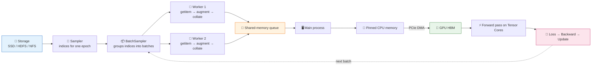
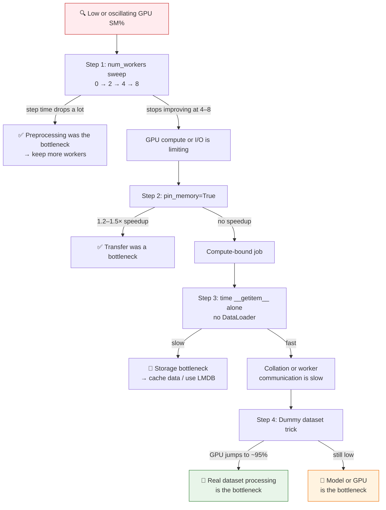

# 📘 Segment 4: DataLoader — Feeding the Model Efficiently

> **Course:** Applied Accelerated AI · NPTEL · IIT Guwahati  
> **Instructor:** Dr. Satyajit Das · **Duration:** ~26 min  
> **One-line takeaway:** The DataLoader is the conveyor belt between disk and GPU. If it is slow, the GPU starves, however good the model is.

---

## 🎯 Learning Objectives

1. Write a custom `Dataset` by implementing `__len__` and `__getitem__`.
2. Configure `DataLoader`: `batch_size`, `shuffle`, `num_workers`, `pin_memory`, `drop_last`.
3. Apply torchvision transforms: normalise, random crop, flip, colour jitter.
4. Diagnose bottlenecks using GPU utilisation and simple timing.
5. Understand why the DataLoader can be the single biggest bottleneck in training.

---

## 🗺️ Video Roadmap

| ⏱ Time | Chapter | Key idea |
|:------:|---------|----------|
| **0:24** | 1. Introduction | The DataLoader feeds batches to the training loop each epoch |
| **2:12** | 2. Custom Dataset | Implement `__len__` + `__getitem__`; the DataLoader calls them for you |
| **6:36** | 3. DataLoader configuration | Constructor parameters and the 5-step sampler→loop flow |
| **10:54** | 4. Pipeline stages and mechanics | Storage → Sampler → Workers → pinned memory/DMA → GPU |
| **19:27** | 5. Image transformations | Resize/crop/flip/jitter plus normalisation |
| **21:57** | 6. Diagnosing bottlenecks | `num_workers` sweep, `pin_memory`, I/O vs preprocessing, dummy dataset |
| **24:50** | 7. Summary | Recap and a preview of mixed precision in the next segment |

---

## 1️⃣ Introduction (0:24 – 2:12)

- The data is **prepared, pre-processed, sampled, batched**, and then given to the training process.
- In the training loop from the previous segment, each epoch traverses the whole dataset **batch by batch**.
- `Dataset` turns raw data into pre-processed samples. `DataLoader` delivers them to the device.
- The standard loop per batch is:
  1. Move data to the device.
  2. Forward pass.
  3. Compute the loss.
  4. Backward pass.
  5. Update the parameters.

---

## 2️⃣ Custom Dataset (2:12 – 6:36)

### The Dataset contract
| Method | Returns | Notes |
|--------|---------|-------|
| `__len__(self)` | Total number of samples | e.g. 100,000 |
| `__getitem__(self, idx)` | One `(input, label)` pair for index `idx` | Called one sample at a time |

> ⚠️ You **never call these directly**. The DataLoader does it automatically.

### `__init__` is where you set up
- File paths (a list of image paths).
- Integer class IDs (the labels).
- The transform (torchvision transforms).

### Image classification example (3:03)
```python
class ImageDataset(Dataset):
    def __init__(self, image_paths, labels, transform=None):
        self.paths = image_paths
        self.labels = labels
        self.transform = transform

    def __len__(self):
        return len(self.paths)

    def __getitem__(self, idx):
        img = Image.open(self.paths[idx]).convert('RGB')
        label = self.labels[idx]
        if self.transform:
            img = self.transform(img)      # returns tensor
        return img, torch.tensor(label, dtype=torch.long)
```

### NLP example (5:52)
- Tokenise all the texts in `__init__` with `truncation=True`, `padding='max_length'`, `max_length=128`, `return_tensors='pt'`.
- `__getitem__` returns a dict of `{k: v[idx]}` plus `labels`.

### Benchmarks
`torchvision.datasets` provides CIFAR10, MNIST, ImageNet, COCO, STL10, CelebA, etc.

---

## 3️⃣ DataLoader Configuration (6:36 – 10:54)

```python
loader = DataLoader(
    dataset,
    batch_size=32,
    shuffle=True,
    num_workers=4,
    pin_memory=True,
    drop_last=True,
    persistent_workers=True,
    prefetch_factor=2,
)
```

| Parameter | What it does | Guidance |
|-----------|--------------|----------|
| `batch_size` | Samples per batch | — |
| `shuffle` | Randomises order every epoch | `True` for training, `False` for validation |
| `num_workers` | Parallel processes running `__getitem__` | `0` = debugging; `4–8` = much faster |
| `pin_memory` | Page-locks CPU memory for faster GPU transfer | 2–3× faster than pageable memory |
| `drop_last` | Discards the final batch if smaller than `batch_size` | Avoids BatchNorm issues with a batch of size 1 |
| `persistent_workers` | Keeps workers alive between epochs | Saves ~2–5 s per epoch |
| `prefetch_factor` | Batches pre-loaded per worker | Default 2 (an integer, not a boolean) |

### How the DataLoader uses your Dataset (each epoch)
1. **Sampler** generates a shuffled list of indices.
2. **BatchSampler** groups the indices into batches.
3. **Workers** call `dataset.__getitem__(idx)` in parallel.
4. Workers apply transforms, assemble tensors, and place them in a **shared-memory queue**.
5. The **main process** reads batches from the queue and yields them to the training loop.

> 💡 **Example (10:01):** 100 samples with batch size 20 gives **5 iterations per epoch**.  
> Each batch is sent `.to(device)`, which is the GPU, or the CPU if no GPU is available.

---

## 4️⃣ Pipeline Stages and Mechanics (10:54 – 19:27)



### Stage-by-stage notes

| ⏱ Time | Stage | Details |
|:------:|-------|---------|
| **10:54** | **Storage** | Raw data on SSD, HDFS or NFS, wherever it lives |
| **11:10** | **Sampler** | Generates the ordered list of integer indices for one epoch. Variants: `SequentialSampler` (validation), shuffled/random (training), `WeightedRandomSampler` (per-sample weights), `DistributedSampler` (covered in distributed data parallel training) |
| **12:08** | **BatchSampler** | Wraps any sampler and groups indices into lists of `batch_size`. Each list goes to one worker |
| **12:40** | **Worker** | Runs `__getitem__`, then augmentation, then **collation**. Once collated, the batch is ready for the GPU |
| **13:09** | **PCIe DMA** | Sends the batch to the GPU. A slow transfer delays the next batch |
| **13:48** | **`persistent_workers`** | Avoids re-initialising workers each epoch (saves ~2–5 s) |
| **14:05** | **`prefetch_factor`** | Each worker prefetches 2 batches ahead |
| **14:32** | **Worker count limit** | Max ≈ physical CPU cores ÷ number of GPUs. For example, 8 cores with 1 GPU means at most 8 workers |
| **15:06** | **Pinned memory** | Pageable RAM can be swapped to disk by the OS at any time, so the GPU cannot safely DMA from it. `pin_memory=True` allocates output tensors directly in pinned memory and removes the extra copy |
| **15:53** | **Shared memory** | Workers are separate processes and cannot return tensors directly to the main process. They write the batch to shared memory, which the main process maps |
| **18:14** | **GPU HBM** | Once the batch is in HBM (e.g. on Hopper), the forward pass runs at full Tensor Core throughput across all SMs |

### 🧮 Shared-memory sizing
```
shm needed = num_workers × prefetch_factor × batch_size × (C × H × W × bytes_per_pixel)
```
- Docker's default `/dev/shm` is **64 MB**. That can fit one ImageNet batch with 4 workers, but not more.
- If shared memory is too small, **data loading slows down**.
- Fix: increase the Docker shared memory (e.g. `--shm-size=16g`) and restart the container.

---

## 5️⃣ Image Transformations (19:27 – 21:57)

### Why transform?
| Raw data | Model needs |
|----------|-------------|
| PIL image, varying sizes, `uint8` in [0, 255] | Tensor, fixed size, `float32`, normalised |

- **Training transforms** add random augmentation to reduce overfitting.
- **Validation/test transforms** are deterministic only (no randomness).
- **Normalisation is essential.** Raw pixels make gradients unstable and convergence fluctuate. Normalised data trains faster and more stably.

### Training vs validation transforms

| Training (augmenting) | Validation (deterministic) |
|-----------------------|----------------------------|
| `RandomResizedCrop(224, scale=(0.08, 1.0))` | `Resize(256)` |
| `RandomHorizontalFlip(p=0.5)` | `CenterCrop(224)` |
| `ColorJitter(0.4, 0.4, 0.4, 0.1)` | `ToTensor()` |
| `ToTensor()` | `Normalize(mean, std)` |
| `Normalize(mean, std)` | |

### ImageNet statistics
- `mean = [0.485, 0.456, 0.406]`
- `std = [0.229, 0.224, 0.225]`
- Normalising brings values to roughly **N(0, 1)**.
- Fine-tuning a pretrained model: use the **ImageNet** statistics.
- Training on your own data: **compute mean/std from your training set**.

### torchvision v2 (modern API)
- `import torchvision.transforms.v2 as T2`
- It operates on **tensors, not just PIL**, so it is faster and GPU-compatible.
- `T2.ToDtype(torch.float32, scale=True)` replaces `ToTensor` plus the float conversion.

### Augmentation cheat-sheet

| Technique | Purpose |
|-----------|---------|
| RandomCrop / RandomResizedCrop | Position invariance |
| RandomHorizontalFlip | Left-right symmetry |
| ColorJitter | Robustness to lighting |
| RandomRotation | Robustness to orientation |
| RandomGrayscale | Colour-irrelevant features |
| CutMix / MixUp | Regularisation, better generalisation |
| RandAugment / TrivialAugment | Automatic augmentation policies |

---

## 6️⃣ Diagnosing and Fixing Bottlenecks (21:57 – 24:50)

### 🩺 The #1 diagnostic: GPU utilisation
```bash
nvidia-smi dmon -s u -d 1
```
- Watch the **SM%** column.
- **Oscillating 0% → 95% → 0% → 95%** means the DataLoader is the bottleneck (the GPU is starving).
- **Target:** SM% sustained above **85%** with less than **10%** variance.



### Step details

| Step | Action | Interpretation |
|------|--------|----------------|
| **1. Workers sweep** (21:57) | Start at `num_workers=0`, then 2, 4, 8, measuring step time each time. Don't start with too many | Time drops → increase workers. Plateau after 4–8 → GPU or I/O limit. Rule of thumb: **4 per GPU**, capped at physical cores ÷ GPUs |
| **2. `pin_memory`** (22:22) | Enable it and re-measure | **1.2–1.5×** faster means PCIe was a bottleneck. No gain means compute-bound |
| **3. Isolate I/O vs preprocessing** (22:41) | Time a plain loop over the `Dataset` | Slow → storage is the issue. Fast → collation or worker communication is slow |
| **4. Dummy DataLoader** (23:22) | Swap in an in-memory synthetic dataset | GPU → ~95%: real data processing is the bottleneck. Still low: model or GPU is the bottleneck |

```python
class DummyDataset(Dataset):
    def __len__(self): return 10000
    def __getitem__(self, i):
        return torch.randn(3, 224, 224), torch.tensor(0)
```

---

## ✅ Summary (24:50 – end)

- ✔️ A **Dataset** subclasses `torch.utils.data.Dataset` and implements `__len__` and `__getitem__`. The DataLoader calls them automatically.
- ✔️ **Key DataLoader settings:** `shuffle=True` (train), `num_workers=4–8`, `pin_memory=True`, `persistent_workers=True`, `drop_last=True`. Wrong defaults are the #1 source of accidental poor performance.
- ✔️ **Training transforms** are random (crop, flip, jitter). **Validation transforms** are deterministic (resize, centre crop, normalise).
- ✔️ **Always normalise** with your training-set mean/std, or ImageNet stats when fine-tuning pretrained models.
- ✔️ **SM% oscillation** (0% ↔ 95%) means DataLoader starvation. Fix it with more workers, and use the dummy dataset to tell data loading apart from GPU compute.
- ⏭️ **Next segment:** speeding up training further with different numerical precisions.

---

## 🧠 Quick Self-Check

1. Which two methods must a custom `Dataset` implement?
2. Why is `shuffle=False` used for validation?
3. What does `pin_memory=True` change about the CPU→GPU copy?
4. What does a GPU SM% pattern of 0% → 95% → 0% indicate?
5. If a dummy dataset still shows low GPU utilisation, where is the bottleneck?

<details>
<summary>Answers</summary>

1. `__len__` and `__getitem__`.
2. Deterministic order gives reproducible validation.
3. Tensors are allocated in page-locked memory, so the GPU can DMA directly without an extra copy.
4. DataLoader starvation: the GPU finishes batches faster than they are delivered.
5. The model or the GPU itself, not data loading.
</details>

---

## 📝 Notes on the Source

- At 8:11 the transcript says "prefetch factor equal to true". On the slide it is an **integer** (`prefetch_factor=2`), not a boolean.
- At 22:49 "`__getitem__` alone... working as a data loader" refers to the Step 3 benchmark: timing a loop over the dataset without the DataLoader.
- Slide references: PyTorch Dataset/DataLoader tutorial, `torch/utils/data/dataloader.py`, PyTorch Performance Tuning Guide, Shorten & Khoshgoftaar (J Big Data, 2019).
