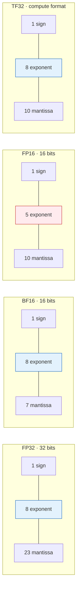
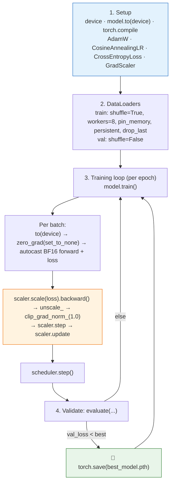

# 📗 Segment 5: First Steps in Performance — AMP, torch.compile & Key Practices

> **Course:** Applied Accelerated AI · NPTEL · IIT Guwahati  
> **Instructor:** Dr. Satyajit Das · **Duration:** ~23 min  
> **One-line takeaway:** Apply the minimum set of optimisations before going deeper: mixed precision first, then `torch.compile`, then DataLoader tuning, then profiling. Always measure before and after.

---

## 🎯 Learning Objectives

1. Apply AMP training with `autocast` (and `GradScaler` where needed) in a few lines.
2. Enable `torch.compile` with one line and understand what it does conceptually.
3. Use `torch.backends.cuda.matmul.allow_tf32` and related flags on Ampere+ GPUs.
4. Measure the combined speedup of AMP + compile versus baseline FP32 eager training.
5. Identify the six most common PyTorch performance mistakes and their fixes.

---

## 🗺️ Video Roadmap

| ⏱ Time | Chapter | Key idea |
|:------:|---------|----------|
| **0:24** | 1. Introduction to performance | Training performance: AMP and compilation are the minimum for a modern pipeline |
| **1:29** | 2. Deep dive into data types | FP32, FP16, BF16, TF32, FP8, INT8, INT4, FP64 and why they differ |
| **2:45** | 3. Interactive precision guide | Bit layouts (sign / exponent / mantissa), max values, peak TFLOPS on A100 |
| **11:05** | 4. Decision guide for training | Choose dtype by GPU generation, model size, VRAM, batch size and shared memory |
| **11:53** | 5. VRAM and precision analysis | 7B-parameter memory calculator and the overflow demo |
| **16:40** | 6. Leveraging `torch.compile` | Compile modes and which models benefit |
| **17:39** | 7. Practical implementation tips | Handout: AMP benchmark, compile warm-up, modes, TF32 |
| **22:35** | 8. Course summary and conclusion | Different ways to accelerate PyTorch training; see you next week |

---

## 1️⃣ Introduction to Performance (0:24 – 1:29)

- This segment focuses solely on **training performance**.
- Topics: **Automatic Mixed Precision (AMP)** and a few **compilation practices**.
- You will learn to:
  - apply AMP in training,
  - enable `torch.compile` with one line and understand what it does,
  - see what happens in the backend to improve performance,
  - measure the **combined speedup** of AMP and other dtypes.
- It all comes down to **precision**.

---

## 2️⃣ Deep Dive into Data Types (1:29 – 2:45)

- PyTorch tensors support many dtypes: **FP32, FP16, BF16, INT8**, and more.
- **FP32** is single precision (32 bits per number).
- **FP16** is half precision, so parameters take about half the storage.
- ⚠️ A smaller dtype does **not** automatically mean better performance. The next chapter shows why.

---

## 3️⃣ Interactive Precision Guide (2:45 – 11:05)

### Bit layouts



> 🔵 Blue = 8-bit exponent (FP32-like dynamic range). 🔴 Red = 5-bit exponent (narrow range, overflow risk).

### Data type reference

| Dtype | Layout (S / E / M) | Key facts | Typical use |
|-------|:------------------:|-----------|-------------|
| **FP32** | 1 / 8 / 23 | Default PyTorch dtype; widest dynamic range | Master copy of weights |
| **BF16** | 1 / 8 / 7 | Same range as FP32, truncated mantissa; 2 bytes; about **2×** the A100 peak TFLOPS of FP32; no overflow risk | **Recommended for training** on A100/H100 |
| **FP16** | 1 / 5 / 10 | Narrow range; values above **65,504** overflow to Inf; needs **GradScaler** | Older GPUs, with loss scaling |
| **TF32** | 1 / 8 / 10 | **Not a storage dtype.** An internal compute format for CUDA matmul. Takes FP32 input, computes with reduced mantissa. On by default on Ampere+ | Free speed on Ampere+ |
| **FP8** | 1 / 4 / 3 | Very low range, needs careful scaling. **H100/H200 only**. Halves VRAM versus BF16 | Hopper-class training/inference |
| **INT8** | 1 sign + 7 value bits | Max value 127; about 1,000 TOPS-class throughput. ~4× smaller than FP32, often about 1% accuracy drop | Post-training quantisation, inference |
| **INT4** | 1 sign + 3 value bits | Max value 7. Lets large LLMs fit small GPUs (e.g. a 70B model on a 48 GB GPU) | Extreme quantisation of LLMs |
| **FP64** | 1 / 11 / 52 | 8 bytes per element; about 19.5 TFLOPS on A100 | NumPy default, scientific computing; almost never in deep learning |

> 💡 **BF16 vs FP16:** both use 16 bits. BF16 spends them on **range** (8 exponent bits), FP16 on **precision** (10 mantissa bits). For training, range matters more.

### Hardware support summary
- **Older GPUs:** FP16 supported. **TF32 is not available.**
- **Ampere+ (A100):** TF32 and BF16.
- **Hopper (H100/H200):** FP8.
- **INT8 / INT4:** quantisation and inference.
- **FP64:** scientific computing and high-precision accumulation.

---

## 4️⃣ Decision Guide for Training (11:05 – 11:53)

Choose the dtype by considering:

1. **GPU generation** (RTX, V100, Ampere, Hopper).
2. **Model size** versus available VRAM.
3. **Batch size.**
4. **Docker shared memory.**

All of these need to be kept in sync with each other.

---

## 5️⃣ VRAM and Precision Analysis (11:53 – 16:40)

### 🧮 7-billion-parameter example

| Scenario | What is stored | Observation |
|----------|----------------|-------------|
| **Inference (FP32 master)** | Weights only | ~**60 GB** in the demo |
| **Inference (INT4)** | Weights only | Down to ~**3.5 GB**, usually with only ~1% accuracy loss |
| **Training** | Weights + gradients + optimiser state (**about 3×** weights) | FP64 weights-only ~56 GB → ~**168 GB** for training; **~84 GB** for FP16/BF16 |

```
training memory ≈ 3 × weight memory     (weights + gradients + optimiser values)
```

### ⚡ Overflow demonstration

| Test value | What happens |
|-----------|--------------|
| **65,600** | INT8, INT4, FP16 and FP8 **overflow**. BF16, TF32, FP32 and FP64 survive thanks to their 8+ exponent bits |
| **65,857** | FP64, FP32, TF32 keep the value exactly. **BF16 rounds it to ~65,859** (less mantissa precision). FP16 keeps 857 here but is the one that overflows at larger values |
| **Very large values** | BF16 still holds the range. INT8/INT4 overflow quickly |

- Small rounding errors **accumulate over every training step** into a measurable accuracy difference.
- **Trade-off:** decide how much accuracy loss is acceptable (e.g. ±5%).
  - Accept loss for higher performance, or
  - Keep high accuracy at moderate performance.
- **AMP** automates this by choosing the dtype per operation.

---

## 6️⃣ Leveraging `torch.compile` (16:40 – 17:39)

### Compile modes

| Mode | Compile time | Runtime | Best for |
|------|:------------:|:-------:|----------|
| `default` | Balanced | Balanced | Starting point |
| `reduce-overhead` | Faster | Good | **Fixed shapes** |
| `max-autotune` | **Slowest** | **Fastest** | Long runs; explores many optimisations at compile time |

### Who benefits most?
- ✅ **Transformers** with many small ops: **30–50% speedup** (Llama, BERT, ViT).
- ✅ Models with many **element-wise ops** (LayerNorm, GELU, Dropout chains) that get **fused**.
- ⚠️ Compilation takes time upfront.
- ⚠️ Helps less when a model is dominated by one large convolution or GEMM.

> 📌 **Rule:** try `torch.compile` first. If it does not help, **profile** before doing anything else.

---

## 7️⃣ Practical Implementation Tips (17:39 – 22:35)

### 🔹 AMP implementation (from slides)

```python
from torch.cuda.amp import autocast, GradScaler

scaler = GradScaler()   # manages loss scaling

for x, y in loader:
    x, y = x.to(device), y.to(device)
    optimizer.zero_grad()

    with autocast(dtype=torch.bfloat16):   # 1. forward in BF16
        logits = model(x)
        loss = criterion(logits, y)

    scaler.scale(loss).backward()          # 2. scale loss
    scaler.step(optimizer)                 # 3. unscale, check Inf/NaN
    scaler.update()                        #    adjust scale factor
```

**BF16 shortcut (A100/H100):** no scaler needed.
```python
with autocast(dtype=torch.bfloat16):
    ...
loss.backward()
optimizer.step()
```

### 🔹 Why not always FP16?
- FP16 has a **narrow dynamic range**, so very large or small gradients become Inf or 0.
- **Loss scaling** multiplies the loss before backward and divides the gradients afterwards.
- **GradScaler** adjusts the scale automatically using overflow detection.
- **BF16** has the same range as FP32, so no loss scaling is needed.
- **Recommendation:** BF16 on Ampere+, FP16 + GradScaler on older GPUs (e.g. V100).

### 🔹 Performance impact

| GPU | FP32 TFLOPS | BF16 TFLOPS | Speedup |
|-----|:-----------:|:-----------:|:-------:|
| A100 SXM4 | 312 | 624 | **2.0×** |
| H100 SXM5 | 989 | 1979 | **2.0×** |

The 2× comes from **Tensor Cores**, which are designed for half-precision matrix multiply.

### 🔹 The handout (interactive notebook) — 18:40 onward

| ⏱ Time | Section | What it shows |
|:------:|---------|---------------|
| **18:46** | Format worked example | Dynamic range, mantissa/exponent bits and size reduction |
| **19:27** | AMP implementation | `torch.amp.autocast` on the CUDA device |
| **19:55** | AMP benchmark | FP32 vs BF16 AMP vs FP16 AMP + scaler. Little speedup here because the **model is tiny**; scale up the model to see larger gains |
| **20:18** | Compile warm-up | Compile time vs steady-state time and the resulting speedup |
| **20:54** | Compile modes | Eager vs `default` vs `reduce-overhead` |
| **21:47** | TF32 via `cuda.matmul` | Enabled by default on Ampere+. Gains are small on this small model |

> 🔁 The workflow is reusable: swap in your own model and rerun.

### 🔹 `torch.compile` in plain language
- Every Python line in the forward pass has **interpreter overhead**, around 10–20% of step time on a fast GPU.
- `torch.compile` captures the math operations and compiles them to optimised GPU code.
- It **fuses** adjacent ops (e.g. LayerNorm + Dropout + Add) into one kernel, reducing memory traffic.
- **First 3–5 forward passes are slower** (compilation). Do not benchmark them.
- The compiled result is **cached**, so a second run is instant.

```python
model = MyModel().to('cuda')
model = torch.compile(model)   # the one-line change
```

### 🔹 TF32 (free speed on Ampere+)
```python
print(torch.backends.cuda.matmul.allow_tf32)
print(torch.backends.cudnn.allow_tf32)
```
- Tensor Cores run matmul in TF32 with an FP32 interface.
- The slides claim **~3× over FP32 on matmul** with negligible accuracy loss.
- Disable only for numerical reproducibility testing: `torch.backends.cuda.matmul.allow_tf32 = False`.

---

## 🚨 Six Common Performance Mistakes

| # | Mistake | Symptom | Fix |
|:-:|---------|---------|-----|
| 1 | Forgetting `model.train()` / `model.eval()` | Validation accuracy matches training; Dropout stays active at eval | `model.train()` at the start of each training epoch, `model.eval()` at the start of validation |
| 2 | Not zeroing gradients | Loss oscillates wildly or explodes | `optimizer.zero_grad(set_to_none=True)` as the **first line** of each step |
| 3 | `num_workers=0` | GPU at 30–40% utilisation | `num_workers=4`, `pin_memory=True`; check utilisation reaches 85%+ |
| 4 | Not moving data to GPU | `RuntimeError: Expected all tensors to be on the same device` | `x = x.to(device)`, `y = y.to(device)` every step |
| 5 | Calling `model.forward(x)` | Hooks silently skipped | Always call `model(x)`, which goes through `__call__` |
| 6 | Timing GPU code without synchronising | Benchmarks show ~0.1 ms per step (CPU dispatch only) | `torch.cuda.synchronize()` before starting and before stopping the timer |

```python
torch.cuda.synchronize()
t0 = time.perf_counter()
output = model(x)
torch.cuda.synchronize()
elapsed = time.perf_counter() - t0
```

---

## 🏭 Production-Ready Training Template



> The slides note that PyTorch Lightning and the HuggingFace Trainer implement this same pattern internally.

---

## ✅ Performance Quick-Start Checklist

- [ ] `model.train()` and `model.eval()` in the correct places
- [ ] `zero_grad(set_to_none=True)` every step
- [ ] `num_workers >= 4`, `pin_memory=True`
- [ ] AMP with `autocast(dtype=torch.bfloat16)`
- [ ] `model = torch.compile(model)`
- [ ] TF32 enabled (default on A100)

---

## 📌 Summary (22:35 – end)

- ✔️ **AMP** with BF16 autocast gives about **2× speedup and ~2× VRAM reduction** with the lowest risk. Do it first.
- ✔️ **`torch.compile(model)`** needs no model changes and gives **20–50%** additional speedup on Transformers by cutting Python overhead and fusing ops.
- ✔️ **TF32** is on by default on A100/H100 and speeds up matmul at negligible accuracy cost.
- ✔️ Avoid the **six common mistakes** above.
- ✔️ **Order of optimisation:** AMP → `torch.compile` → DataLoader tuning → profiling. **Never optimise without measuring before and after.**
- ⏭️ **Next week:** the instructor will share the interactive page for practice, then moves on.

---

## 🧠 Quick Self-Check

1. Why does BF16 not need loss scaling while FP16 does?
2. Is TF32 a storage dtype you can set on a tensor?
3. Why are the first few `torch.compile` steps slower?
4. Why must you call `torch.cuda.synchronize()` when timing GPU code?
5. Roughly how much memory does training need compared with weights-only inference, and why?

<details>
<summary>Answers</summary>

1. BF16 keeps FP32's 8 exponent bits, so its dynamic range matches FP32. FP16 has only 5 exponent bits, so gradients can overflow or underflow.
2. No. It is an internal compute format used by CUDA matmul on Ampere+; inputs stay FP32.
3. Compilation happens during those passes. After that, the compiled code is reused (and cached).
4. GPU execution is asynchronous. Without it you time only the CPU dispatch.
5. About **3×**, because training stores weights, gradients and optimiser state.
</details>

---

## 📝 Notes on the Source

- **Transcript vs slides on FP16 overflow:** the transcript says values "above 6554" overflow. The correct FP16 maximum is **65,504**.
- **Transcript on BF16 vs FP16 at 65,857:** it is garbled in places. The point is that FP16 overflows at large magnitudes while BF16 survives but loses mantissa precision (857 → 859).
- **Transcript on TF32:** it says multiplication runs at "BF16 precision". TF32 actually keeps a **10-bit mantissa** (the same as FP16) with an FP32 exponent range. The slides describe it as a "19-bit float".
- **Transcript on INT8 throughput:** it mentions "Ampere series" for ~1,000 TFLOPS. This is INT8 TOPS on A100.
- **Slide inconsistency:** the Learning Objectives and the Quick-Start Checklist mention six mistakes, and the summary slide lists six, but the summary's wording omits "set_to_none". The Mistakes slide itself is authoritative.
- **TF32 speedup claim:** the slides say ~3× over FP32 matmul. NVIDIA's A100 spec shows 156 vs 19.5 TFLOPS for TF32 vs FP32 non-tensor, but real-world gains vary by model.
- **Template note:** the template slide combines `GradScaler` with BF16 autocast. For BF16 the scaler is unnecessary (see the "BF16 shortcut" slide), so `scaler` can be removed in that setting.
- **Slide references:** Micikevicius et al. (ICLR 2018, Mixed Precision Training), Ansel et al. (ASPLOS 2024, PyTorch 2), PyTorch Performance Tuning Guide, NVIDIA TF32 documentation.
