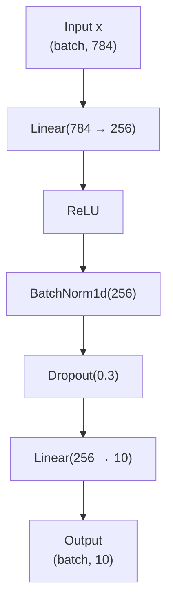
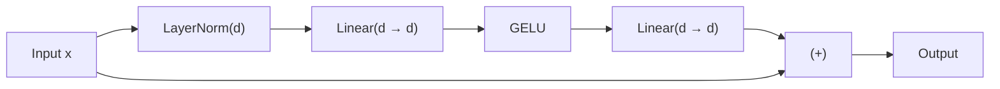

# Detailed Notes: Segment 2 – Building Neural Networks with `nn.Module`

**Course:** NPTEL – Applied Accelerated Artificial Intelligence  
**Instructor:** Dr. Satyajit Das  
**Department:** Computer Science and Engineering, IIT Guwahati  
**Focus:** From raw matrix multiplications to well-organised, inspectable, saveable neural network models

---

## Learning Objectives

| # | Objective |
|---|-----------|
| 01 | Explain why `torch.nn.Module` is the fundamental building block and what it provides over raw tensor operations |
| 02 | Define a custom neural network by subclassing `nn.Module` and implementing `__init__` and `forward` methods |
| 03 | Use built-in layers: `nn.Linear`, `nn.Conv2d`, `nn.BatchNorm2d`, `nn.LayerNorm`, `nn.Dropout`, `nn.Embedding` |
| 04 | Inspect a model’s parameters, named modules, and compute total parameter count |
| 05 | Save and load model weights using `state_dict`, `torch.save`, and `torch.load` |

---

## 1. `torch.nn.Module`: The Building Block of All Models

### Why Not Just Use Raw Tensors?

Raw tensors force the programmer to manually:

- Track every weight tensor
- Move weights to the correct device (CPU ↔ GPU)
- Save and load weights correctly
- Handle training vs evaluation behaviour

`nn.Module` automates all of the above. It is a **container** that organises:

- Parameters (learnable weights)
- Sub-modules (other layers or blocks)
- The forward computation graph

**Key property – Composability:**  
Any `nn.Module` can contain other `nn.Module`s. This allows building entire model trees, not just individual layers.

### The Two Required Components

Every custom module must:

1. Call `super().__init__()` inside `__init__`
2. Implement the `forward` method that defines the computation

```python
import torch
import torch.nn as nn

class MyLayer(nn.Module):
    def __init__(self):
        super().__init__()                  # ALWAYS call this
        self.linear = nn.Linear(4, 3)       # creates weight matrix W and bias b
        self.relu = nn.ReLU()

    def forward(self, x):
        x = self.linear(x)                  # calls Linear.forward(x)
        return self.relu(x)

# Instantiation and usage
layer = MyLayer()
out = layer(torch.randn(2, 4))              # calls __call__ → forward()
```

**Important calling rule:**  
Always call the module as a function: `layer(x)`.  
Never call `layer.forward(x)` directly.  
`__call__` adds hooks, input checks, and other infrastructure around `forward`.

### What `nn.Module` Provides Automatically

| Feature | Description |
|---------|-------------|
| Parameter registration | Anything assigned as `nn.Parameter` or `nn.Module` is automatically tracked |
| `model.parameters()` | Iterator over **all** learnable weights across every sub-module |
| `model.to(device)` | Recursively moves all parameters **and** buffers to the given device |
| `model.train()` / `model.eval()` | Switches training / evaluation mode (affects Dropout, BatchNorm, etc.) |
| `model.state_dict()` | Ordered dictionary of all parameter (and buffer) tensors – used for saving/loading |

### `nn.Parameter` vs Buffers

| Concept | Meaning | Appears in `parameters()`? | Saved with model? | Optimised by optimiser? |
|---------|---------|---------------------------|-------------------|-------------------------|
| `nn.Parameter` | Learnable weight tensor | Yes | Yes | Yes |
| Buffer (`register_buffer`) | Non-learnable state (e.g. BatchNorm running mean/variance) | No | Yes | No |

Example of registering a buffer:

```python
self.register_buffer('running_mean', torch.zeros(C))
```

Buffers move with `.to(device)` but are **not** updated by the optimiser.

---

## 2. Built-in Layers – The Vocabulary of Neural Network Design

### Linear Layers

| Layer | Purpose | Notes |
|-------|---------|-------|
| `nn.Linear(in_features, out_features, bias=True)` | Fully-connected layer | Computes \( y = xW^\top + b \) |
| `nn.LazyLinear` | Same as Linear but infers `in_features` on first forward | Convenient for rapid prototyping |

- Default weight initialisation: **Kaiming uniform** (designed for ReLU networks).
- This initialisation strongly influences convergence speed.

### Convolutional Layers

| Layer | Typical Use |
|-------|-------------|
| `nn.Conv2d(in_ch, out_ch, kernel_size, stride=1, padding=0)` | 2-D images |
| `nn.Conv1d` | 1-D sequences (audio, text embeddings, time-series) |
| `nn.ConvTranspose2d` | Upsampling / generative models (e.g. U-Net decoder) |
| `padding='same'` | Output spatial size equals input size (PyTorch ≥ 1.9) |

### Normalisation Layers (Critical for Deep Networks)

| Layer | Normalises Across | Learnable Parameters | Typical Use |
|-------|-------------------|----------------------|-------------|
| `nn.BatchNorm2d(C)` | Batch dimension | γ (scale), β (shift) + running stats | CNNs |
| `nn.LayerNorm(normalised_shape)` | Feature dimension of each sample | γ, β | Transformers (works with any batch size) |
| `nn.GroupNorm(num_groups, num_channels)` | Groups of channels | γ, β | Object detection |
| `nn.RMSNorm` (PyTorch ≥ 2.4) | Features (no mean subtraction) | scale only | Llama, Mistral |

### Activation Functions

| Activation | Formula / Description | Common Domains |
|------------|-----------------------|----------------|
| `nn.ReLU()` | \(\max(0, x)\) | CNNs (AlexNet, VGG, ResNet) |
| `nn.GELU()` | Gaussian Error Linear Unit | Transformers (GPT, BERT) |
| `nn.SiLU()` / Swish | \(x \cdot \sigma(x)\) | Modern LLMs (Llama 2, Phi) |
| `nn.Sigmoid()`, `nn.Tanh()` | Squashing functions | Gates, probability outputs |

### Regularisation & Sequence Layers

| Layer | Behaviour |
|-------|-----------|
| `nn.Dropout(p=0.1)` | Randomly zeros fraction \(p\) of activations **during training**; becomes identity in `eval()` mode |
| `nn.Embedding(num_embeddings, embedding_dim)` | Lookup table that converts integer token IDs → dense vectors |
| `nn.MultiheadAttention(embed_dim, num_heads)` | Full multi-head attention with optional causal masking |
| `nn.TransformerEncoderLayer` | Complete Pre-LN or Post-LN Transformer block (Attention + FFN + Norms) |

---

## 3. Composing Models

### 3.1 `nn.Sequential` – Quick Composition for Simple Networks

```python
model = nn.Sequential(
    nn.Linear(784, 256),
    nn.ReLU(),
    nn.BatchNorm1d(256),
    nn.Dropout(0.3),
    nn.Linear(256, 10),
)
```

**Execution flow (data shape example):**



**Strengths:**  
- Modules executed strictly in order  
- Input of each layer = output of previous layer  

**Limitation:**  
Cannot implement branching, merging, or residual (skip) connections.

### 3.2 Custom Architecture with Residual (Skip) Connections

```python
class ResBlock(nn.Module):
    def __init__(self, d):
        super().__init__()
        self.net = nn.Sequential(
            nn.LayerNorm(d),
            nn.Linear(d, d),
            nn.GELU(),
            nn.Linear(d, d),
        )

    def forward(self, x):
        return x + self.net(x)   # residual / skip connection
```

**Data-flow diagram:**



The residual connection \( x + \text{net}(x) \) is the key idea behind ResNet-style architectures. It eases gradient flow through deep networks.

### 3.3 `nn.ModuleList` – Dynamic Lists of Modules

```python
self.layers = nn.ModuleList([
    nn.Linear(d, d) for _ in range(6)
])
```

**Why not a plain Python list?**  
A normal Python list is **not** registered by PyTorch → parameters are invisible to optimisers and `.to(device)`.

`ModuleList` guarantees that every contained module is properly tracked.

**Comparison of Composition Styles**

| Style | Automatic Execution Order | Supports Residual / Branching | Useful For |
|-------|---------------------------|-------------------------------|------------|
| `nn.Sequential` | Yes (strict linear) | No | Simple feed-forward stacks |
| Custom `nn.Module` | You write `forward()` yourself | Yes | Residuals, multi-path, complex logic |
| `nn.ModuleList` | No (you must loop in `forward`) | Yes (inside your loop) | Dynamic depth, repeated identical blocks |

---

## 4. Inspecting Models

```python
model = MyModel()

# Total and trainable parameter count
total = sum(p.numel() for p in model.parameters())
trainable = sum(p.numel() for p in model.parameters() if p.requires_grad)
print(f"{total/1e6:.1f}M params, {trainable/1e6:.1f}M trainable")

# Named parameter shapes (excellent for debugging)
for name, p in model.named_parameters():
    print(name, p.shape)

# Full module tree
print(model)
```

These utilities are essential for:

- Understanding model size
- Verifying that layers were registered correctly
- Debugging shape mismatches

---

## 5. Saving and Loading Model Weights

**Recommended pattern – save only the `state_dict`:**

```python
# Save
torch.save(model.state_dict(), "model.pth")

# Load into a freshly created model of the same architecture
model2 = MyModel()
model2.load_state_dict(torch.load("model.pth"))
```

**Why never save the entire model object?**

- Pickling the whole model embeds the **class definition**.
- If you later change the source code of the class, loading fails.
- `state_dict` is just a dictionary of tensors → portable across code changes and PyTorch versions.

---

## 6. Defining Complete Models – Worked Examples

### 6.1 Three-Layer MLP Classifier

```python
class MLPClassifier(nn.Module):
    def __init__(self, input_dim, hidden_dim, output_dim, dropout=0.1):
        super().__init__()
        self.net = nn.Sequential(
            nn.Linear(input_dim, hidden_dim),
            nn.LayerNorm(hidden_dim),
            nn.GELU(),
            nn.Dropout(dropout),
            nn.Linear(hidden_dim, hidden_dim),
            nn.LayerNorm(hidden_dim),
            nn.GELU(),
            nn.Dropout(dropout),
            nn.Linear(hidden_dim, output_dim),
        )

    def forward(self, x):
        return self.net(x)

# Instantiation
model = MLPClassifier(784, 512, 10).to("cuda")
print(model)   # prints full architecture
# Approximate size: 784→512→512→10 ≈ 800 K parameters
```

### 6.2 Mini Transformer for Text Classification

```python
class TextClassifier(nn.Module):
    def __init__(self, vocab, d=128, h=4, layers=2):
        super().__init__()
        self.embed = nn.Embedding(vocab, d)
        self.layers = nn.ModuleList([
            nn.TransformerEncoderLayer(
                d_model=d,
                nhead=h,
                dim_feedforward=d * 4,
                batch_first=True,
                norm_first=True,          # Pre-LN style
            )
            for _ in range(layers)
        ])
        self.head = nn.Linear(d, 2)        # binary classification

    def forward(self, token_ids):
        x = self.embed(token_ids)         # (B, T, d)
        for layer in self.layers:
            x = layer(x)
        return self.head(x.mean(1))       # mean-pool over sequence length T
```

### 6.3 Custom Weight Initialisation

PyTorch default (Kaiming uniform) is already good for ReLU / GELU networks.  
For custom schemes:

```python
def init_weights(m):
    if isinstance(m, nn.Linear):
        nn.init.xavier_uniform_(m.weight)
        nn.init.zeros_(m.bias)

model.apply(init_weights)   # applies recursively to every sub-module
```

---

## 7. Segment 2 Summary – Key Takeaways

1. **`nn.Module` is the fundamental building block.**  
   It automatically tracks parameters, supports `.to(device)`, and provides `train()` / `eval()` mode switching. Never keep raw tensors as learnable weights.

2. **Implementation pattern**  
   - Override `__init__` to create layers (always call `super().__init__()`).  
   - Override `forward` to define the computation.  
   - Call the model as a function: `model(x)` — never `model.forward(x)`.

3. **Essential built-in layers**  
   - `nn.Linear` → MLPs  
   - `nn.Conv2d` → vision  
   - `nn.LayerNorm` + `nn.MultiheadAttention` → Transformers  
   - `nn.Embedding` → NLP / token inputs  
   - `nn.Dropout` → regularisation

4. **Inspection tools**  
   - `model.parameters()` → optimisation  
   - `model.named_parameters()` → debugging  
   - `model.state_dict()` → saving / loading

5. **Persistence best practice**  
   Always save and load the `state_dict`. It is a pure dictionary of tensors and remains portable across code changes and PyTorch versions.

---

**Next Steps (Upcoming Sessions)**  
Training loops, optimisers, loss functions, and performance optimisation techniques will be covered after this foundational segment on model construction.

---

*Notes prepared from the official lecture slides and spoken transcript of Segment 2 – Applied Accelerated Artificial Intelligence (NPTEL).*
