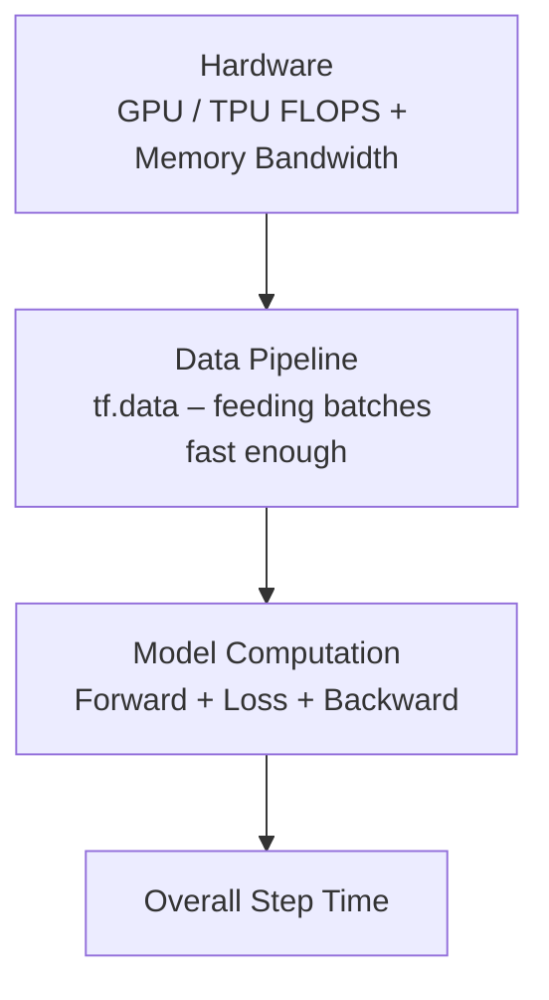

# Week 05 – Segment 1: TensorFlow Execution Models & Performance Basics

## 1. Learning Objectives (Segment 1 focus)

| # | Objective |
|---|-----------|
| 01 | Understand TensorFlow’s eager and graph execution modes |
| 02 | Explain how computation graphs improve performance |
| 03 | Build efficient data pipelines using the `tf.data` API *(covered in later segments)* |
| 04 | Apply `@tf.function` and AutoGraph for graph optimization *(introduced here, detailed later)* |
| 05 | Profile TF workloads with TensorBoard *(introduced conceptually)* |
| 06 | Understand XLA compilation and how to enable it *(Segment 4)* |
| 07 | Export and load models using TensorFlow SavedModel format *(Segment 5)* |
| 08 | Convert and deploy models across frameworks using ONNX *(Segment 5)* |

This segment lays the foundation for all later performance and interoperability topics.

## 2. What is TensorFlow?

### 2.1 Definition & Origin
- **Open-source machine learning framework** developed by the **Google Brain** team.
- Publicly released in **2015**.
- Designed for **numerical computation using data-flow graphs**.
- Native support for:
  - CPU
  - GPU
  - **TPU** (Tensor Processing Unit – widely used inside Google data centres)
  - Distributed execution across multiple devices / machines.

### 2.2 Two Levels of API

| Level | API | Purpose | Typical Use |
|-------|-----|---------|-------------|
| **High-level** | Keras API | Rapid model building & training | Prototyping, quick experiments |
| **Low-level** | `tf.Tensor`, `tf.Variable`, `tf.GradientTape` | Fine-grained control | Custom training loops, research, maximum performance |

**Key insight from lecture:**  
High-level APIs give you “plug-and-play” speed. Low-level APIs give you **flexibility + better performance** because you control exactly what happens.

### 2.3 Core Concept – Tensors
- Multi-dimensional arrays (scalars → vectors → matrices → higher-rank tensors).
- **All operations in TensorFlow operate on and return tensors.**
- **Critical difference from PyTorch:**  
  TensorFlow tensors created with `tf.constant` / `tf.zeros` etc. are **immutable**.  
  Operations always create **new** tensors; there are no in-place mutations on constants.

### 2.4 Why TensorFlow for Accelerated AI?
- Built-in GPU/TPU support with **automatic device placement**.
- Rich production ecosystem:
  - **TF Serving** – high-performance model serving
  - **TF Lite** – mobile / edge deployment
  - **TF.js** – browser / Node.js
  - **TFX** – end-to-end ML pipelines

Most production-grade AI deployments in large organisations still rely heavily on this ecosystem.


## 3. Tensors in Practice (from lecture)

### 3.1 Creating Tensors

```python
# Rank-0 (scalar)
scalar = tf.constant(42, dtype=tf.int32)

# Rank-1 (vector)
vector = tf.constant([1, 2, 3], dtype=tf.float32)

# Rank-2 (matrix)
matrix = tf.constant([[1, 2], [3, 4]], dtype=tf.float32)

# Rank-3 (batch of matrices) – zeros example
batch = tf.zeros(shape=(2, 3, 4))   # 2 batches of 3×4 matrices
```

### 3.2 Immutability vs Mutability

| Creation Method | Mutable? | Typical Use |
|-----------------|----------|-------------|
| `tf.constant(...)` | **No** | Fixed values, graph constants |
| `tf.zeros`, `tf.ones`, `tf.fill` | **No** | Initialisation of constant tensors |
| `tf.Variable(...)` | **Yes** | Model weights, biases, any state that must be updated |

```python
# This will raise an exception – constants are immutable
w = tf.constant([1.0, 2.0])
# w[0] = 3.0          # Error!

# Correct way for trainable parameters
w = tf.Variable([1.0, 2.0], name="weights")
w.assign([3.0, 4.0])  # Works
```

**Why this matters:**  
During training we **must** update weights. Therefore every trainable parameter is declared as a `tf.Variable`.

### 3.3 NumPy Interoperability
```python
import numpy as np

np_arr = np.array([[1, 2], [3, 4]], dtype=np.float32)
tf_tensor = tf.convert_to_tensor(np_arr)   # NumPy → TensorFlow
back_to_np = tf_tensor.numpy()             # TensorFlow → NumPy
```

### 3.4 Common Operations (mirrors PyTorch style)
- Element-wise: `tf.add`, `tf.multiply`, `tf.subtract`, …
- Reductions: `tf.reduce_sum`, `tf.reduce_mean`, `tf.reduce_min`, `tf.reduce_max`
- Shape ops: `tf.reshape`, `tf.transpose`, `tf.expand_dims`, flattening, etc.

All of these operations return **new tensors**.

## 4. Eager Execution vs Graph Execution

### 4.1 Side-by-side Comparison

| Aspect | Eager Execution (default in TF 2.x) | Graph Execution (via `@tf.function`) |
|--------|-------------------------------------|--------------------------------------|
| Execution style | Line-by-line, like normal Python | Builds a symbolic graph first, then runs it |
| Debugging | Extremely easy – `print()`, Python control flow works | Harder – must use `tf.print` or trace tools |
| Performance | Good for development, suboptimal for repeated heavy work | Better – whole-graph optimisations possible |
| Serialisation | Difficult | Native – graphs can be saved & deployed |
| Optimisations | Limited (no future knowledge) | Operator fusion, constant folding, dead-code elimination, etc. |
| When to use | Development, debugging, research | Production training & inference |

### 4.2 Key Insight from Lecture
> “TF 2.x gives you the **best of both worlds**:  
> Use eager mode while developing and debugging.  
> Once the code is correct, wrap the critical functions with `@tf.function` to get graph-mode performance.”

```python
@tf.function
def my_optimized_function(x, y):
    return tf.matmul(x, y) + tf.nn.relu(x)
```

- **First call** → TensorFlow **traces** the Python function and builds a concrete graph (tracing phase).
- **Subsequent calls** → The cached graph is executed (no Python interpreter overhead).


## 5. The Computation Graph

### 5.1 Definition
A **Directed Acyclic Graph (DAG)** where:
- **Nodes** = operations (`tf.matmul`, `tf.nn.relu`, `tf.add`, …)
- **Edges** = tensors flowing between operations


### 5.2 Advantages of Graph Representation

| Advantage | Explanation |
|-----------|-------------|
| **Portability** | Graph can be saved and executed on any supported platform (CPU/GPU/TPU/mobile) |
| **Parallelism** | Independent subgraphs can execute concurrently |
| **Optimisation** | Runtime can reorder, fuse, prune, and constant-fold operations |
| **Distributed execution** | Graph can be partitioned across multiple devices / machines |

### 5.3 How `@tf.function` Builds the Graph
1. First invocation → **tracing**: Python code is executed under a special tracer that records every TensorFlow operation.
2. A **ConcreteFunction** is created for that particular input signature (shapes + dtypes).
3. Later calls with the same signature reuse the cached ConcreteFunction.
4. Different shapes/dtypes trigger re-tracing (and a new ConcreteFunction).

## 6. Automatic Differentiation – `tf.GradientTape`

This is the TensorFlow counterpart of PyTorch’s Autograd.

### 6.1 Basic Idea
`tf.GradientTape` acts as a **recorder**.  
Everything that happens **inside** the `with tape:` block is recorded.  
When you call `tape.gradient(...)`, the recorded operations are differentiated using the chain rule.

### 6.2 Scalar Example

Let  
```math
y = x^{2} + 3x + 2
```

We want ($\frac{dy}{dx}$) evaluated at (x = 3).

**Analytic derivative:**
```math
\frac{dy}{dx} = 2x + 3 \quad \Rightarrow \quad 2\cdot 3 + 3 = 9
```

**TensorFlow code:**
```python
x = tf.Variable(3.0)

with tf.GradientTape() as tape:
    y = x**2 + 3*x + 2

dy_dx = tape.gradient(y, x)
# dy_dx.numpy() → 9.0
```

### 6.3 Multivariate Example

```math
z = x_1^{2} + x_2^{3} + x_1 x_2
```

```python
x1 = tf.Variable(2.0)
x2 = tf.Variable(3.0)

with tf.GradientTape() as tape:
    z = x1**2 + x2**3 + x1*x2

grads = tape.gradient(z, [x1, x2])
# grads[0] = ∂z/∂x1 , grads[1] = ∂z/∂x2
```


### 6.4 Persistent Tape (Multi-loss / Multiple gradient calls)

By default, after the **first** call to `tape.gradient()`, the tape is released (resources freed).  
If you need multiple gradient computations from the same forward pass (common with multi-task losses), use:

```python
with tf.GradientTape(persistent=True) as tape:
    f = x**3
    g = x**2

df_dx = tape.gradient(f, x)   # 3x²
dg_dx = tape.gradient(g, x)   # 2x

del tape   # free resources when finished
```


**Comparison with PyTorch:**
- PyTorch accumulates gradients by default → you must call `optimizer.zero_grad()`.
- TensorFlow’s `GradientTape` **forgets** after the first `gradient()` call (unless `persistent=True`).  
  This is closer to an automatic “zero-grad” behaviour.

## 7. TensorFlow Performance Basics

### 7.1 The AI Training Performance Stack



Three possible bottlenecks:
1. **Hardware** – raw compute / memory bandwidth
2. **Data pipeline** – GPU waiting for the next batch (I/O bound)
3. **Model computation** – forward/backward itself (compute bound)

### 7.2 Common Performance Bottlenecks

| Bottleneck | Symptom | Root Cause |
|------------|---------|------------|
| CPU–GPU data starvation | GPU utilisation low, idle time high | Input pipeline too slow |
| Python / C++ boundary crossings | High host overhead | Missing `@tf.function` |
| Sub-optimal batch size / layout | Poor memory coalescing | Non-contiguous tensors, bad batch size |
| Unnecessary device copies | Extra `MemcpyH2D` / `MemcpyD2H` in trace | Data transferred mid-graph instead of once at the beginning |

### 7.3 Profiling Philosophy
> “**Profile first, optimise second.**”

Tools mentioned:
- **TensorBoard Profiler**
  - Step-time breakdown
  - Input-pipeline analysis
  - Trace Viewer (Chrome-style timeline)

**Target metrics:**
- Maximise GPU / TPU utilisation
- Minimise idle time
- Keep the accelerator busy with useful work


## 8. Quick Reference – Eager → Graph Transition

```python
# Development (eager – easy to debug)
def train_step(x, y):
    with tf.GradientTape() as tape:
        pred = model(x)
        loss = loss_fn(y, pred)
    grads = tape.gradient(loss, model.trainable_variables)
    optimizer.apply_gradients(zip(grads, model.trainable_variables))
    return loss

# Production (graph – high performance)
@tf.function
def train_step(x, y):
    with tf.GradientTape() as tape:
        pred = model(x)
        loss = loss_fn(y, pred)
    grads = tape.gradient(loss, model.trainable_variables)
    optimizer.apply_gradients(zip(grads, model.trainable_variables))
    return loss
```

Just adding the decorator is often enough to obtain large speed-ups for repeated training steps.

## 9. Summary of Segment 1

| Topic | Key Take-away |
|-------|---------------|
| TensorFlow identity | End-to-end framework with strong production tooling (Serving, Lite, TFX, …) |
| Tensors | Immutable by default; use `tf.Variable` for anything that must change |
| Eager mode | Default in TF 2.x – Pythonic, easy to debug |
| Graph mode | Activated by `@tf.function` – enables whole-graph optimisations & deployment |
| Computation graph | DAG of ops + tensors → portability, parallelism, optimisations |
| GradientTape | Explicit recording context; `persistent=True` for multi-loss scenarios |
| Performance | Always profile (TensorBoard) before optimising; watch input pipeline & Python overhead |


